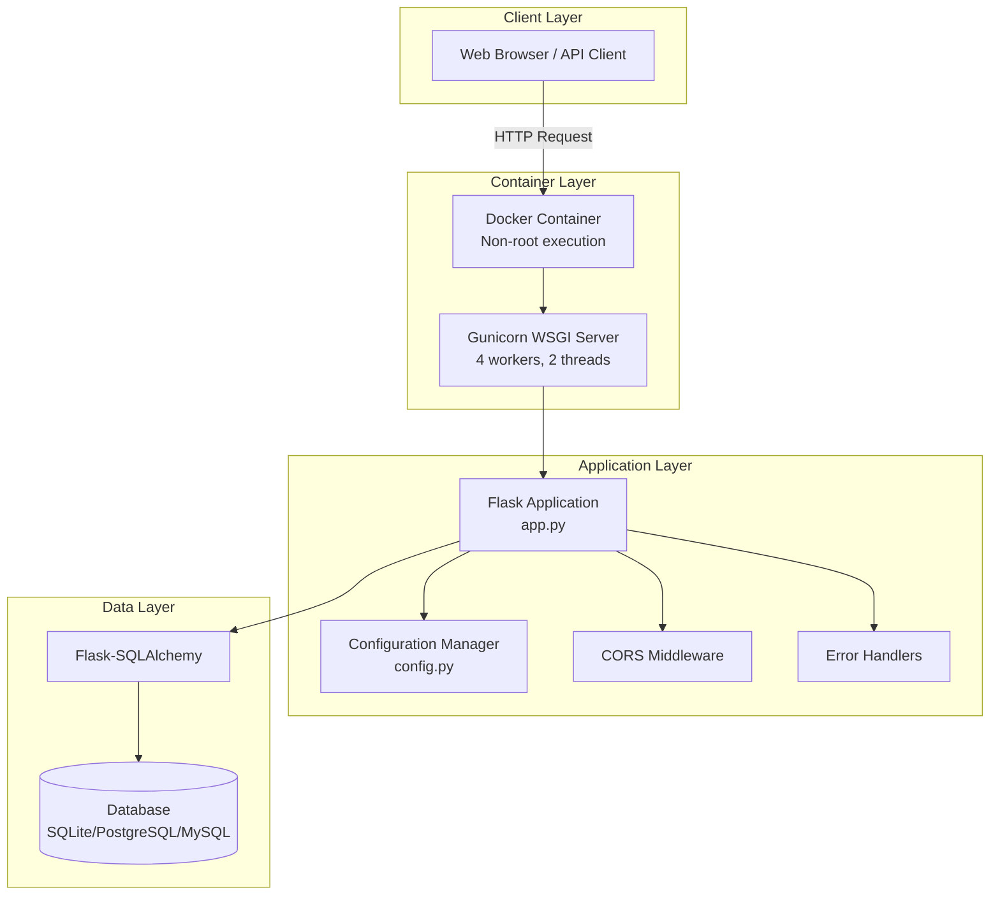
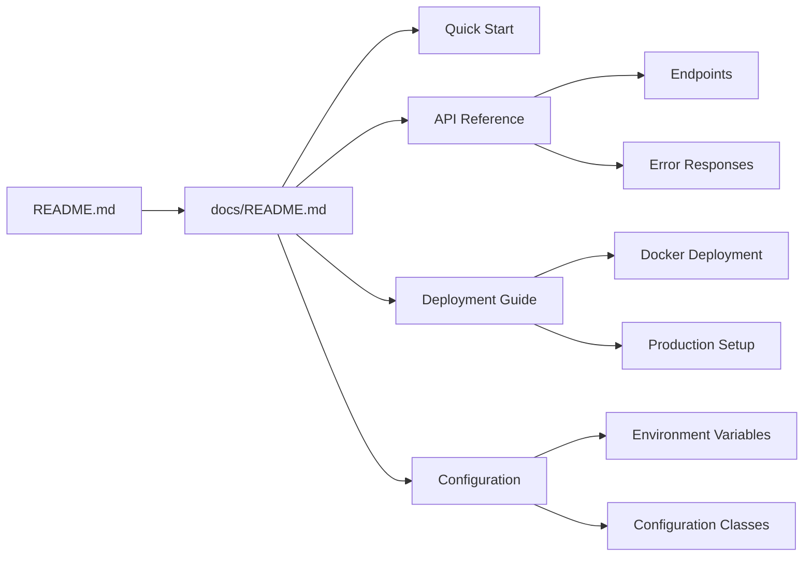

# ExistingProduct1-3Dec

A Python/Flask web server application providing RESTful API endpoints.

Created by Blitzy

## Table of Contents

- [Architecture Overview](#architecture-overview)
- [Prerequisites](#prerequisites)
- [Installation](#installation)
- [Configuration](#configuration)
- [Running the Application](#running-the-application)
  - [Development Server](#development-server)
  - [Production Server](#production-server)
- [Running Tests](#running-tests)
- [Docker Deployment](#docker-deployment)
- [Project Structure](#project-structure)
- [API Documentation](#api-documentation)
- [Full Documentation](#full-documentation)
- [Contributing](#contributing)

## Architecture Overview

This Flask application follows a modern, production-ready architecture with layered components for maintainability and scalability.



**Key Architectural Components:**

| Component | Description | Source |
|-----------|-------------|--------|
| Application Factory | `create_app()` function enables testing and multi-environment support | `app.py:34-97` |
| Configuration Classes | Environment-specific configs (Development, Production, Testing) | `config.py` |
| CORS Middleware | Cross-origin request handling for `/api/*` routes | `app.py:78-81` |
| Error Handlers | Consistent JSON error responses for all HTTP errors | `app.py:100-185` |
| Database ORM | Flask-SQLAlchemy for database abstraction | `models/__init__.py` |
| WSGI Server | Gunicorn for production deployments | `Dockerfile:98-107` |

> **Note:** This project was migrated from Node.js/Express to Python/Flask. The `app.py` file replaces the original `server.js/app.js` and implements the Flask application factory pattern for modern Flask development.

For detailed architecture documentation, see the [Full Documentation](#full-documentation) section.

## Prerequisites

Before you begin, ensure you have the following installed:

- **Python 3.12+** - [Download Python](https://www.python.org/downloads/)
- **pip** - Python package installer (included with Python 3.12+)
- **virtualenv** (recommended) - For isolated Python environments

Verify your Python installation:

```bash
python --version  # Should output Python 3.12.x or higher
pip --version
```

## Installation

1. **Clone the repository:**

```bash
git clone <repository-url>
cd ExistingProduct1-3Dec
```

2. **Create and activate a virtual environment (recommended):**

```bash
# Create virtual environment
python -m venv venv

# Activate on Linux/macOS
source venv/bin/activate

# Activate on Windows
venv\Scripts\activate
```

3. **Install dependencies:**

```bash
pip install -r requirements.txt
```

## Configuration

1. **Create environment file:**

Copy the example environment file and configure your settings:

```bash
cp .env.example .env
```

2. **Configure environment variables:**

Edit the `.env` file with your specific configuration:

```bash
# Flask Configuration
FLASK_APP=app.py
FLASK_ENV=development  # Use 'production' for production deployments
SECRET_KEY=your-secret-key-here

# Database Configuration (if applicable)
DATABASE_URL=sqlite:///app.db

# Additional configuration as needed
DEBUG=True
```

**Important:** Never commit your `.env` file to version control. It contains sensitive information.

> **More Details:** For complete configuration reference including all environment variables, configuration classes, and production security settings, see the [Configuration Reference](docs/guides/configuration.md).

## Running the Application

### Development Server

Run the Flask development server with hot-reload enabled:

```bash
# Using Flask CLI
flask run

# Or using Python directly
python app.py

# Specify host and port
flask run --host=0.0.0.0 --port=5000
```

The development server will start at `http://localhost:5000` by default.

**Development server features:**
- Auto-reload on code changes
- Debug mode with detailed error pages
- Interactive debugger

### Production Server

For production deployments, use Gunicorn as the WSGI server:

```bash
# Basic Gunicorn startup
gunicorn app:app

# With workers and binding configuration
gunicorn --workers=4 --bind=0.0.0.0:8000 app:app

# With logging
gunicorn --workers=4 --bind=0.0.0.0:8000 --access-logfile=- --error-logfile=- app:app
```

**Recommended production configuration:**

```bash
gunicorn \
  --workers=4 \
  --threads=2 \
  --bind=0.0.0.0:8000 \
  --timeout=120 \
  --access-logfile=- \
  --error-logfile=- \
  app:app
```

## Running Tests

This project uses **pytest** for testing.

### Run all tests:

```bash
pytest
```

### Run tests with verbose output:

```bash
pytest -v
```

### Run tests with coverage report:

```bash
pytest --cov=. --cov-report=html
```

### Run specific test file:

```bash
pytest tests/test_api.py
```

### Run tests matching a pattern:

```bash
pytest -k "test_user"
```

## Docker Deployment

### Build the Docker image:

```bash
docker build -t existingproduct1-3dec .
```

### Run the Docker container:

```bash
# Basic run
docker run -p 8000:8000 existingproduct1-3dec

# With environment variables
docker run -p 8000:8000 \
  -e FLASK_ENV=production \
  -e SECRET_KEY=your-secret-key \
  existingproduct1-3dec

# With environment file
docker run -p 8000:8000 --env-file .env existingproduct1-3dec

# Run in detached mode
docker run -d -p 8000:8000 --name flask-app existingproduct1-3dec
```

### Docker Compose (if applicable):

```bash
# Start services
docker-compose up

# Start in detached mode
docker-compose up -d

# Stop services
docker-compose down
```

### View container logs:

```bash
docker logs flask-app
```

> **More Details:** For comprehensive deployment documentation including multi-stage Docker builds, production Gunicorn configuration, health monitoring, scaling considerations, and security checklists, see the [Deployment Guide](docs/deployment/deployment.md).

## Project Structure

```
ExistingProduct1-3Dec/
├── app.py                 # Main Flask application entry point (application factory)
├── config.py              # Configuration management (environment-based configs)
├── requirements.txt       # Python dependencies (pinned versions)
├── Dockerfile             # Multi-stage Docker container definition
├── .env.example           # Environment variable template (documented defaults)
├── .gitignore             # Git ignore patterns
├── README.md              # This file
├── models/
│   └── __init__.py        # Database models and SQLAlchemy initialization
├── routes/
│   └── __init__.py        # API blueprint and route handlers
└── docs/                  # Comprehensive documentation
    ├── README.md              # Documentation index and navigation
    ├── getting-started/
    │   └── quick-start.md     # Quick start guide
    ├── api/
    │   ├── endpoints.md       # API endpoint reference
    │   └── error-responses.md # Error handling documentation
    ├── guides/
    │   ├── configuration.md   # Configuration reference
    │   └── troubleshooting.md # Troubleshooting guide
    └── deployment/
        └── deployment.md      # Deployment guide (Docker, Gunicorn, production)
```

> **Note:** This is the current repository structure. Additional directories (`services/`, `middleware/`, `utils/`, `tests/`) may be added as the application expands. See the [Full Documentation](#full-documentation) section for detailed documentation of each component.

## API Documentation

### Base URL

| Environment | URL | Notes |
|-------------|-----|-------|
| Development | `http://localhost:5000` | Flask development server |
| Docker | `http://localhost:8000` | Containerized deployment |
| Production | `https://your-domain.com` | Your production domain |

### Available Endpoints

All API endpoints are prefixed with `/api`. CORS is enabled for all `/api/*` routes.

| Method | Endpoint | Description | Auth Required |
|--------|----------|-------------|---------------|
| GET | `/api/health` | Health check endpoint | No |

> **Health Check Note:** The Dockerfile HEALTHCHECK uses `/health` (root path) while the API exposes `/api/health`. For container health checks, use `/health`. For API clients, use `/api/health`. Both endpoints may return health status depending on your route configuration.

**Quick Health Check Test:**

```bash
# Development server
curl http://localhost:5000/api/health

# Docker container
curl http://localhost:8000/api/health

# Expected response
{"status": "healthy"}
```

*Additional endpoints will be documented in the [API Reference](docs/api/endpoints.md) as they are implemented.*

### Response Format

All API responses follow a consistent JSON format for predictable client-side handling.

**Success Response:**
```json
{
  "data": {},
  "message": "Success"
}
```

**Error Response:**
```json
{
  "error": "Error type",
  "message": "Detailed error description"
}
```

Source: `app.py:111-185` - All error handlers return consistent JSON responses.

### HTTP Status Codes

| Code | Description | Use Case |
|------|-------------|----------|
| 200 | Success | Successful GET, PUT, PATCH requests |
| 201 | Created | Successful POST requests that create resources |
| 400 | Bad Request | Malformed request, invalid parameters |
| 401 | Unauthorized | Missing or invalid authentication |
| 403 | Forbidden | Valid auth but insufficient permissions |
| 404 | Not Found | Requested resource doesn't exist |
| 405 | Method Not Allowed | HTTP method not supported for endpoint |
| 500 | Internal Server Error | Server-side errors (details logged, not exposed) |

For detailed error response examples and handling guidance, see the [Error Responses Guide](docs/api/error-responses.md).

### Request/Response Headers

**Request Headers:**
```
Content-Type: application/json
Accept: application/json
```

**Response Headers:**
```
Content-Type: application/json
Access-Control-Allow-Origin: <configured origins>
```

For complete API documentation including request/response examples, see the [API Reference](docs/api/endpoints.md).

## Full Documentation

Comprehensive documentation is available in the `docs/` directory:

| Document | Description | Path |
|----------|-------------|------|
| **Documentation Index** | Navigation hub for all documentation | [docs/README.md](docs/README.md) |
| **Quick Start Guide** | Get started quickly with essential steps | [docs/getting-started/quick-start.md](docs/getting-started/quick-start.md) |
| **API Reference** | Complete API endpoint documentation | [docs/api/endpoints.md](docs/api/endpoints.md) |
| **Error Handling Guide** | Error response formats and handling | [docs/api/error-responses.md](docs/api/error-responses.md) |
| **Configuration Reference** | Environment variables and config classes | [docs/guides/configuration.md](docs/guides/configuration.md) |
| **Troubleshooting Guide** | Common issues and solutions | [docs/guides/troubleshooting.md](docs/guides/troubleshooting.md) |
| **Deployment Guide** | Docker, Gunicorn, and production setup | [docs/deployment/deployment.md](docs/deployment/deployment.md) |

### Documentation Structure



> **Tip:** Start with the [Quick Start Guide](docs/getting-started/quick-start.md) for a fast onboarding experience, or explore the [Documentation Index](docs/README.md) for a complete overview.

## Contributing

### Development Setup

1. Fork the repository
2. Create a feature branch: `git checkout -b feature/your-feature-name`
3. Make your changes
4. Run tests: `pytest`
5. Commit your changes: `git commit -m "Add your feature"`
6. Push to the branch: `git push origin feature/your-feature-name`
7. Submit a pull request

### Code Style

This project follows Python best practices:

- **PEP 8** - Python style guide
- **Type hints** - Use type annotations for function signatures
- **Docstrings** - Document all public functions and classes

### Running Linters (if configured):

```bash
# Flake8
flake8 .

# Black formatter
black .

# isort for imports
isort .
```

## License

This project is proprietary software. All rights reserved.

## Support

For issues, questions, or contributions, please open an issue in the repository.
