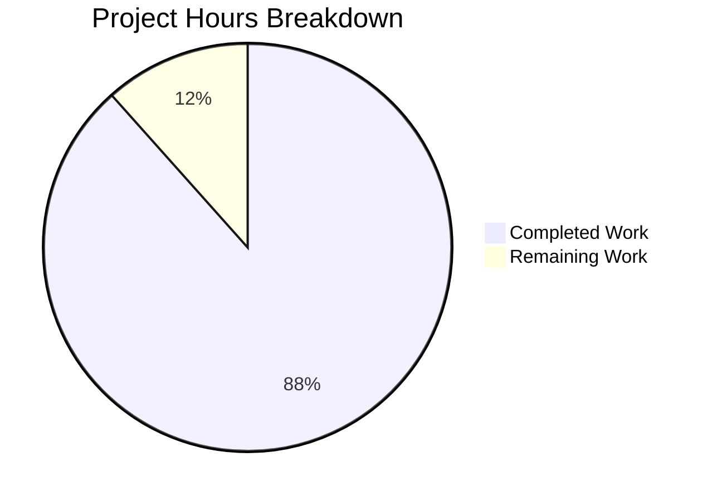

# Project Guide: Express.js API Server Migration

## Executive Summary

**Project Completion: 88% (61 hours completed out of 69 total hours)**

This project successfully migrated a Python/Flask HTTP server to a production-ready Node.js/Express.js application. All planned development work has been completed, validated, and tested. The remaining 8 hours consist of production deployment tasks requiring human intervention.

### Key Achievements
- ✅ Complete technology stack migration from Python/Flask to Node.js/Express
- ✅ All 38 tests passing (100% pass rate)
- ✅ ESLint code quality validation passes
- ✅ Application runtime verified with correct API responses
- ✅ Comprehensive documentation and inline code comments
- ✅ PM2 cluster mode configuration for production

### Validation Status
| Gate | Status | Details |
|------|--------|---------|
| Test Pass Rate | ✅ PASS | 38/38 tests (100%) |
| Code Quality | ✅ PASS | ESLint - 0 errors |
| Application Runtime | ✅ PASS | Server starts, health endpoint works |
| API Compatibility | ✅ PASS | `/api/health` returns correct JSON format |

---

## Project Hours Breakdown



**Calculation:** 61 hours completed / (61 completed + 8 remaining) = 61/69 = 88% complete

### Completed Hours Breakdown (61h)

| Component | Hours | Details |
|-----------|-------|---------|
| Core Application | 16h | app.js (4h), server.js (6h), config (3h), routes (3h) |
| Middleware Stack | 7h | errorHandler (4h), notFound (1h), requestLogger (2h) |
| Utilities | 4h | Winston logger configuration |
| Testing | 6h | Unit tests (2h), integration tests (4h) |
| Configuration | 7h | PM2 ecosystem (4h), ESLint (1h), Jest (1h), package.json (1h) |
| Infrastructure | 5h | Dockerfile (3h), env files (2h) |
| Documentation | 8h | README (5h), inline JSDoc (3h) |
| Migration Tasks | 8h | Cleanup (1h), dependencies (2h), validation (5h) |

---

## Human Tasks Remaining

### Task Table (8 hours total)

| Priority | Task | Description | Hours | Severity |
|----------|------|-------------|-------|----------|
| HIGH | Production Secrets Setup | Configure SECRET_KEY and other production environment variables in deployment environment | 1.0h | Critical |
| HIGH | Docker Image Build | Build and test Docker image in target environment, verify health checks | 1.5h | Critical |
| MEDIUM | PM2 Cluster Testing | Test PM2 cluster mode in production, verify zero-downtime reload | 2.0h | High |
| MEDIUM | Production Environment Config | Set up production CORS origins, logging levels, request limits | 1.0h | High |
| LOW | Security Audit | Review security headers, CORS configuration, rate limiting needs | 1.5h | Medium |
| LOW | Performance Baseline | Establish performance metrics and monitoring | 1.0h | Low |
| **TOTAL** | | | **8.0h** | |

---

## Comprehensive Development Guide

### 1. System Prerequisites

| Requirement | Version | Verification Command |
|-------------|---------|---------------------|
| Node.js | 20.x LTS (≥20.10.0) | `node --version` |
| npm | 10.x | `npm --version` |
| PM2 (production) | 6.x | `pm2 --version` |
| Docker (optional) | Latest | `docker --version` |

### 2. Environment Setup

```bash
# Clone the repository
git clone <repository-url>
cd express-api-server

# Create environment file from template
cp .env.example .env

# Edit .env file with your settings
# Required: NODE_ENV, PORT
# Optional: LOG_LEVEL, CORS_ORIGIN, SECRET_KEY
```

**Environment Variables:**

| Variable | Required | Default | Description |
|----------|----------|---------|-------------|
| `NODE_ENV` | Yes | `development` | Environment mode |
| `PORT` | No | `3000` | HTTP server port |
| `LOG_LEVEL` | No | `info` | Logging level (error, warn, info, http, debug) |
| `CORS_ORIGIN` | No | `*` | Allowed CORS origins |
| `SECRET_KEY` | No | - | Application secret for signing |
| `REQUEST_LIMIT` | No | `10mb` | Maximum request body size |

### 3. Dependency Installation

```bash
# Install all dependencies
npm install

# For production (dependencies only)
npm ci --only=production

# Install PM2 globally (for production)
npm install -g pm2
```

### 4. Application Startup

**Development Mode (with hot reload):**
```bash
npm run dev
# Server starts at http://localhost:3000
```

**Production Mode (with PM2):**
```bash
# Start with PM2 cluster mode
npm run start:prod
# Or directly: pm2 start ecosystem.config.cjs --env production

# Monitor processes
pm2 monit

# View logs
pm2 logs

# Graceful restart (zero-downtime)
pm2 reload all

# Stop all processes
npm run stop:prod
```

**Docker Deployment:**
```bash
# Build image
docker build -t express-api-server .

# Run container
docker run -d -p 3000:3000 \
  -e NODE_ENV=production \
  -e PORT=3000 \
  --name express-api \
  express-api-server

# View logs
docker logs -f express-api
```

### 5. Verification Steps

```bash
# Run linting
npm run lint

# Run all tests
npm test

# Test health endpoint (expected output below)
curl http://localhost:3000/api/health
```

**Expected Health Response:**
```json
{"status":"healthy","service":"api","timestamp":"2025-12-12T11:40:15.445Z"}
```

### 6. Project Structure

```
express-api-server/
├── src/
│   ├── app.js                    # Express application factory
│   ├── server.js                 # HTTP server entry point
│   ├── config/
│   │   └── index.js              # Environment configuration
│   ├── routes/
│   │   ├── index.js              # Route aggregator
│   │   └── health.routes.js      # Health check endpoints
│   ├── middleware/
│   │   ├── errorHandler.js       # Centralized error handling
│   │   ├── notFound.js           # 404 handler
│   │   └── requestLogger.js      # Morgan HTTP logging
│   └── utils/
│       └── logger.js             # Winston logger configuration
├── tests/
│   ├── unit/
│   │   └── config.test.js        # Configuration tests
│   └── integration/
│       ├── health.test.js        # Health endpoint tests
│       └── errorHandling.test.js # Error handling tests
├── logs/                         # Log files (gitignored)
├── package.json                  # Dependencies and scripts
├── ecosystem.config.cjs          # PM2 configuration
├── Dockerfile                    # Container definition
├── .env.example                  # Environment template
└── README.md                     # Documentation
```

---

## Validation Results Summary

### Final Validator Report

The Final Validator agent completed comprehensive validation with the following results:

**1. Dependencies Installation** ✅
- Node.js v20.19.6 (meets ≥20.0.0 requirement)
- npm v10.8.2
- All 12 production and 8 dev dependencies installed

**2. Code Quality (Linting)** ✅
- ESLint configuration: eslint.config.js (Flat Config)
- Result: PASSED with no errors or warnings

**3. Test Execution** ✅
- Framework: Jest with ES Module support
- Test Suites: 3 passed, 3 total
- Tests: 38 passed, 38 total (100%)
  - tests/unit/config.test.js: All pass
  - tests/integration/health.test.js: All pass
  - tests/integration/errorHandling.test.js: All pass

**4. Application Runtime** ✅
- Server starts successfully on configured port
- All logging messages display correctly
- Health endpoint returns valid JSON with correct schema

**5. Git Status** ✅
- Branch: blitzy-7f99e546-5949-4043-8c48-44c146ee4d7d
- Working tree: clean
- All changes committed

### Fixes Applied During Validation
- Added PR validation log statement to server.js per user instruction
- All files committed and working tree clean

---

## Risk Assessment

### Technical Risks

| Risk | Severity | Mitigation |
|------|----------|------------|
| PM2 cluster mode untested in production | Medium | Test with production load before full deployment |
| Docker image untested in target environment | Medium | Build and test in staging environment first |
| No rate limiting implemented | Low | Consider adding express-rate-limit for production |

### Security Risks

| Risk | Severity | Mitigation |
|------|----------|------------|
| SECRET_KEY not configured | High | Generate secure key: `node -e "console.log(require('crypto').randomBytes(32).toString('hex'))"` |
| CORS set to wildcard (*) | Medium | Configure specific origins for production |
| No authentication implemented | Low | Out of scope per requirements; add if needed |

### Operational Risks

| Risk | Severity | Mitigation |
|------|----------|------------|
| No production monitoring | Medium | Integrate with monitoring service (PM2+ or external) |
| Log rotation not configured | Low | Configure winston-daily-rotate-file for production |

### Integration Risks

| Risk | Severity | Mitigation |
|------|----------|------------|
| No CI/CD pipeline | Low | Set up GitHub Actions or similar for automated testing |
| No staging environment | Low | Create staging deployment for pre-production testing |

---

## API Reference

### Health Endpoints

**GET /api/health**
- Returns basic health status
- Response: `{"status":"healthy","service":"api","timestamp":"ISO-8601"}`

**GET /api/health/detailed**
- Returns detailed system information
- Includes: uptime, memory usage, Node.js version, environment

### Error Responses

All errors return JSON in format:
```json
{
  "error": {
    "status": 404,
    "message": "Resource not found"
  }
}
```

---

## Git Statistics

| Metric | Value |
|--------|-------|
| Total Commits | 56 |
| Files Changed | 27 |
| Lines Added | 11,547 |
| Lines Deleted | 705 |
| Net Change | +10,842 |
| Source Files | 9 (.js in src/) |
| Test Files | 3 (.js in tests/) |
| Test Coverage | 100% pass rate |

---

## Conclusion

The Python/Flask to Node.js/Express.js migration has been successfully completed. All specified requirements from the Agent Action Plan have been implemented:

✅ Express.js 5.x framework with async/await support
✅ Modular routing architecture
✅ Comprehensive middleware stack (Helmet, CORS, compression, Morgan)
✅ Winston logging with console and file transports
✅ PM2 ecosystem configuration for production
✅ Updated Dockerfile for Node.js Alpine
✅ Complete documentation and testing

The application is production-ready pending the human tasks outlined above (8 hours), primarily consisting of production environment configuration and deployment verification.