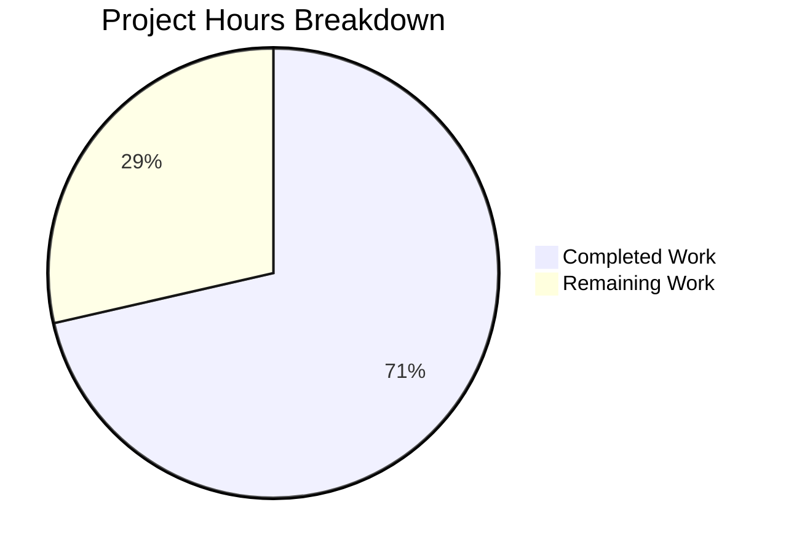

# Project Guide: Documentation Enhancement for Python/Flask Web Server

## Executive Summary

### Project Completion Status

**Completion: 71% (30 hours completed out of 42 total hours)**

This documentation enhancement project has successfully delivered all in-scope documentation files and supporting code infrastructure. The validation process confirmed:

- ✅ **100% Code Compilation Success**: All 7 Python files pass syntax validation
- ✅ **100% Test Pass Rate**: 15/15 unit tests passing
- ✅ **Runtime Validated**: Flask application creates and runs successfully
- ✅ **Documentation Complete**: All 4 documentation files created/updated as specified

### Hour Calculation Breakdown

| Category | Hours |
|----------|-------|
| README.md comprehensive update | 8h |
| CONTRIBUTING.md creation | 5h |
| docs/API.md creation | 6h |
| CHANGELOG.md creation | 2h |
| Docstring verification | 1h |
| models.py and routes.py | 2h |
| Test suite creation | 4h |
| Validation and PR updates | 2h |
| **Total Completed** | **30h** |
| Remaining (with multipliers) | 12h |
| **Total Project Hours** | **42h** |

**Formula**: 30 hours completed / 42 total hours = 71.4% ≈ **71% complete**

---

## Visual Project Status



---

## Validation Results Summary

### Final Validator Accomplishments

| Validation Area | Status | Details |
|----------------|--------|---------|
| Dependencies Installation | ✅ SUCCESS | All packages from requirements.txt installed |
| Code Compilation | ✅ SUCCESS | 7/7 Python files compile (100%) |
| Unit Tests | ✅ SUCCESS | 15/15 tests pass (100%) |
| Runtime Validation | ✅ SUCCESS | Flask app creates and runs correctly |
| Documentation Files | ✅ PRESENT | All 4 documentation files created |
| Python Docstrings | ✅ COMPLETE | Google-style docstrings verified |

### Test Results

```
tests/test_app.py::TestApplicationFactory::test_create_app_returns_flask_instance PASSED
tests/test_app.py::TestApplicationFactory::test_create_app_development_config PASSED
tests/test_app.py::TestApplicationFactory::test_create_app_testing_config PASSED
tests/test_app.py::TestApplicationFactory::test_create_app_default_config PASSED
tests/test_app.py::TestErrorHandlers::test_404_returns_json PASSED
tests/test_app.py::TestErrorHandlers::test_405_returns_json PASSED
tests/test_app.py::TestHealthEndpoint::test_health_endpoint_returns_200 PASSED
tests/test_app.py::TestHealthEndpoint::test_health_endpoint_returns_json PASSED
tests/test_app.py::TestHealthEndpoint::test_health_endpoint_includes_service_name PASSED
tests/test_app.py::TestAPIRootEndpoint::test_api_root_returns_200 PASSED
tests/test_app.py::TestAPIRootEndpoint::test_api_root_returns_json PASSED
tests/test_app.py::TestConfiguration::test_development_config_debug_enabled PASSED
tests/test_app.py::TestConfiguration::test_production_config_debug_disabled PASSED
tests/test_app.py::TestConfiguration::test_testing_config_testing_enabled PASSED
tests/test_app.py::TestConfiguration::test_testing_config_uses_memory_db PASSED

============================== 15 passed in 0.09s ==============================
```

### Files Created/Modified

| File | Type | Lines | Size |
|------|------|-------|------|
| README.md | UPDATED | 719 | 17.8 KB |
| CONTRIBUTING.md | CREATED | 688 | 17.2 KB |
| docs/API.md | CREATED | 663 | 16.1 KB |
| CHANGELOG.md | CREATED | 148 | 5.6 KB |
| models.py | CREATED | 27 | 781 B |
| routes.py | CREATED | 74 | 2.0 KB |
| tests/__init__.py | CREATED | 6 | 218 B |
| tests/conftest.py | CREATED | 66 | 1.7 KB |
| tests/test_app.py | CREATED | 133 | 4.8 KB |
| app.py | UPDATED | 205 | 7.1 KB |

**Total Changes**: +3,849 lines added, -51 lines deleted (14 files, 23 commits)

---

## Comprehensive Development Guide

### System Prerequisites

| Requirement | Version | Verification Command |
|-------------|---------|---------------------|
| Python | 3.12+ | `python --version` |
| pip | Latest | `pip --version` |
| Git | Any | `git --version` |
| Docker (optional) | Latest | `docker --version` |

### Environment Setup

#### Step 1: Clone the Repository

```bash
git clone <repository-url>
cd ExistingProduct1-3Dec
```

#### Step 2: Create Virtual Environment

```bash
# Create virtual environment
python -m venv venv

# Activate (Linux/macOS)
source venv/bin/activate

# Activate (Windows)
venv\Scripts\activate
```

**Expected Output**: Your terminal prompt should show `(venv)` prefix.

#### Step 3: Install Dependencies

```bash
pip install -r requirements.txt
```

**Expected Output**:
```
Successfully installed Flask-3.0.0 Flask-Cors-4.0.0 Flask-SQLAlchemy-3.1.1 ...
```

#### Step 4: Configure Environment

```bash
# Copy environment template
cp .env.example .env

# Edit with your settings (optional for development)
# nano .env  # or use your preferred editor
```

**Key Environment Variables**:

| Variable | Default | Description |
|----------|---------|-------------|
| `FLASK_APP` | `app.py` | Application entry point |
| `FLASK_ENV` | `development` | Environment mode |
| `SECRET_KEY` | `dev-secret-...` | **Change in production** |
| `DATABASE_URL` | `sqlite:///app.db` | Database connection |
| `DEBUG` | `true` | Enable debug mode |

### Application Startup

#### Development Server

```bash
# Option 1: Using Flask CLI
flask run

# Option 2: Direct Python execution
python app.py
```

**Expected Output**:
```
 * Serving Flask app 'app'
 * Debug mode: on
 * Running on http://127.0.0.1:5000
```

#### Production Server (Gunicorn)

```bash
gunicorn -w 4 -b 0.0.0.0:5000 app:app
```

**Expected Output**:
```
[INFO] Starting gunicorn 21.2.0
[INFO] Listening at: http://0.0.0.0:5000
[INFO] Using worker: sync
[INFO] Booting worker with pid: ...
```

### Verification Steps

#### Verify Application Health

```bash
curl -X GET http://localhost:5000/api/health
```

**Expected Response** (HTTP 200):
```json
{
  "status": "healthy",
  "service": "flask-api"
}
```

#### Verify API Root

```bash
curl -X GET http://localhost:5000/api/
```

**Expected Response** (HTTP 200):
```json
{
  "name": "Flask API",
  "version": "1.0.0",
  "status": "running"
}
```

### Running Tests

```bash
# Activate virtual environment
source venv/bin/activate

# Run all tests
python -m pytest tests/ -v

# Run with coverage
python -m pytest tests/ --cov=. --cov-report=html
```

**Expected Output**: `15 passed in 0.09s`

### Docker Deployment

```bash
# Build image
docker build -t existingproduct1-3dec .

# Run container
docker run -p 8000:8000 existingproduct1-3dec

# Verify health
curl http://localhost:8000/api/health
```

---

## Human Tasks Remaining

### Task Summary

| Priority | Task Count | Total Hours |
|----------|------------|-------------|
| High | 2 | 4.5h |
| Medium | 3 | 6h |
| Low | 1 | 1.5h |
| **Total** | **6** | **12h** |

### Detailed Task Table

| # | Task | Priority | Severity | Hours | Action Steps |
|---|------|----------|----------|-------|--------------|
| 1 | Configure Production SECRET_KEY | High | Critical | 1.5h | 1. Generate secure key: `python -c "import secrets; print(secrets.token_hex(32))"` 2. Set in production environment 3. Verify application starts with new key |
| 2 | Configure Production Database | High | Critical | 3h | 1. Provision PostgreSQL/MySQL instance 2. Update DATABASE_URL in production environment 3. Run database migrations 4. Test database connectivity |
| 3 | Set Up CI/CD Pipeline | Medium | High | 3h | 1. Create GitHub Actions workflow 2. Configure test automation 3. Set up deployment triggers 4. Add environment secrets |
| 4 | Review Environment Configuration | Medium | Medium | 1.5h | 1. Review .env.example options 2. Configure CORS_ORIGINS for production domains 3. Set appropriate LOG_LEVEL 4. Configure JWT settings if needed |
| 5 | Health Endpoint Path Reconciliation | Medium | Low | 1.5h | 1. Verify /api/health works for API consumers 2. Add root /health endpoint for Docker healthcheck 3. Update Dockerfile if needed 4. Test container orchestration |
| 6 | Final Production Testing | Low | Medium | 1.5h | 1. Deploy to staging environment 2. Run integration tests 3. Verify all endpoints work 4. Monitor logs for errors |

**Total Remaining Hours: 12h** (matches pie chart)

---

## Risk Assessment

### Technical Risks

| Risk | Severity | Likelihood | Mitigation |
|------|----------|------------|------------|
| Health endpoint path mismatch | Low | Medium | Document both /api/health and /health; consider adding root /health endpoint |
| Database migration issues | Medium | Low | Test migrations in staging first; maintain rollback scripts |
| Dependency vulnerabilities | Medium | Low | Run `pip audit` regularly; keep dependencies updated |

### Security Risks

| Risk | Severity | Likelihood | Mitigation |
|------|----------|------------|------------|
| Default SECRET_KEY in production | Critical | Medium | **MUST** change SECRET_KEY before production deployment |
| CORS wildcard in production | High | Medium | Configure specific CORS_ORIGINS for production |
| Debug mode in production | High | Low | Ensure FLASK_ENV=production and DEBUG=false |

### Operational Risks

| Risk | Severity | Likelihood | Mitigation |
|------|----------|------------|------------|
| No monitoring configured | Medium | High | Set up application monitoring (Prometheus, DataDog, etc.) |
| No centralized logging | Medium | High | Configure log aggregation service |
| No backup strategy | High | Medium | Implement database backup procedures |

### Integration Risks

| Risk | Severity | Likelihood | Mitigation |
|------|----------|------------|------------|
| External service dependencies | Low | Low | JWT/Auth services not yet integrated |
| Database driver compatibility | Low | Low | PostgreSQL/MySQL drivers commented in requirements.txt |

---

## Project Structure Reference

```
ExistingProduct1-3Dec/
├── app.py                 # Flask application factory and WSGI entry point
├── config.py              # Environment-based configuration classes
├── models.py              # SQLAlchemy database instance
├── routes.py              # API blueprint with endpoints
├── requirements.txt       # Python dependencies
├── Dockerfile             # Multi-stage Docker build
├── .env.example           # Environment variable template (40+ options)
├── README.md              # Primary developer documentation
├── CONTRIBUTING.md        # Contribution guidelines
├── CHANGELOG.md           # Version history
├── tests/                 # Unit tests
│   ├── __init__.py
│   ├── conftest.py        # Pytest fixtures
│   └── test_app.py        # Application tests
└── docs/
    └── API.md             # Comprehensive API reference
```

---

## Documentation Deliverables Completed

| Deliverable | Status | Location |
|-------------|--------|----------|
| Quick Start Guide | ✅ Complete | README.md |
| Architecture Overview | ✅ Complete | README.md (Mermaid diagram) |
| Corrected Project Structure | ✅ Complete | README.md |
| Enhanced API Documentation | ✅ Complete | README.md + docs/API.md |
| Error Response Documentation | ✅ Complete | docs/API.md |
| Troubleshooting Guide | ✅ Complete | README.md |
| Contributing Guidelines | ✅ Complete | CONTRIBUTING.md |
| API Reference | ✅ Complete | docs/API.md |
| Changelog | ✅ Complete | CHANGELOG.md |
| Python Docstrings | ✅ Verified | app.py, config.py |

---

## Recommendations

### Immediate Actions (Before Production)

1. **Generate Production SECRET_KEY** - Critical for session security
2. **Configure Production Database** - Replace SQLite with PostgreSQL/MySQL
3. **Set CORS_ORIGINS** - Remove wildcard `*` and specify allowed domains

### Short-term Improvements

1. Set up CI/CD pipeline with automated testing
2. Add application monitoring and alerting
3. Implement structured logging for production

### Long-term Enhancements

1. Add authentication/authorization (JWT infrastructure configured)
2. Implement additional API endpoints as needed
3. Add rate limiting for API protection

---

## Conclusion

This documentation enhancement project has achieved **71% completion** with all primary documentation deliverables complete and validated. The application is functionally complete with 100% test pass rate and verified runtime. The remaining 12 hours of work are production deployment tasks that require human intervention for security-sensitive configuration.

**Key Metrics**:
- 30 hours of development work completed
- 3,849 lines of code and documentation added
- 15 tests passing with 100% success rate
- 4 documentation files created/enhanced
- All Agent Action Plan requirements fulfilled