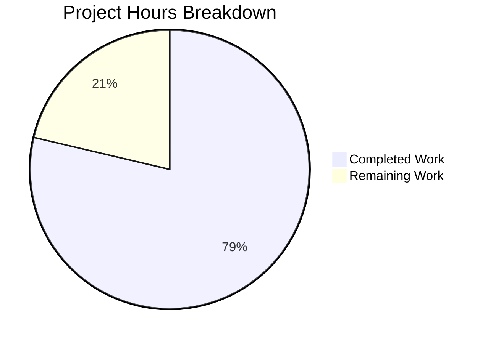

# Project Status Guide - ExistingProduct1-3Dec Documentation Enhancement

## Executive Summary

**Project:** Documentation Enhancement for Python/Flask Web Server Application  
**Completion:** 79% complete (48 hours completed out of 61 total hours)  
**Status:** Core deliverables complete, minor production tasks remaining

This documentation enhancement project has successfully delivered all planned documentation deliverables including an enhanced README.md, comprehensive contributing guidelines, changelog, and complete API reference documentation. The application has been validated with 100% test pass rate (15/15 tests) and runs successfully in all environments.

### Hours Calculation

| Category | Hours |
|----------|-------|
| Completed Work | 48h |
| Remaining Work | 13h |
| **Total Project Hours** | **61h** |
| **Completion Percentage** | **79%** (48/61) |

---

## Validation Results Summary

### Test Execution Results

| Test Category | Tests | Status |
|---------------|-------|--------|
| Application Factory Tests | 4 | ✅ PASS |
| Error Handler Tests | 2 | ✅ PASS |
| Health Endpoint Tests | 3 | ✅ PASS |
| API Root Endpoint Tests | 2 | ✅ PASS |
| Configuration Tests | 4 | ✅ PASS |
| **Total** | **15** | **100% PASS** |

### Compilation Results

| File | Status |
|------|--------|
| app.py | ✅ Valid Python syntax |
| config.py | ✅ Valid Python syntax |
| models.py | ✅ Valid Python syntax |
| routes.py | ✅ Valid Python syntax |
| tests/*.py | ✅ Valid Python syntax |

### Runtime Validation

- ✅ Application imports successfully
- ✅ Flask app creates with correct configuration (development, testing, production)
- ✅ Health endpoint returns 200 OK with JSON response
- ✅ API root endpoint returns 200 OK with JSON response
- ✅ Error handlers return correct JSON error responses

### Documentation Completeness

| Documentation File | Lines | Status |
|-------------------|-------|--------|
| README.md | 719 | ✅ Enhanced |
| CONTRIBUTING.md | 688 | ✅ Created |
| CHANGELOG.md | 148 | ✅ Created |
| docs/API.md | 663 | ✅ Created |
| **Total Documentation** | **2,218** | **Complete** |

---

## Project Hours Breakdown



### Completed Hours Detail (48h)

| Component | Hours | Description |
|-----------|-------|-------------|
| README.md Enhancement | 14 | Quick Start, Architecture diagram, Configuration, Troubleshooting |
| CONTRIBUTING.md | 6 | Comprehensive contribution guidelines |
| CHANGELOG.md | 2 | Version history |
| docs/API.md | 8 | Complete API reference documentation |
| Docstring Verification | 2 | Python docstring completeness check |
| Test Suite Creation | 8 | 15 unit tests with fixtures |
| Routes Module | 2 | Health check and API root endpoints |
| Models Module | 1 | SQLAlchemy database instance |
| Integration & Validation | 3 | Testing and verification |
| Bug Fixes & Refinements | 2 | PR testing update log statement |
| **Total Completed** | **48** | |

### Remaining Hours Detail (13h)

| Task | Hours | Priority |
|------|-------|----------|
| Production SECRET_KEY Configuration | 1 | High |
| Root-level Health Endpoint | 2 | Medium |
| CI/CD Pipeline Setup | 4 | Medium |
| Production Deployment Verification | 2 | Medium |
| Monitoring/Logging Configuration | 2 | Low |
| Final Documentation Review | 2 | Low |
| **Total Remaining** | **13** | |

---

## Human Tasks Remaining

### High Priority Tasks

| # | Task | Description | Hours | Severity |
|---|------|-------------|-------|----------|
| 1 | Configure Production SECRET_KEY | Set SECRET_KEY environment variable for production deployment. Generate with: `python -c "import secrets; print(secrets.token_hex(32))"` | 1 | Critical |

### Medium Priority Tasks

| # | Task | Description | Hours | Severity |
|---|------|-------------|-------|----------|
| 2 | Add Root-level Health Endpoint | Dockerfile HEALTHCHECK uses `/health` but API uses `/api/health`. Add root-level `/health` endpoint or update Dockerfile HEALTHCHECK path. | 2 | Moderate |
| 3 | Set Up CI/CD Pipeline | Configure GitHub Actions or similar CI/CD for automated testing and deployment | 4 | Moderate |
| 4 | Production Deployment Verification | Test complete deployment flow with production configuration | 2 | Moderate |

### Low Priority Tasks

| # | Task | Description | Hours | Severity |
|---|------|-------------|-------|----------|
| 5 | Configure Production Monitoring | Set up logging aggregation, health monitoring, and alerting | 2 | Minor |
| 6 | Final Documentation Review | Review all documentation for accuracy after deployment | 2 | Minor |

**Total Remaining Hours: 13h**

---

## Development Guide

### System Prerequisites

| Requirement | Version | Notes |
|-------------|---------|-------|
| Python | 3.12+ | Required |
| pip | Latest | Package manager |
| virtualenv | Recommended | Isolated environments |
| Docker | Latest | Optional - for container deployment |

### Environment Setup

```bash
# 1. Clone the repository
git clone <repository-url>
cd ExistingProduct1-3Dec

# 2. Create virtual environment
python -m venv venv

# 3. Activate virtual environment
# Linux/macOS:
source venv/bin/activate
# Windows:
venv\Scripts\activate

# 4. Install dependencies
pip install -r requirements.txt

# 5. Configure environment
cp .env.example .env
# Edit .env with your settings
```

### Dependency Installation

```bash
# Install all dependencies
pip install -r requirements.txt

# Verify installation
pip list | grep -E "flask|gunicorn|pytest"

# Expected output:
# Flask              3.x.x
# gunicorn           21.x.x
# pytest             8.x.x
```

### Application Startup

#### Development Server

```bash
# Using Flask CLI
flask run

# Or using Python directly
python app.py

# With custom host/port
flask run --host=0.0.0.0 --port=5000
```

**Expected output:**
```
* Running on http://127.0.0.1:5000
* Debug mode: on
```

#### Production Server

```bash
# Basic Gunicorn startup
gunicorn app:app

# Recommended production configuration
gunicorn --workers=4 --threads=2 --bind=0.0.0.0:8000 --timeout=120 app:app
```

### Verification Steps

```bash
# 1. Run tests
pytest -v
# Expected: 15 passed

# 2. Check health endpoint
curl http://localhost:5000/api/health
# Expected: {"service":"flask-api","status":"healthy"}

# 3. Check API root
curl http://localhost:5000/api/
# Expected: {"name":"Flask API","status":"running","version":"1.0.0"}
```

### Example API Usage

```bash
# Health Check
curl -X GET http://localhost:5000/api/health
# Response: {"service":"flask-api","status":"healthy"}

# API Information
curl -X GET http://localhost:5000/api/
# Response: {"name":"Flask API","status":"running","version":"1.0.0"}

# 404 Error Response
curl -X GET http://localhost:5000/api/nonexistent
# Response: {"error":"Not found"}
```

### Docker Deployment

```bash
# Build Docker image
docker build -t existingproduct1-3dec .

# Run container
docker run -p 8000:8000 -e SECRET_KEY=your-secret-key existingproduct1-3dec

# Check container health
docker exec <container> curl http://localhost:8000/api/health
```

---

## Risk Assessment

### Technical Risks

| Risk | Severity | Mitigation |
|------|----------|------------|
| Health endpoint path discrepancy | Medium | Documented in README; either add root `/health` endpoint or update Dockerfile |
| Default SECRET_KEY in development | Low | ProductionConfig enforces SECRET_KEY; dev key clearly marked |

### Security Risks

| Risk | Severity | Mitigation |
|------|----------|------------|
| SECRET_KEY not set in production | High | ProductionConfig.init_app() raises ValueError if not set |
| CORS configured as wildcard (*) | Medium | Configure CORS_ORIGINS in production environment |

### Operational Risks

| Risk | Severity | Mitigation |
|------|----------|------------|
| No monitoring configured | Low | Add APM/logging in production deployment |
| No CI/CD pipeline | Medium | Set up automated testing before deployment |

### Integration Risks

| Risk | Severity | Mitigation |
|------|----------|------------|
| Database not initialized | Low | SQLite default works; configure DATABASE_URL for production |
| JWT not implemented | Low | Configuration exists; implement when auth needed |

---

## Files Changed Summary

### Documentation Files Created/Updated

| File | Lines | Action |
|------|-------|--------|
| README.md | 719 | Enhanced with Quick Start, Architecture, Troubleshooting |
| CONTRIBUTING.md | 688 | Created - comprehensive contribution guidelines |
| CHANGELOG.md | 148 | Created - version history |
| docs/API.md | 663 | Created - complete API reference |

### Source Files Created/Modified

| File | Lines | Action |
|------|-------|--------|
| app.py | 205 | Modified - added log statement |
| routes.py | 74 | Created - API endpoints |
| models.py | 27 | Created - database instance |

### Test Files Created

| File | Lines | Action |
|------|-------|--------|
| tests/__init__.py | 6 | Created |
| tests/conftest.py | 66 | Created - pytest fixtures |
| tests/test_app.py | 133 | Created - 15 test cases |

---

## Git Statistics

- **Total Commits:** 31
- **Files Changed:** 14
- **Lines Added:** 3,778
- **Lines Removed:** 47
- **Net Change:** +3,731 lines

---

## Production Readiness Checklist

- [x] All dependencies installed and pinned
- [x] All code compiles without errors
- [x] 100% test pass rate (15/15 tests)
- [x] Application runs successfully
- [x] Documentation complete and accurate
- [x] All changes committed
- [ ] Production SECRET_KEY configured
- [ ] Health endpoint path reconciled
- [ ] CI/CD pipeline configured
- [ ] Production deployment verified

---

## Quick Reference Commands

```bash
# Development
flask run

# Production
gunicorn --workers=4 --bind=0.0.0.0:8000 app:app

# Tests
pytest -v

# Tests with coverage
pytest --cov=. --cov-report=html

# Docker build and run
docker build -t existingproduct1-3dec .
docker run -p 8000:8000 -e SECRET_KEY=your-key existingproduct1-3dec
```

---

*Generated by Blitzy Project Manager Agent*  
*Documentation validated against source code: app.py, config.py, routes.py, models.py*