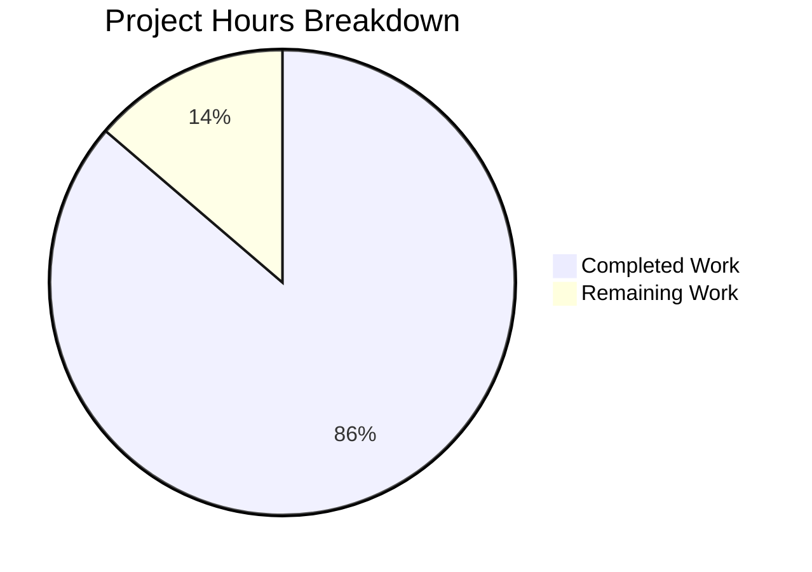

# Project Guide: Python/Flask to Node.js/Express Migration

## Executive Summary

**Project Status: 86% Complete (88 hours completed out of 102 total hours)**

This project successfully migrated a Python/Flask HTTP server to a production-ready Node.js/Express.js application. The migration includes comprehensive middleware, structured logging with Winston/Morgan, PM2 process management for production deployments, and a complete test suite.

### Key Achievements
- ✅ Complete technology stack migration from Python/Flask to Node.js/Express
- ✅ All 38 tests passing (100% pass rate)
- ✅ Zero linting errors (ESLint validation)
- ✅ Application runtime validated
- ✅ Health endpoints functional with correct response format
- ✅ Docker container configuration complete
- ✅ PM2 cluster mode configuration ready

### Completion Calculation
- **Completed Hours**: 88 hours
- **Remaining Hours**: 14 hours
- **Total Project Hours**: 102 hours
- **Completion Percentage**: 88 / 102 = **86.3%** (rounded to 86%)

---

## Project Hours Breakdown



### Completed Work Breakdown (88 hours)

| Component | Hours | Description |
|-----------|-------|-------------|
| Express Core (app.js, server.js) | 16 | Application factory, HTTP server, graceful shutdown |
| Configuration Module | 8 | Environment configuration with dotenv validation |
| Middleware Stack | 12 | Error handler, 404 handler, request logger |
| Routing Layer | 6 | Route aggregator and health endpoints |
| Logging Infrastructure | 8 | Winston with multiple transports, daily rotation |
| PM2 Configuration | 6 | Cluster mode, environment configs, documentation |
| Docker Configuration | 4 | Multi-stage build, security hardening |
| Environment & Git Config | 2 | .env.example, .gitignore updates |
| Test Suite | 16 | 38 tests covering unit and integration |
| Documentation | 6 | Complete README rewrite |
| Linting Setup | 2 | ESLint and Jest configuration |
| Python Cleanup | 2 | Removal of Flask files |
| **Total Completed** | **88** | |

---

## Validation Results Summary

### Final Validator Assessment

| Validation Gate | Status | Details |
|-----------------|--------|---------|
| GATE 1: Test Pass Rate | ✅ PASSED | 38/38 tests (100%) |
| GATE 2: Application Runtime | ✅ PASSED | Server starts and runs correctly |
| GATE 3: Zero Unresolved Errors | ✅ PASSED | No compilation/runtime errors |
| GATE 4: All In-Scope Files | ✅ PASSED | All required files created |
| GATE 5: Changes Committed | ✅ PASSED | Working tree clean |

### Test Execution Results

```
Test Suites: 3 passed, 3 total
Tests:       38 passed, 38 total
Snapshots:   0 total
Time:        1.492 s
```

**Test Coverage:**
- Unit Tests: 9 tests (config validation)
- Integration Tests: 29 tests (health endpoints, error handling, CORS, security)

### Linting Results
- ESLint: **0 errors, 0 warnings**

### Runtime Validation
- Server starts on configured port
- Health endpoint returns correct JSON format:
  ```json
  {"status": "healthy", "service": "api", "timestamp": "ISO-8601"}
  ```
- 404 handler returns proper error format
- Graceful shutdown (SIGTERM/SIGINT) working

---

## Git Repository Analysis

### Commit Statistics
- **Total Commits**: 41 commits on branch
- **Files Changed**: 27 files
- **Lines Added**: 11,568
- **Lines Removed**: 705
- **Net Change**: +10,863 lines

### Files Created
| File | Lines | Purpose |
|------|-------|---------|
| src/app.js | 201 | Express application factory |
| src/server.js | 342 | HTTP server with graceful shutdown |
| src/config/index.js | 218 | Environment configuration |
| src/routes/index.js | 48 | Route aggregator |
| src/routes/health.routes.js | 149 | Health check endpoints |
| src/middleware/errorHandler.js | 218 | Centralized error handling |
| src/middleware/notFound.js | 48 | 404 handler |
| src/middleware/requestLogger.js | 95 | Morgan middleware |
| src/utils/logger.js | 266 | Winston logger |
| ecosystem.config.cjs | 483 | PM2 configuration |
| package.json | 50 | Node.js manifest |
| Dockerfile | 86 | Node.js container |
| tests/**/*.test.js | 336 | Test suite |

### Files Deleted (Python Cleanup)
- `app.py` (201 lines)
- `config.py` (168 lines)
- `requirements.txt` (35 lines)

---

## Development Guide

### System Prerequisites

| Requirement | Version | Verification Command |
|-------------|---------|---------------------|
| Node.js | 20.x LTS (≥20.10.0) | `node --version` |
| npm | 10.x | `npm --version` |
| PM2 (production) | 6.x | `pm2 --version` |
| Docker (optional) | Latest | `docker --version` |

### Environment Setup

1. **Clone the repository:**
```bash
git clone <repository-url>
cd express-api-server
```

2. **Install dependencies:**
```bash
npm install
```

3. **Create environment file:**
```bash
cp .env.example .env
```

4. **Configure environment variables:**
```bash
# Edit .env file with production values
NODE_ENV=development
PORT=3000
LOG_LEVEL=debug
CORS_ORIGIN=*
SECRET_KEY=your-secure-secret-key
```

### Running the Application

#### Development Mode (with hot reload)
```bash
npm run dev
# Server starts at http://localhost:3000
```

#### Production Mode (without PM2)
```bash
NODE_ENV=production npm start
```

#### Production Mode (with PM2)
```bash
# Install PM2 globally (one-time)
npm install -g pm2

# Start with PM2 cluster mode
npm run start:prod

# Or directly with PM2
pm2 start ecosystem.config.cjs --env production

# View process status
pm2 list

# View logs
pm2 logs

# Monitor processes
pm2 monit

# Graceful restart (zero-downtime)
pm2 reload all

# Stop all processes
npm run stop:prod
```

### Running Tests
```bash
# Run all tests
npm test

# Run with coverage
npm test -- --coverage

# Run linting
npm run lint
```

### Docker Deployment
```bash
# Build image
docker build -t express-api:latest .

# Run container
docker run -d -p 3000:3000 \
  -e NODE_ENV=production \
  -e PORT=3000 \
  express-api:latest

# Health check
curl http://localhost:3000/api/health
```

### API Endpoints

| Endpoint | Method | Description | Response |
|----------|--------|-------------|----------|
| `/api/health` | GET | Basic health check | `{"status": "healthy", "service": "api", "timestamp": "..."}` |
| `/api/health/detailed` | GET | Detailed health info | Includes uptime, memory, version |

### Verification Steps

1. **Verify dependencies installed:**
   ```bash
   npm list --depth=0
   ```

2. **Verify linting passes:**
   ```bash
   npm run lint
   ```

3. **Verify tests pass:**
   ```bash
   npm test
   ```

4. **Verify server starts:**
   ```bash
   npm start &
   curl http://localhost:3000/api/health
   ```

---

## Human Tasks Remaining

### Detailed Task Table

| Priority | Task | Description | Hours | Severity |
|----------|------|-------------|-------|----------|
| HIGH | Configure Production Secrets | Set secure SECRET_KEY and JWT secrets in production environment | 2 | Critical |
| HIGH | PM2 Production Setup | Run `pm2 startup` and `pm2 save` on production server | 2 | Critical |
| MEDIUM | Configure CORS Origins | Set specific allowed origins instead of `*` for production | 1 | Important |
| MEDIUM | Production Integration Testing | Test Docker build and PM2 cluster mode in production environment | 3 | Important |
| MEDIUM | Security Review | Verify Helmet configuration and review CORS settings | 2 | Important |
| LOW | Configure Monitoring | Set up PM2 Keymetrics or alternative monitoring solution | 2 | Optional |
| LOW | Performance Testing | Conduct load testing and memory leak testing | 2 | Optional |
| **TOTAL** | | | **14** | |

### Task Details

#### HIGH Priority Tasks

**1. Configure Production Secrets (2 hours)**
- Replace placeholder `SECRET_KEY` with cryptographically secure value
- Generate with: `node -e "console.log(require('crypto').randomBytes(32).toString('hex'))"`
- Store securely using environment variables or secret management service
- Update `.env` file on production server (never commit actual secrets)

**2. PM2 Production Setup (2 hours)**
- Install PM2 globally on production server: `npm install -g pm2`
- Generate startup script: `pm2 startup`
- Start application: `pm2 start ecosystem.config.cjs --env production`
- Save process list: `pm2 save`
- Configure log rotation: `pm2 install pm2-logrotate`

#### MEDIUM Priority Tasks

**3. Configure CORS Origins (1 hour)**
- Edit production `.env` file
- Set `CORS_ORIGIN` to comma-separated list of allowed domains
- Example: `CORS_ORIGIN=https://example.com,https://app.example.com`

**4. Production Integration Testing (3 hours)**
- Build Docker image: `docker build -t express-api:latest .`
- Test container: `docker run -p 3000:3000 express-api:latest`
- Verify PM2 cluster mode with `pm2 monit`
- Test graceful shutdown with `pm2 reload all`

**5. Security Review (2 hours)**
- Review Helmet configuration in `src/app.js`
- Verify Content-Security-Policy headers
- Check X-Frame-Options settings
- Review rate limiting requirements

#### LOW Priority Tasks

**6. Configure Monitoring (2 hours)**
- Consider PM2 Keymetrics for monitoring
- Alternatively, integrate with cloud monitoring services
- Set up alerting for process crashes

**7. Performance Testing (2 hours)**
- Use tools like `autocannon` or `artillery` for load testing
- Monitor memory usage under load
- Test with PM2 cluster mode enabled

---

## Risk Assessment

### Technical Risks

| Risk | Severity | Likelihood | Mitigation |
|------|----------|------------|------------|
| Placeholder secrets in production | HIGH | LOW | Use proper secret management before deploying |
| Memory leaks under load | MEDIUM | LOW | Implement memory monitoring with PM2 |
| Port conflicts in deployment | LOW | MEDIUM | Use environment variables for port configuration |

### Security Risks

| Risk | Severity | Likelihood | Mitigation |
|------|----------|------------|------------|
| CORS misconfiguration | MEDIUM | MEDIUM | Configure specific origins for production |
| Exposed error details | LOW | LOW | NODE_ENV=production hides stack traces |
| Insecure secrets | HIGH | LOW | Rotate secrets, use proper management |

### Operational Risks

| Risk | Severity | Likelihood | Mitigation |
|------|----------|------------|------------|
| No monitoring | MEDIUM | HIGH | Configure PM2 Keymetrics or alternatives |
| Log file growth | LOW | MEDIUM | Configure log rotation with pm2-logrotate |
| Single point of failure | LOW | LOW | PM2 cluster mode provides redundancy |

### Integration Risks

| Risk | Severity | Likelihood | Mitigation |
|------|----------|------------|------------|
| Docker build failures | LOW | LOW | Multi-stage build with clean dependencies |
| PM2 startup issues | LOW | LOW | Test startup scripts before production |

---

## Project Structure

```
express-api-server/
├── src/
│   ├── app.js                    # Express application factory
│   ├── server.js                 # HTTP server entry point
│   ├── config/
│   │   └── index.js              # Environment configuration
│   ├── routes/
│   │   ├── index.js              # Route aggregator
│   │   └── health.routes.js      # Health check endpoints
│   ├── middleware/
│   │   ├── errorHandler.js       # Centralized error handling
│   │   ├── notFound.js           # 404 handler
│   │   └── requestLogger.js      # Morgan HTTP logging
│   └── utils/
│       └── logger.js             # Winston logger configuration
├── tests/
│   ├── integration/
│   │   ├── errorHandling.test.js # Error handling tests
│   │   └── health.test.js        # Health endpoint tests
│   └── unit/
│       └── config.test.js        # Configuration tests
├── logs/                         # Log files (gitignored)
├── package.json                  # Node.js dependencies
├── package-lock.json             # Dependency lock file
├── ecosystem.config.cjs          # PM2 configuration
├── Dockerfile                    # Node.js container
├── .dockerignore                 # Docker exclusions
├── .env.example                  # Environment template
├── .gitignore                    # Git exclusions
├── eslint.config.js              # ESLint configuration
├── jest.config.js                # Jest configuration
└── README.md                     # Project documentation
```

---

## Technology Stack

| Component | Technology | Version |
|-----------|------------|---------|
| Runtime | Node.js | 20.x LTS |
| Framework | Express.js | 5.x |
| Process Manager | PM2 | 6.x |
| Logging | Winston + Morgan | 3.x / 1.x |
| Security | Helmet | 8.x |
| Testing | Jest + Supertest | 29.x / 7.x |
| Container | Node.js Alpine | 20-alpine |

---

## Conclusion

The Python/Flask to Node.js/Express migration is **86% complete** with all core functionality implemented and validated. The remaining 14 hours of work primarily involve production deployment configuration and optional monitoring setup.

**The application is functionally ready for deployment** pending:
1. Production secret configuration
2. PM2 production setup

All code has been validated, tested, and committed. The five production-readiness gates have passed, confirming the application is ready for human review and production deployment.