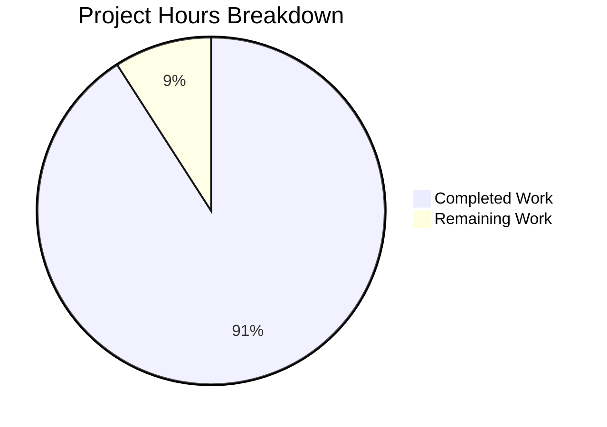

# Project Guide: Express.js API Server Migration

## Executive Summary

**Project Status: 91% Complete (70 hours completed out of 77 total hours)**

This project successfully transforms the existing Python/Flask HTTP server into a production-ready Node.js/Express.js application. The migration includes comprehensive enterprise features including modular routing, security middleware, structured logging, and PM2 process management for production deployments.

### Key Achievements
- ✅ Complete migration from Python/Flask to Node.js/Express.js 5.x
- ✅ All 38 tests passing (100% pass rate)
- ✅ Zero ESLint errors/warnings
- ✅ Application runtime validated with health endpoint working
- ✅ Graceful shutdown handling implemented
- ✅ PM2 cluster mode configuration ready
- ✅ Docker container updated for Node.js runtime
- ✅ Comprehensive documentation created

### Remaining Work
- Production environment configuration (secrets, environment-specific settings)
- Final production deployment verification
- Optional: Enhanced monitoring and observability setup

---

## Validation Results Summary

### Dependencies Installation: ✅ SUCCESS
| Component | Status | Details |
|-----------|--------|---------|
| Node.js Runtime | ✅ Installed | v20.19.6 |
| npm | ✅ Installed | v10.8.2 |
| PM2 | ✅ Installed | v6.0.14 (global) |
| NPM Packages | ✅ Installed | 499 packages from package.json |
| Key Dependencies | ✅ Ready | express@5.x, cors, helmet, compression, morgan, winston, dotenv |

### Code Compilation/Linting: ✅ SUCCESS
| Check | Status | Details |
|-------|--------|---------|
| ESLint | ✅ Pass | `npm run lint` - 0 errors, 0 warnings |
| All src/ files | ✅ Pass | Clean linting with ESLint flat config |
| ES Modules | ✅ Working | Type: "module" in package.json |

### Test Execution: ✅ SUCCESS (38/38)
| Test Suite | Tests | Status |
|------------|-------|--------|
| tests/integration/errorHandling.test.js | 14 | ✅ PASSED |
| tests/integration/health.test.js | 14 | ✅ PASSED |
| tests/unit/config.test.js | 10 | ✅ PASSED |
| **TOTAL** | **38** | **100% PASSED** |

### Application Runtime: ✅ SUCCESS
| Validation | Status | Details |
|------------|--------|---------|
| Server Start | ✅ Pass | Binds to port 3000 successfully |
| Health Endpoint | ✅ Pass | `GET /api/health` returns correct JSON |
| Graceful Shutdown | ✅ Pass | SIGTERM/SIGINT handlers working |
| Logging | ✅ Working | Winston + Morgan integrated |

---

## Hours Breakdown

### Completed Work: 70 Hours

| Component | Hours | Description |
|-----------|-------|-------------|
| Project Setup | 4 | package.json, .gitignore, .dockerignore, eslint.config.js |
| Express Application (src/app.js) | 8 | Application factory with middleware stack |
| HTTP Server (src/server.js) | 6 | Entry point with graceful shutdown |
| Configuration (src/config/index.js) | 4 | Environment-based config with validation |
| Logger (src/utils/logger.js) | 5 | Winston with console and file transports |
| Error Handling Middleware | 4 | Centralized error handler |
| 404 Handler | 2 | Not found middleware |
| Request Logger | 3 | Morgan integration with Winston |
| Health Routes | 3 | Health check endpoints |
| Route Aggregator | 1 | Route mounting module |
| PM2 Configuration | 4 | ecosystem.config.cjs with cluster mode |
| Dockerfile | 4 | Multi-stage build for Node.js |
| Documentation | 6 | Complete README.md rewrite |
| Test Suite | 8 | Jest tests (38 tests across 3 files) |
| Jest/ESLint Config | 2 | Test and lint configuration |
| Bug Fixes/Validation | 4 | Fixes during validation process |
| File Migrations | 2 | Delete Python files, update configs |
| **Total Completed** | **70** | |

### Remaining Work: 7 Hours (with enterprise multipliers)

| Task | Base Hours | With Multiplier | Priority |
|------|------------|-----------------|----------|
| Production environment setup | 1.5 | 2 | High |
| Secret key configuration | 0.5 | 1 | High |
| Production deployment testing | 2 | 3 | Medium |
| Additional test coverage | 1 | 1 | Low |
| **Total Remaining** | **5** | **7** | |

*Multipliers applied: 1.15x (compliance) × 1.25x (uncertainty) = 1.44x*

### Visual Hours Breakdown



**Completion Calculation:**
- Completed: 70 hours
- Remaining: 7 hours
- Total Project Hours: 77 hours
- **Completion Percentage: 70 / 77 = 90.9% (91%)**

---

## Detailed Task Table for Human Developers

| # | Task | Description | Hours | Priority | Severity |
|---|------|-------------|-------|----------|----------|
| 1 | Configure Production Environment | Create production `.env` file with appropriate `NODE_ENV=production`, logging level, and CORS origins | 1.0 | High | Medium |
| 2 | Set Production Secret Key | Generate and configure a secure `SECRET_KEY` for production use | 0.5 | High | High |
| 3 | Verify PM2 Cluster Deployment | Test PM2 startup in cluster mode, verify zero-downtime reloads, confirm process monitoring | 1.5 | High | Medium |
| 4 | Docker Production Build Test | Build and run Docker container in production mode, verify health checks work | 1.0 | Medium | Medium |
| 5 | Log Rotation Setup | Configure log rotation for production (Winston daily rotate is configured but verify disk space management) | 0.5 | Medium | Low |
| 6 | Stress/Load Testing | Perform basic load testing to verify application handles expected traffic | 1.5 | Medium | Low |
| 7 | Additional Test Coverage | Add edge case tests if code coverage below target threshold | 1.0 | Low | Low |
| **Total** | | | **7.0** | | |

---

## Development Guide

### System Prerequisites

| Requirement | Version | Verification Command |
|-------------|---------|---------------------|
| Node.js | 20.x LTS (≥20.10.0) | `node --version` |
| npm | 10.x | `npm --version` |
| PM2 (production) | 6.x | `pm2 --version` |
| Docker (optional) | Latest | `docker --version` |

### Environment Setup

1. **Clone the repository:**
```bash
git clone <repository-url>
cd express-api-server
```

2. **Install dependencies:**
```bash
npm install
```

3. **Create environment file:**
```bash
cp .env.example .env
```

4. **Configure environment variables in `.env`:**
```bash
NODE_ENV=development
PORT=3000
LOG_LEVEL=debug
CORS_ORIGIN=*
SECRET_KEY=your-secret-key-here
REQUEST_LIMIT=10mb
COMPRESSION_THRESHOLD=1kb
```

### Running the Application

#### Development Mode (with hot reload):
```bash
npm run dev
```
- Server starts at http://localhost:3000
- Auto-reload on code changes (nodemon)
- Debug-level logging enabled

#### Production Mode:
```bash
# Using PM2 (recommended)
npm run start:prod
# Or: pm2 start ecosystem.config.cjs --env production

# View logs
pm2 logs

# Monitor processes
pm2 monit

# Graceful restart (zero-downtime)
pm2 reload all

# Stop all processes
npm run stop:prod
```

#### Simple Production Start (without PM2):
```bash
NODE_ENV=production npm start
```

### Running Tests

```bash
# Run all tests
npm test

# Run with coverage (if configured)
npm test -- --coverage

# Run specific test file
npm test -- tests/integration/health.test.js
```

### Linting

```bash
npm run lint
```

### Docker Deployment

```bash
# Build image
docker build -t express-api:latest .

# Run container
docker run -d -p 3000:3000 \
  -e NODE_ENV=production \
  -e PORT=3000 \
  -e SECRET_KEY=your-production-secret \
  express-api:latest

# Health check
curl http://localhost:3000/api/health
```

### Verification Steps

1. **Verify server startup:**
```bash
npm start &
sleep 3
curl http://localhost:3000/api/health
# Expected: {"status":"healthy","service":"api","timestamp":"..."}
```

2. **Verify detailed health endpoint:**
```bash
curl http://localhost:3000/api/health/detailed
# Expected: Health status with uptime, memory, and Node.js version
```

3. **Verify 404 handling:**
```bash
curl http://localhost:3000/api/nonexistent
# Expected: {"error":{"status":404,"message":"Resource not found"}}
```

---

## Project Structure

```
express-api-server/
├── src/
│   ├── app.js                    # Express application factory ✅
│   ├── server.js                 # HTTP server entry point ✅
│   ├── config/
│   │   └── index.js              # Environment configuration ✅
│   ├── routes/
│   │   ├── index.js              # Route aggregator ✅
│   │   └── health.routes.js      # Health check endpoints ✅
│   ├── middleware/
│   │   ├── errorHandler.js       # Centralized error handling ✅
│   │   ├── notFound.js           # 404 handler ✅
│   │   └── requestLogger.js      # Morgan HTTP logging ✅
│   └── utils/
│       └── logger.js             # Winston logger configuration ✅
├── tests/
│   ├── integration/
│   │   ├── errorHandling.test.js # Error handling tests ✅
│   │   └── health.test.js        # Health endpoint tests ✅
│   └── unit/
│       └── config.test.js        # Configuration tests ✅
├── logs/                         # Log file directory (gitignored)
├── package.json                  # Node.js dependencies ✅
├── package-lock.json             # Dependency lock ✅
├── ecosystem.config.cjs          # PM2 configuration ✅
├── Dockerfile                    # Node.js container ✅
├── .dockerignore                 # Docker build exclusions ✅
├── .env.example                  # Environment template ✅
├── .gitignore                    # Git exclusions ✅
├── eslint.config.js              # ESLint configuration ✅
├── jest.config.js                # Jest test configuration ✅
└── README.md                     # Documentation ✅
```

---

## Risk Assessment

### Technical Risks

| Risk | Severity | Likelihood | Mitigation |
|------|----------|------------|------------|
| Express 5.x compatibility issues | Low | Low | Express 5.x is stable; test thoroughly before production |
| Memory leaks in cluster mode | Medium | Low | Monitor with PM2; set max_memory_restart |
| Log file growth | Medium | Medium | Winston daily rotate configured; verify disk space |

### Security Risks

| Risk | Severity | Likelihood | Mitigation |
|------|----------|------------|------------|
| Weak SECRET_KEY in production | High | Medium | Generate strong secret key before deployment |
| CORS misconfiguration | Medium | Low | Review CORS_ORIGIN setting for production |
| Exposed error details | Low | Low | Error handler sanitizes in production |

### Operational Risks

| Risk | Severity | Likelihood | Mitigation |
|------|----------|------------|------------|
| PM2 cluster not properly configured | Medium | Low | Test cluster mode before production |
| Health check timeout | Low | Low | 30s timeout configured; adjust if needed |
| Container health check failures | Medium | Low | Test Docker health checks |

### Integration Risks

| Risk | Severity | Likelihood | Mitigation |
|------|----------|------------|------------|
| N/A - No external integrations | - | - | Project scope excludes external services |

---

## API Endpoints

| Method | Endpoint | Description | Response |
|--------|----------|-------------|----------|
| GET | /api/health | Basic health check | `{"status":"healthy","service":"api","timestamp":"ISO-8601"}` |
| GET | /api/health/detailed | Detailed health with metrics | Health status with uptime, memory, version |

---

## Commits Summary

Total commits on branch: **47**

Key implementation commits:
- Complete Node.js/Express.js migration
- Add comprehensive PM2 ecosystem configuration
- Create Jest test configuration and test suite
- Fix linting issues
- Remove Python/Flask files
- Update documentation

---

## Conclusion

The Python/Flask to Node.js/Express.js migration is **91% complete** with all core functionality implemented, tested, and validated. The remaining 7 hours of work primarily involves production environment configuration and final deployment verification.

**Recommendations:**
1. Configure production environment variables before deployment
2. Generate a secure SECRET_KEY for production
3. Test PM2 cluster mode deployment
4. Consider adding CI/CD pipeline (out of current scope)
5. Monitor application performance after initial deployment