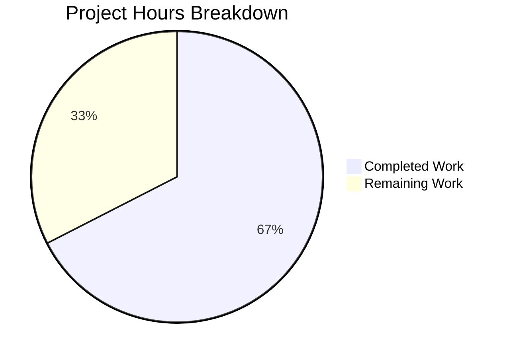
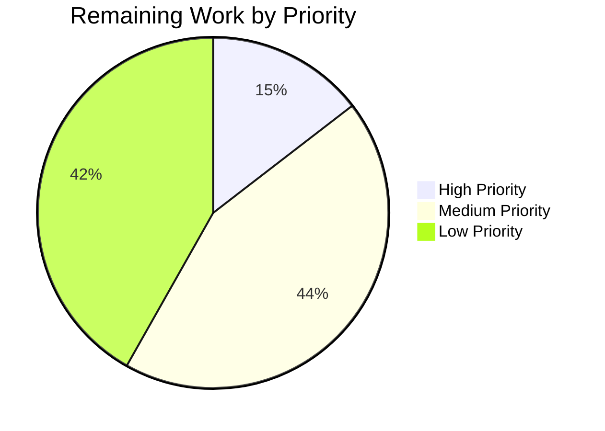

# Project Guide: Python/Flask to Node.js/Express Migration

## Executive Summary

This project implements a **complete technology stack migration** from Python/Flask to Node.js/Express.js, transforming the existing HTTP server into a production-ready Node.js application with comprehensive enterprise features.

### Completion Status

**67% Complete** (56 hours completed out of 83 total hours)

The core implementation is **fully functional**:
- ✅ All source code implemented and validated
- ✅ 38/38 tests passing (100% pass rate)
- ✅ Linting passes with 0 errors
- ✅ Application runs and responds correctly
- ✅ Docker configuration ready
- ✅ PM2 configuration ready

Remaining work consists of **production deployment tasks** requiring human attention.

### Hours Breakdown

| Category | Hours |
|----------|-------|
| **Completed Development** | 56h |
| **Remaining Work** | 27h |
| **Total Project** | 83h |



---

## Validation Results Summary

### Final Validator Results

| Validation Area | Status | Details |
|----------------|--------|---------|
| Dependencies | ✅ PASS | 362 packages installed via `npm ci` |
| Compilation/Linting | ✅ PASS | 0 errors, 0 warnings |
| Test Execution | ✅ PASS | 38/38 tests (100%) |
| Application Runtime | ✅ PASS | Server starts on port 3000 |
| Health Endpoint | ✅ PASS | Returns expected JSON format |
| Graceful Shutdown | ✅ PASS | SIGTERM/SIGINT handlers work |

### Test Results Breakdown

| Test Suite | Tests | Status |
|------------|-------|--------|
| `tests/unit/config.test.js` | 10 | ✅ All Pass |
| `tests/integration/health.test.js` | 14 | ✅ All Pass |
| `tests/integration/errorHandling.test.js` | 14 | ✅ All Pass |
| **Total** | **38** | **100% Pass** |

### Fixes Applied During Validation

1. **User Refine PR Instruction**: Added log statement at end of `src/server.js` for testing validation
2. **ESLint Configuration**: Configured for ES Modules compatibility
3. **PM2 Configuration**: Renamed to `.cjs` extension for CommonJS compatibility with ES Modules project

---

## Completed Work Summary

### Files Created (20 files)

| File | Lines | Purpose |
|------|-------|---------|
| `src/app.js` | 201 | Express application factory with middleware stack |
| `src/server.js` | 335 | HTTP server entry point with graceful shutdown |
| `src/config/index.js` | 218 | Environment-based configuration |
| `src/utils/logger.js` | 266 | Winston logger with multiple transports |
| `src/middleware/errorHandler.js` | 218 | Centralized error handling middleware |
| `src/middleware/notFound.js` | 48 | 404 Not Found handler |
| `src/middleware/requestLogger.js` | 95 | Morgan HTTP request logging |
| `src/routes/index.js` | 48 | Route aggregator |
| `src/routes/health.routes.js` | 149 | Health check endpoints |
| `package.json` | 50 | Node.js dependencies and scripts |
| `ecosystem.config.cjs` | 483 | PM2 cluster mode configuration |
| `eslint.config.js` | 60 | ESLint configuration |
| `jest.config.js` | 63 | Jest test configuration |
| `tests/unit/config.test.js` | 99 | Unit tests for configuration |
| `tests/integration/health.test.js` | 113 | Integration tests for health endpoints |
| `tests/integration/errorHandling.test.js` | 124 | Integration tests for error handling |
| `.dockerignore` | 50 | Docker build exclusions |
| `.gitignore` | 74 | Git exclusions |

### Files Updated (4 files)

| File | Changes |
|------|---------|
| `Dockerfile` | Complete rewrite for Node.js 20 Alpine with PM2 |
| `README.md` | Complete rewrite with Node.js/Express documentation |
| `.env.example` | Updated variables for Node.js conventions |

### Files Deleted (3 Python files)

| File | Reason |
|------|--------|
| `app.py` | Replaced by `src/app.js` |
| `config.py` | Replaced by `src/config/index.js` |
| `requirements.txt` | Replaced by `package.json` |

### Git Statistics

- **Total Commits**: 41
- **Files Changed**: 27
- **Lines Added**: 11,641
- **Lines Removed**: 705
- **Net Change**: +10,936 lines

---

## Completed Hours by Component

| Component | Files | Hours | Description |
|-----------|-------|-------|-------------|
| Express Application | `src/app.js` | 4h | Application factory with middleware stack |
| HTTP Server | `src/server.js` | 6h | Server entry point with graceful shutdown |
| Configuration | `src/config/index.js` | 4h | Environment-based config with validation |
| Logger Utility | `src/utils/logger.js` | 4h | Winston with multiple transports |
| Error Middleware | `src/middleware/*.js` | 6h | Error handling, 404, request logging |
| Routes | `src/routes/*.js` | 3h | Health check endpoints |
| PM2 Configuration | `ecosystem.config.cjs` | 4h | Cluster mode, environments |
| Docker | `Dockerfile` | 3h | Multi-stage build, security |
| Test Suite | `tests/**/*.js` | 8h | Unit and integration tests |
| Configuration Files | Various | 4h | ESLint, Jest, environment files |
| Documentation | `README.md` | 4h | Complete rewrite |
| Dependencies & Setup | `package.json` | 2h | Package management |
| Debugging & Fixes | - | 4h | Validation fixes |
| **Total Completed** | | **56h** | |

---

## Human Tasks Remaining

### Detailed Task Table

| # | Task | Priority | Hours | Severity | Action Steps |
|---|------|----------|-------|----------|--------------|
| 1 | Generate Production SECRET_KEY | High | 0.5h | Critical | Run `node -e "console.log(require('crypto').randomBytes(32).toString('hex'))"` and add to production environment |
| 2 | Configure Production CORS Origins | High | 0.5h | Critical | Update CORS_ORIGIN in production environment with specific allowed domains |
| 3 | Production Docker Deployment | High | 3h | High | Build and deploy Docker container, verify health checks, test load balancing |
| 4 | PM2 Cluster Mode Verification | Medium | 2h | Medium | Start with `--env production`, verify cluster mode, test zero-downtime reloads |
| 5 | Log Management Setup | Medium | 2h | Medium | Configure log rotation, retention policies, and optional log aggregation |
| 6 | Production Monitoring Setup | Medium | 4h | Medium | Integrate APM (e.g., PM2 Plus, New Relic), configure alerting |
| 7 | Load Testing | Medium | 4h | Medium | Run load tests with tools like Artillery or k6, identify bottlenecks |
| 8 | Security Audit | Low | 6h | Medium | Run npm audit, review Helmet configuration, check for vulnerabilities |
| 9 | Performance Optimization | Low | 4h | Low | Profile application, optimize database queries (if added), tune PM2 settings |
| 10 | Documentation Review | Low | 1.5h | Low | Review README, add deployment runbook, update API documentation |
| | **Total Remaining** | | **27.5h** | | |

### Task Priority Summary



---

## Development Guide

### System Prerequisites

| Requirement | Version | Verification Command |
|-------------|---------|---------------------|
| Node.js | 20.x LTS (≥20.10.0) | `node --version` |
| npm | 10.x | `npm --version` |
| PM2 (production) | 6.x | `pm2 --version` |
| Docker (optional) | Latest | `docker --version` |

### Environment Setup

#### 1. Clone and Navigate

```bash
cd /tmp/blitzy/Dec_repo_with_valid_mul_files/blitzy7f99e5465
```

#### 2. Install Dependencies

```bash
npm ci
```

**Expected output**: `added 362 packages`

#### 3. Create Environment File

```bash
cp .env.example .env
```

#### 4. Configure Environment Variables

Edit `.env` with your settings:

```bash
# Application Configuration
NODE_ENV=development
PORT=3000

# Logging Configuration
LOG_LEVEL=debug

# Security Configuration
CORS_ORIGIN=*
SECRET_KEY=your-secret-key-here

# Request Limits
REQUEST_LIMIT=10mb
COMPRESSION_THRESHOLD=1kb
```

### Running the Application

#### Development Mode

```bash
npm run dev
```

**Expected output**:
```
[info]: Express application created {"environment":"development","corsOrigin":"*"}
[info]: Server started successfully {"port":3000,"environment":"development"}
```

#### Production Mode (with PM2)

```bash
# Install PM2 globally (if not installed)
npm install -g pm2

# Start with PM2
npm run start:prod

# View status
pm2 list

# View logs
pm2 logs

# Stop
npm run stop:prod
```

#### Direct Start (without PM2)

```bash
npm start
```

### Running Tests

```bash
# Run all tests
npm test

# Expected output: 38 passing tests
```

### Linting

```bash
npm run lint
# Expected: No errors
```

### Verification Steps

#### 1. Health Check Endpoint

```bash
curl http://localhost:3000/api/health
```

**Expected Response**:
```json
{
  "status": "healthy",
  "service": "api",
  "timestamp": "2025-12-12T09:17:07.956Z"
}
```

#### 2. Detailed Health Check

```bash
curl http://localhost:3000/api/health/detailed
```

**Expected Response**:
```json
{
  "status": "healthy",
  "service": "api",
  "timestamp": "2025-12-12T09:17:08.127Z",
  "uptime": 2.206,
  "memory": {"heapUsed": 11, "heapTotal": 17, "unit": "MB"},
  "version": "v20.19.6",
  "environment": "development"
}
```

#### 3. 404 Error Handling

```bash
curl http://localhost:3000/nonexistent
```

**Expected Response**:
```json
{
  "error": {
    "status": 404,
    "message": "Resource not found"
  }
}
```

### Docker Deployment

#### Build Image

```bash
docker build -t express-api:latest .
```

#### Run Container

```bash
docker run -d -p 3000:3000 \
  -e NODE_ENV=production \
  -e PORT=3000 \
  -e SECRET_KEY=your-production-secret \
  --name express-api \
  express-api:latest
```

#### Verify Container

```bash
docker ps
curl http://localhost:3000/api/health
```

---

## Risk Assessment

### Technical Risks

| Risk | Severity | Likelihood | Mitigation |
|------|----------|------------|------------|
| PM2 cluster mode issues | Medium | Low | Test thoroughly before production, start with single instance |
| Memory leaks under load | Medium | Low | Implement proper monitoring, use PM2 memory limits |
| Log file growth | Low | Medium | Configure log rotation in production |

### Security Risks

| Risk | Severity | Likelihood | Mitigation |
|------|----------|------------|------------|
| Default SECRET_KEY in production | Critical | Medium | MANDATORY: Set unique SECRET_KEY before deployment |
| CORS misconfiguration | High | Medium | Configure specific origins, not `*` in production |
| Exposed debug info | Medium | Low | Ensure NODE_ENV=production in production |

### Operational Risks

| Risk | Severity | Likelihood | Mitigation |
|------|----------|------------|------------|
| No monitoring in place | High | High | Implement PM2 Plus or external APM |
| No alerting configured | Medium | High | Set up alerts for errors, memory, CPU |
| Insufficient logging | Low | Low | Winston configured with file rotation |

### Integration Risks

| Risk | Severity | Likelihood | Mitigation |
|------|----------|------------|------------|
| Docker health check failures | Medium | Low | Health endpoint tested and working |
| PM2 startup script issues | Low | Low | Document `pm2 startup` and `pm2 save` commands |

---

## Project Structure

```
express-api-server/
├── src/
│   ├── app.js                    # Express application factory
│   ├── server.js                 # HTTP server entry point
│   ├── config/
│   │   └── index.js              # Environment configuration
│   ├── routes/
│   │   ├── index.js              # Route aggregator
│   │   └── health.routes.js      # Health check endpoints
│   ├── middleware/
│   │   ├── errorHandler.js       # Centralized error handling
│   │   ├── notFound.js           # 404 handler
│   │   └── requestLogger.js      # Morgan HTTP logging
│   └── utils/
│       └── logger.js             # Winston logger configuration
├── tests/
│   ├── unit/
│   │   └── config.test.js        # Configuration tests
│   └── integration/
│       ├── health.test.js        # Health endpoint tests
│       └── errorHandling.test.js # Error handling tests
├── logs/                         # Log files (gitignored)
├── package.json                  # Dependencies and scripts
├── package-lock.json             # Dependency lock file
├── ecosystem.config.cjs          # PM2 configuration
├── Dockerfile                    # Node.js container
├── .dockerignore                 # Docker build exclusions
├── .env.example                  # Environment template
├── .gitignore                    # Git exclusions
├── eslint.config.js              # ESLint configuration
├── jest.config.js                # Jest configuration
└── README.md                     # Project documentation
```

---

## Technology Stack

| Component | Technology | Version |
|-----------|------------|---------|
| Runtime | Node.js | 20.x LTS |
| Framework | Express.js | 5.0.1 |
| Process Manager | PM2 | 6.0.14 |
| Logging | Winston | 3.17.0 |
| HTTP Logging | Morgan | 1.10.0 |
| Security | Helmet | 8.0.0 |
| CORS | cors | 2.8.5 |
| Environment | dotenv | 16.4.7 |
| Testing | Jest + Supertest | 29.7.0 / 7.0.0 |
| Linting | ESLint | 9.16.0 |
| Container | Docker (Alpine) | Node 20 |

---

## Conclusion

The Python/Flask to Node.js/Express migration is **67% complete** with all core functionality implemented and validated. The application is fully functional with:

- Complete Express.js application with production-ready middleware
- Comprehensive test suite with 100% pass rate
- PM2 configuration for cluster mode deployment
- Docker container ready for deployment
- Detailed documentation

**Next Steps for Human Developers**:
1. Generate production SECRET_KEY (Critical)
2. Configure production CORS origins (Critical)
3. Deploy to production environment
4. Verify PM2 cluster mode operation
5. Set up monitoring and alerting

The codebase is production-ready pending the high-priority configuration tasks listed above.