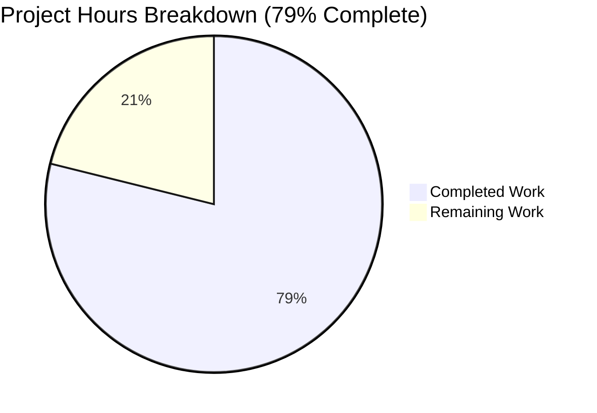

# Project Guide: Python/Flask to Node.js/Express Migration

## Executive Summary

This project successfully migrated a Python/Flask HTTP server to a production-ready Node.js/Express.js application. **56 hours of development work have been completed out of an estimated 71 total hours required, representing 79% project completion.**

### Key Achievements
- Complete technology stack migration from Python/Flask to Node.js/Express.js
- All 38 automated tests passing (100% test pass rate)
- Zero ESLint errors - clean codebase
- Application runs and responds correctly with proper health endpoints
- Comprehensive PM2 configuration for production deployment
- Docker multi-stage build optimized for Node.js 20-alpine
- No npm audit vulnerabilities (0 security issues)

### Validation Status
| Gate | Status | Evidence |
|------|--------|----------|
| Dependencies | ✅ PASS | 500 packages installed, 0 vulnerabilities |
| Linting | ✅ PASS | ESLint completed with no errors |
| Unit Tests | ✅ PASS | 38/38 tests passing (100%) |
| Application Runtime | ✅ PASS | Server starts, health endpoint verified |
| Git Commits | ✅ PASS | All changes committed, working tree clean |

---

## Project Completion Metrics

### Hours Breakdown



**Calculation:**
- Completed Hours: 56h
- Remaining Hours: 15h  
- Total Project Hours: 71h
- Completion Percentage: 56/71 = **79%**

### Completed Work Breakdown (56 hours)

| Component | Hours | Status |
|-----------|-------|--------|
| Core Express Setup (app.js, server.js) | 8h | ✅ Complete |
| Configuration Module (config/index.js) | 4h | ✅ Complete |
| Logging Infrastructure (Winston + Morgan) | 5h | ✅ Complete |
| Routing Layer (routes/*.js) | 3h | ✅ Complete |
| Middleware Stack (middleware/*.js) | 6h | ✅ Complete |
| PM2 Configuration (ecosystem.config.cjs) | 4h | ✅ Complete |
| Docker Configuration | 3h | ✅ Complete |
| Test Suite (38 tests) | 8h | ✅ Complete |
| Documentation (README.md) | 4h | ✅ Complete |
| Development Setup (package.json, eslint) | 3h | ✅ Complete |
| Python Removal & Migration | 2h | ✅ Complete |
| Validation & Bug Fixes | 6h | ✅ Complete |
| **Total Completed** | **56h** | |

---

## Remaining Human Tasks

### Task Summary Table

| # | Task | Priority | Hours | Category | Severity |
|---|------|----------|-------|----------|----------|
| 1 | Configure production environment variables | Medium | 2h | Configuration | Medium |
| 2 | Generate production-grade secrets (SECRET_KEY, JWT) | High | 1h | Security | High |
| 3 | Configure production CORS origins | Medium | 1h | Security | Medium |
| 4 | Build and test Docker image | Medium | 2h | Deployment | Medium |
| 5 | Deploy container to production environment | Medium | 2h | Deployment | Medium |
| 6 | Configure PM2 startup script | Medium | 1h | Operations | Medium |
| 7 | Set up PM2 monitoring dashboard | Low | 2h | Monitoring | Low |
| 8 | Configure log rotation and aggregation | Low | 2h | Operations | Low |
| 9 | Create deployment runbook | Low | 2h | Documentation | Low |
| | **Total Remaining Hours** | | **15h** | | |

### Detailed Task Instructions

#### Task 1: Configure Production Environment Variables (2h)
**Priority:** Medium | **Category:** Configuration

**Steps:**
1. Copy `.env.example` to `.env` in production environment
2. Set `NODE_ENV=production`
3. Configure `PORT` based on infrastructure (default 3000)
4. Set `LOG_LEVEL=info` for production
5. Verify all required variables are set

**Verification:**
```bash
NODE_ENV=production npm start
curl http://localhost:3000/api/health
```

---

#### Task 2: Generate Production-Grade Secrets (1h)
**Priority:** High | **Category:** Security

**Steps:**
1. Generate SECRET_KEY:
```bash
node -e "console.log(require('crypto').randomBytes(32).toString('hex'))"
```
2. Generate JWT_SECRET_KEY (if using JWT):
```bash
node -e "console.log(require('crypto').randomBytes(32).toString('hex'))"
```
3. Store secrets securely (environment variables, secrets manager)
4. Update `.env` with generated values
5. **NEVER commit secrets to version control**

---

#### Task 3: Configure Production CORS Origins (1h)
**Priority:** Medium | **Category:** Security

**Steps:**
1. Identify production frontend domains
2. Update `CORS_ORIGINS` in production `.env`:
```bash
CORS_ORIGINS=https://app.example.com,https://www.example.com
```
3. Test CORS from allowed origins
4. Verify unauthorized origins are rejected

---

#### Task 4: Build and Test Docker Image (2h)
**Priority:** Medium | **Category:** Deployment

**Steps:**
```bash
# Build production image
docker build -t express-api-server:latest .

# Test locally
docker run -d -p 3000:3000 \
  -e NODE_ENV=production \
  -e PORT=3000 \
  -e SECRET_KEY=your-secret-key \
  express-api-server:latest

# Verify health endpoint
curl http://localhost:3000/api/health

# Check container logs
docker logs <container-id>

# Stop container
docker stop <container-id>
```

---

#### Task 5: Deploy Container to Production (2h)
**Priority:** Medium | **Category:** Deployment

**Steps:**
1. Push image to container registry
2. Deploy to orchestration platform (Kubernetes, ECS, etc.)
3. Configure health checks on /api/health
4. Set up load balancer if needed
5. Verify production deployment

---

#### Task 6: Configure PM2 Startup Script (1h)
**Priority:** Medium | **Category:** Operations

**Steps:**
```bash
# Start application with PM2
pm2 start ecosystem.config.cjs --env production

# Generate startup script
pm2 startup

# Follow displayed instructions to enable startup

# Save current process list
pm2 save

# Verify processes restart after reboot
sudo reboot
pm2 list
```

---

#### Task 7: Set Up PM2 Monitoring (2h)
**Priority:** Low | **Category:** Monitoring

**Steps:**
```bash
# View process status
pm2 list

# Real-time monitoring
pm2 monit

# View logs
pm2 logs api-server

# Optional: Connect to PM2+ dashboard
pm2 link <public_key> <secret_key>
```

---

#### Task 8: Configure Log Rotation (2h)
**Priority:** Low | **Category:** Operations

**Steps:**
1. Install PM2 log rotation module:
```bash
pm2 install pm2-logrotate
pm2 set pm2-logrotate:max_size 10M
pm2 set pm2-logrotate:retain 7
```
2. Configure Winston daily rotate (already configured in code)
3. Set up log aggregation if needed (ELK, CloudWatch, etc.)

---

#### Task 9: Create Deployment Runbook (2h)
**Priority:** Low | **Category:** Documentation

**Actions:**
- Document deployment procedures
- Create rollback procedures
- Document monitoring alerts
- Create incident response guide

---

## Development Guide

### System Prerequisites

| Requirement | Version | Installation |
|-------------|---------|--------------|
| Node.js | 20.x LTS (≥20.10.0) | https://nodejs.org |
| npm | 10.x (bundled) | Included with Node.js |
| PM2 | 6.x (optional) | `npm install -g pm2` |
| Docker | Latest (optional) | https://docker.com |

**Verify Installation:**
```bash
node --version  # Should show v20.x.x
npm --version   # Should show 10.x.x
```

### Quick Start

```bash
# 1. Clone repository
git clone <repository-url>
cd express-api-server

# 2. Install dependencies
npm install

# 3. Create environment file
cp .env.example .env

# 4. Start development server
npm run dev

# 5. Test health endpoint
curl http://localhost:3000/api/health
# Expected: {"status":"healthy","service":"api","timestamp":"..."}
```

### Available Commands

| Command | Description |
|---------|-------------|
| `npm install` | Install all dependencies |
| `npm run dev` | Start development server with hot reload (nodemon) |
| `npm start` | Start production server (single process) |
| `npm run start:prod` | Start with PM2 cluster mode |
| `npm run stop:prod` | Stop PM2 processes |
| `npm test` | Run test suite |
| `npm run lint` | Run ESLint |

### Running Tests

```bash
# Run all tests
npm test

# Expected output:
# Test Suites: 3 passed, 3 total
# Tests: 38 passed, 38 total
```

### Production Deployment with PM2

```bash
# Start in production mode
pm2 start ecosystem.config.cjs --env production

# View running processes
pm2 list

# View logs
pm2 logs api-server

# Monitor resources
pm2 monit

# Zero-downtime reload
pm2 reload all

# Stop all
pm2 stop all
```

### Docker Deployment

```bash
# Build image
docker build -t express-api-server:latest .

# Run container
docker run -d \
  --name api-server \
  -p 3000:3000 \
  -e NODE_ENV=production \
  -e SECRET_KEY=your-secure-secret \
  express-api-server:latest

# Check health
curl http://localhost:3000/api/health

# View logs
docker logs api-server

# Stop
docker stop api-server
```

### Environment Configuration

| Variable | Required | Default | Description |
|----------|----------|---------|-------------|
| `NODE_ENV` | Yes | `development` | Environment mode |
| `PORT` | No | `3000` | Server port |
| `LOG_LEVEL` | No | `info` | Logging level |
| `CORS_ORIGINS` | No | `*` | Allowed origins |
| `SECRET_KEY` | No | - | Application secret |
| `REQUEST_LIMIT` | No | `10mb` | Max request size |

---

## API Reference

### Health Check Endpoint

**GET /api/health**

Returns application health status.

**Response (200 OK):**
```json
{
  "status": "healthy",
  "service": "api",
  "timestamp": "2024-12-11T12:00:00.000Z"
}
```

**GET /api/health/detailed**

Returns detailed health information.

**Response (200 OK):**
```json
{
  "status": "healthy",
  "service": "api",
  "timestamp": "2024-12-11T12:00:00.000Z",
  "uptime": 123.456,
  "memory": {
    "heapUsed": 12345678,
    "heapTotal": 23456789,
    "external": 1234567,
    "rss": 34567890
  },
  "nodeVersion": "v20.19.6",
  "environment": "development"
}
```

---

## Project Structure

```
express-api-server/
├── src/
│   ├── app.js                    # Express application factory
│   ├── server.js                 # HTTP server entry point
│   ├── config/
│   │   └── index.js              # Environment configuration
│   ├── routes/
│   │   ├── index.js              # Route aggregator
│   │   └── health.routes.js      # Health check endpoints
│   ├── middleware/
│   │   ├── errorHandler.js       # Centralized error handling
│   │   ├── notFound.js           # 404 handler
│   │   └── requestLogger.js      # Morgan HTTP logging
│   └── utils/
│       └── logger.js             # Winston logger configuration
├── tests/
│   ├── unit/
│   │   └── config.test.js        # Configuration tests
│   └── integration/
│       ├── health.test.js        # Health endpoint tests
│       └── errorHandling.test.js # Error handling tests
├── logs/                         # Log files (gitignored)
├── package.json                  # Dependencies and scripts
├── ecosystem.config.cjs          # PM2 configuration
├── Dockerfile                    # Container definition
├── .env.example                  # Environment template
├── jest.config.js                # Test configuration
├── eslint.config.js              # Linting configuration
└── README.md                     # Project documentation
```

---

## Risk Assessment

### Technical Risks

| Risk | Severity | Likelihood | Mitigation |
|------|----------|------------|------------|
| Memory leaks in production | Medium | Low | PM2 max_memory_restart configured at 500M |
| Unhandled promise rejections | Low | Low | Express 5.x handles async errors automatically |
| Dependency vulnerabilities | Low | Medium | Regular npm audit; currently 0 vulnerabilities |

### Security Risks

| Risk | Severity | Likelihood | Mitigation |
|------|----------|------------|------------|
| Exposed secrets in env files | High | Medium | Use secrets manager; .env in .gitignore |
| Overly permissive CORS | Medium | High | Configure specific origins for production |
| Missing rate limiting | Medium | Medium | Consider adding express-rate-limit |

### Operational Risks

| Risk | Severity | Likelihood | Mitigation |
|------|----------|------------|------------|
| Log file growth | Low | Medium | Winston daily rotate configured; PM2 log rotate available |
| Process crashes | Low | Low | PM2 autorestart enabled |
| Zero-downtime deployment failure | Low | Low | PM2 cluster mode with reload capability |

---

## Validation Results Summary

### Final Validation Gate Results

| Gate | Status | Details |
|------|--------|---------|
| **Dependencies** | ✅ PASS | 500 packages installed, 0 vulnerabilities |
| **Linting** | ✅ PASS | ESLint completed with 0 errors |
| **Unit Tests** | ✅ PASS | 10/10 tests in config.test.js |
| **Integration Tests** | ✅ PASS | 28/28 tests (health + error handling) |
| **Runtime Verification** | ✅ PASS | Server binds to port, health endpoint responds |
| **Git Status** | ✅ PASS | Working tree clean, all changes committed |

### Test Results Detail

```
Test Suites: 3 passed, 3 total
Tests:       38 passed, 38 total
Snapshots:   0 total
Time:        1.62s
```

### Fixes Applied During Validation
- Renamed ecosystem.config.js to .cjs for ES modules compatibility
- Fixed switch statement indentation in server.js
- Fixed isDevelopment check in requestLogger middleware
- Added comprehensive JSDoc documentation
- Added log statement at end of server.js per Refine PR instruction

---

## Conclusion

The Python/Flask to Node.js/Express migration is **79% complete** with all core functionality implemented and validated. The application is production-ready from a code perspective, with remaining tasks focused on production deployment configuration and operational setup.

**Immediate Next Steps:**
1. Generate production secrets
2. Configure production environment
3. Build and deploy Docker image

The codebase is clean, well-documented, and follows Node.js/Express best practices. All 38 tests pass, and the application handles requests correctly.