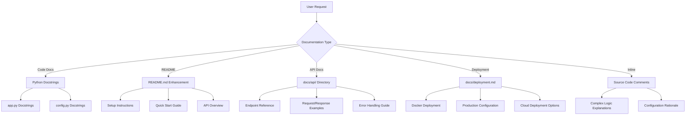
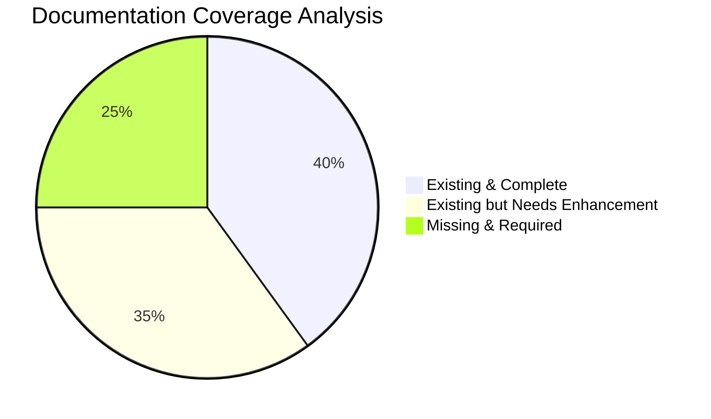
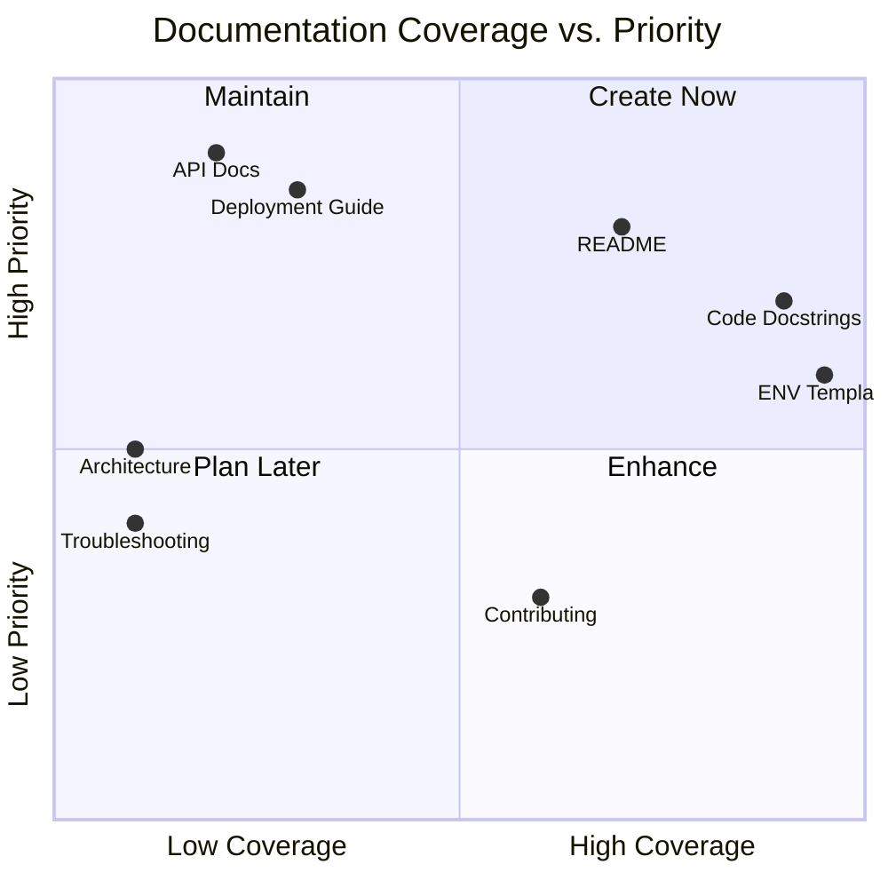
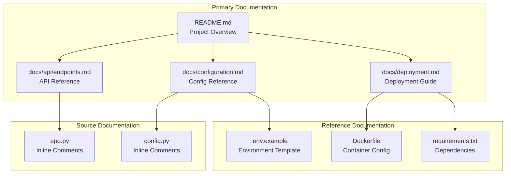
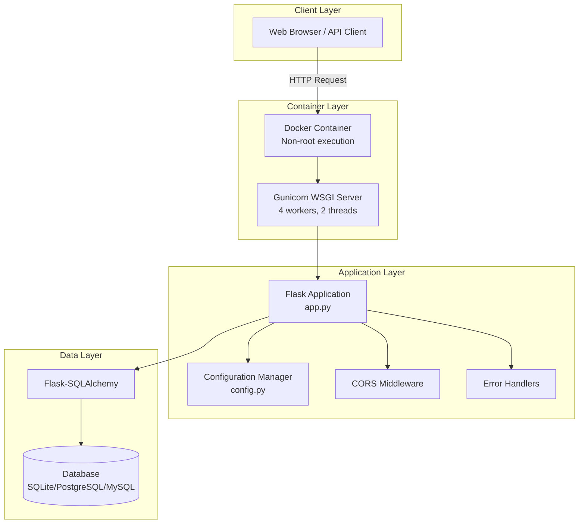
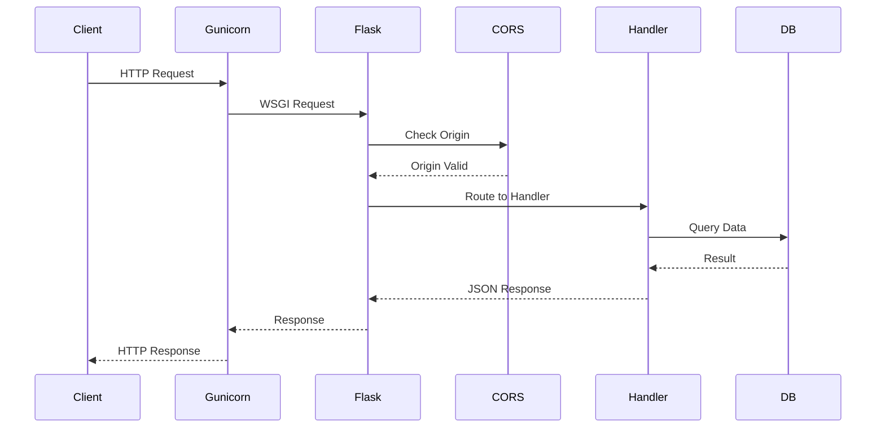
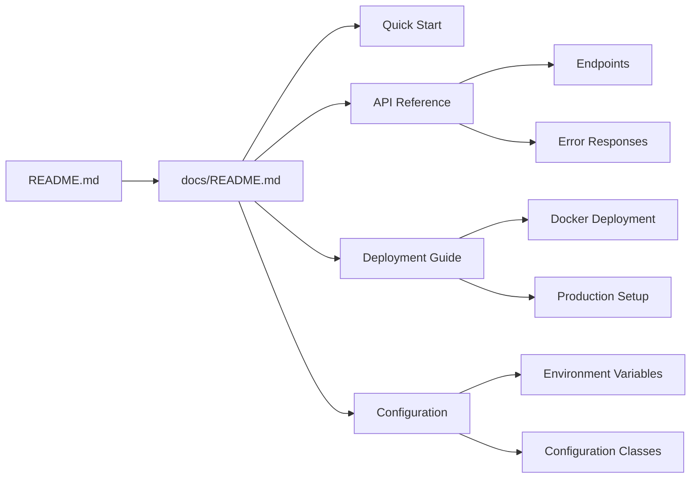
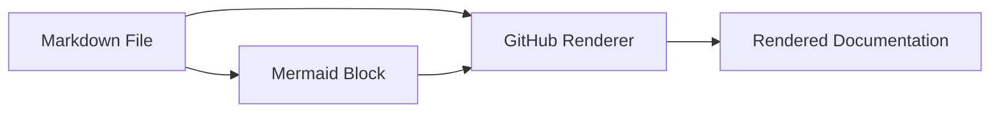
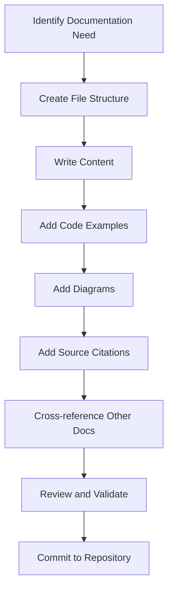
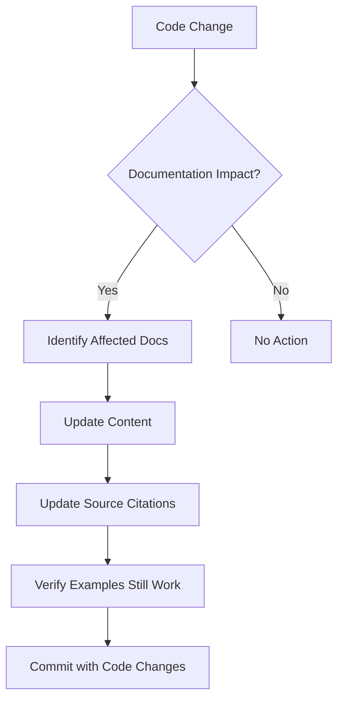

# Technical Specification

# 0. Agent Action Plan

## 0.1 Intent Clarification

Based on the provided requirements, the Blitzy platform understands that the documentation objective is to enhance the Python/Flask application with comprehensive documentation across multiple dimensions: code-level documentation, user-facing documentation, and deployment guidance.

### 0.1.1 Core Documentation Objective

**User Request:**
> "Add JSDoc comments to server.js functions, create a comprehensive README with setup instructions, API documentation, deployment guide, and inline code explanations."

**Documentation Categorization:** 
- [x] Update existing documentation
- [x] Fix documentation gaps
- [x] Improve documentation coverage

**Documentation Types Identified:**
- API documentation (endpoint references and usage examples)
- User guides (setup and configuration instructions)
- Technical specs (architecture documentation)
- README files (project overview and quick start)
- Deployment guide (production deployment instructions)
- Code documentation (docstrings and inline comments)

**Requirements with Enhanced Clarity:**

| Requirement | Interpretation | Action |
|-------------|----------------|--------|
| "JSDoc comments to server.js functions" | Since this is a Python/Flask project migrated from Node.js (where `server.js` became `app.py`), this translates to ensuring comprehensive Python docstrings exist for all functions, classes, and modules | Review and enhance Python docstrings in `app.py` and `config.py` |
| "Comprehensive README with setup instructions" | Enhance existing `README.md` with additional details, clearer structure, and complete setup guidance | Update `README.md` with expanded sections |
| "API documentation" | Create dedicated API reference documentation separate from README | Create `docs/api/` directory with endpoint documentation |
| "Deployment guide" | Create standalone deployment documentation covering Docker, production, and cloud deployments | Create `docs/deployment.md` with comprehensive deployment instructions |
| "Inline code explanations" | Add explanatory comments throughout source code for complex logic sections | Add inline comments to `app.py` and `config.py` |

**Inferred Documentation Needs:**

Based on code analysis:
- The existing `app.py` and `config.py` files already contain comprehensive docstrings but may benefit from additional inline explanations
- The `README.md` exists and is comprehensive but API documentation section is minimal
- No dedicated `docs/` directory exists for organized documentation

Based on structure:
- Project uses Flask application factory pattern requiring explanation
- Multi-environment configuration system needs documentation
- Docker multi-stage build requires deployment documentation

Based on user journey:
- New developers need quick start guide
- API consumers need endpoint reference
- DevOps teams need deployment procedures

### 0.1.2 Special Instructions and Constraints

**Style Preferences:**
- Documentation should be written in Markdown format
- Code examples should use syntax highlighting with language identifiers
- All technical documentation should include practical examples
- Maintain consistency with existing documentation tone (professional, clear, concise)

**Template Requirements:**
- Follow existing README.md structure and formatting patterns
- Use consistent heading hierarchy throughout all documentation
- Include tables for structured information (configuration options, endpoints, parameters)

**Format Requirements:**
- Primary format: Markdown (.md files)
- Diagrams: Mermaid syntax embedded in markdown
- Code blocks: Properly fenced with language identifiers

### 0.1.3 Technical Interpretation

These documentation requirements translate to the following technical documentation strategy:

| Requirement | Technical Action | Target Files |
|-------------|------------------|--------------|
| To document server functions | Review and enhance Python docstrings following Google/NumPy docstring conventions | `app.py`, `config.py` |
| To create comprehensive README | Update existing README with expanded API documentation and examples | `README.md` |
| To create API documentation | Create dedicated API reference files with endpoint specifications | `docs/api/endpoints.md`, `docs/api/error-responses.md` |
| To create deployment guide | Create deployment documentation covering all deployment scenarios | `docs/deployment.md` |
| To add inline explanations | Add contextual comments explaining complex code sections | `app.py`, `config.py` |

**Technical Documentation Flow:**



### 0.1.4 Inferred Documentation Needs

Based on repository analysis, the following implicit documentation needs have been identified:

**Module Documentation Gaps:**
- Module: `app.py`
  - Current status: Comprehensive docstrings exist
  - Enhancement needed: Additional inline comments for error handler registration logic
  - Documentation gap: WSGI server integration explanation

- Module: `config.py`
  - Current status: Comprehensive docstrings exist
  - Enhancement needed: Configuration inheritance diagram
  - Documentation gap: Environment variable precedence explanation

**Feature Documentation Gaps:**
- Health check endpoint path inconsistency (Dockerfile uses `/health`, README references `/api/health`)
- Missing dedicated troubleshooting section
- No architecture decision records (ADRs)

**Integration Documentation Gaps:**
- Frontend integration patterns not fully documented
- Database migration procedures not documented
- Testing strategy documentation needed

## 0.2 Documentation Discovery and Analysis

### 0.2.1 Existing Documentation Infrastructure Assessment

**Repository Analysis Summary:**

The repository analysis reveals a Python/Flask web server application with a flat file structure containing basic documentation. The project was migrated from Node.js/Express, which explains the user's reference to "server.js" (now `app.py`).

**Search Patterns Employed:**
- Documentation files: `README*.md`, `*.md`, `docs/**`
- Configuration files: `*.py`, `*.txt`, `*.example`
- Docker configuration: `Dockerfile`, `.dockerignore`
- Git configuration: `.gitignore`, `.git/`

**Documentation Findings:**

| Documentation Artifact | Location | Status | Coverage |
|------------------------|----------|--------|----------|
| Project README | `README.md` | ✅ Exists | Comprehensive but with gaps |
| Environment Template | `.env.example` | ✅ Exists | Well-documented |
| Docker Configuration | `Dockerfile` | ✅ Exists | Inline comments present |
| Python Docstrings | `app.py`, `config.py` | ✅ Exists | Comprehensive |
| Dedicated docs/ folder | N/A | ❌ Missing | No dedicated docs directory |
| API Reference | In README.md | ⚠️ Minimal | Only health endpoint listed |
| Architecture Docs | N/A | ❌ Missing | No architecture documentation |
| Deployment Guide | In README.md | ⚠️ Partial | Basic Docker section only |

**Current Documentation Infrastructure:**

| Component | Details |
|-----------|---------|
| Documentation framework | None (plain Markdown) |
| Documentation generator | Not configured |
| API documentation tools | None detected |
| Diagram tools | None (Mermaid recommended) |
| Documentation hosting | Not configured |

### 0.2.2 Repository Code Analysis for Documentation

**Files Requiring Documentation Review:**

| File | Type | Public APIs | Current Doc Status |
|------|------|-------------|-------------------|
| `app.py` | Application Entry | `create_app()`, `_register_error_handlers()` | ✅ Comprehensive docstrings |
| `config.py` | Configuration | `Config`, `DevelopmentConfig`, `ProductionConfig`, `TestingConfig`, `_get_bool_env()` | ✅ Comprehensive docstrings |
| `README.md` | User Guide | N/A | ⚠️ Needs enhancement |
| `.env.example` | Config Template | N/A | ✅ Well-documented |
| `Dockerfile` | Container Config | N/A | ✅ Inline comments present |
| `requirements.txt` | Dependencies | N/A | ✅ Commented |

**Key Directories Examined:**

| Directory | Status | Purpose |
|-----------|--------|---------|
| Repository root | Analyzed | Contains all source files |
| `.git/` | Exists | Version control |
| `routes/` | 📋 Planned | API endpoint handlers (not yet implemented) |
| `models/` | 📋 Planned | Database models (not yet implemented) |
| `services/` | 📋 Planned | Business logic (not yet implemented) |
| `middleware/` | 📋 Planned | Auth decorators (not yet implemented) |
| `utils/` | 📋 Planned | Helper functions (not yet implemented) |
| `tests/` | 📋 Planned | Test suite (not yet implemented) |
| `docs/` | ❌ Missing | Documentation files needed |

### 0.2.3 Existing Documentation Content Analysis

**README.md Analysis:**

| Section | Present | Quality | Enhancement Needed |
|---------|---------|---------|-------------------|
| Prerequisites | ✅ Yes | Good | Minor updates |
| Installation | ✅ Yes | Good | None |
| Configuration | ✅ Yes | Good | Add env var table |
| Development Server | ✅ Yes | Good | None |
| Production Server | ✅ Yes | Good | Expand Gunicorn options |
| Running Tests | ✅ Yes | Good | None |
| Docker Deployment | ✅ Yes | Good | Add troubleshooting |
| Project Structure | ✅ Yes | Outdated | Update to match actual files |
| API Documentation | ✅ Yes | Minimal | Significantly expand |
| Contributing | ✅ Yes | Good | Add docstring standards |

**app.py Documentation Analysis:**

| Component | Docstring | Inline Comments | Enhancement |
|-----------|-----------|-----------------|-------------|
| Module docstring | ✅ Complete | - | Add migration notes |
| `create_app()` | ✅ Complete | ✅ Present | Add flow diagram reference |
| `_register_error_handlers()` | ✅ Complete | ⚠️ Minimal | Add error format details |
| Error handlers (400/404/405/500) | ✅ Complete | ⚠️ Minimal | Add usage examples |
| Main execution block | ⚠️ Basic | ✅ Present | Add environment notes |

**config.py Documentation Analysis:**

| Component | Docstring | Inline Comments | Enhancement |
|-----------|-----------|-----------------|-------------|
| Module docstring | ✅ Complete | - | None needed |
| `_get_bool_env()` | ✅ Complete | - | None needed |
| `Config` class | ✅ Complete | ✅ Present | Add inheritance diagram |
| `DevelopmentConfig` | ✅ Complete | - | None needed |
| `ProductionConfig` | ✅ Complete | - | Add security note |
| `TestingConfig` | ✅ Complete | - | None needed |
| `config` dict | ⚠️ Basic | ✅ Present | Add usage examples |

### 0.2.4 Web Search Research Findings

**Best Practices Research:**

| Topic | Finding | Application |
|-------|---------|-------------|
| Flask Documentation Standards | Use Google-style docstrings for Flask applications | Already implemented in codebase |
| Python Inline Comments | PEP 8 recommends comments explaining "why" not "what" | Apply to complex logic sections |
| README Best Practices | Include badges, table of contents, clear examples | Enhance existing README |
| API Documentation | Use OpenAPI/Swagger format for REST APIs | Consider for future expansion |
| Deployment Guides | Include environment-specific sections with checklists | Create dedicated deployment.md |

**Flask-Specific Documentation Patterns:**

- Application factory pattern documentation should explain testing benefits
- Configuration classes should document environment variable override precedence
- Error handlers should include example JSON responses
- CORS configuration should document security implications

### 0.2.5 Documentation Gap Summary



**Critical Gaps:**
1. No dedicated `docs/` directory structure
2. API documentation limited to single endpoint table
3. No standalone deployment guide
4. No architecture documentation
5. No troubleshooting guide
6. Health endpoint path inconsistency not documented

## 0.3 Documentation Scope Analysis

### 0.3.1 Code-to-Documentation Mapping

**Modules Requiring Documentation:**

| Module | File Path | Public APIs | Current Doc Status | Documentation Needed |
|--------|-----------|-------------|-------------------|---------------------|
| Application Factory | `app.py` | `create_app()`, error handlers | ✅ Comprehensive | Inline comment enhancement |
| Configuration Manager | `config.py` | `Config`, `*Config` classes, `_get_bool_env()` | ✅ Comprehensive | Configuration reference doc |
| Environment Template | `.env.example` | Configuration variables | ✅ Complete | Reference in docs |
| Container Config | `Dockerfile` | Build stages, healthcheck | ✅ Inline comments | Deployment guide integration |
| Dependencies | `requirements.txt` | Package list | ✅ Commented | Dependencies documentation |

**Detailed Module Analysis:**

**Module: `app.py` (Application Factory)**
- Public APIs:
  - `create_app(config_name: str = None) -> Flask`
  - `_register_error_handlers(app: Flask) -> None`
  - Error handlers: `bad_request()`, `not_found()`, `method_not_allowed()`, `internal_error()`, `handle_exception()`
- Current documentation: Comprehensive docstrings with Google-style format
- Documentation needed:
  - API reference documentation extracting function signatures
  - Usage examples in dedicated docs
  - Integration with deployment guide

**Module: `config.py` (Configuration Manager)**
- Public APIs:
  - `Config` (base class)
  - `DevelopmentConfig`
  - `ProductionConfig`
  - `TestingConfig`
  - `_get_bool_env(key: str, default: bool = False) -> bool`
  - `config` (dictionary mapping)
- Current documentation: Comprehensive docstrings
- Documentation needed:
  - Environment variable reference table
  - Configuration hierarchy diagram
  - Production deployment checklist

**Configuration Options Requiring Documentation:**

| Config File | Options Documented | Missing Documentation |
|-------------|-------------------|----------------------|
| `.env.example` | 18 variables | None - well documented |
| `config.py` | All Config attributes | Environment precedence diagram |

**Features Requiring User Guides:**

| Feature | Current Coverage | Gaps |
|---------|-----------------|------|
| Application Setup | Basic in README | Need expanded quick start |
| Configuration | ENV template exists | Need variable reference guide |
| Development Server | Covered in README | None |
| Production Deployment | Basic Docker section | Need dedicated deployment guide |
| Testing | Commands in README | Need testing guide |
| Error Handling | Not documented | Need error response guide |
| CORS Configuration | Not documented | Need security configuration guide |

### 0.3.2 Documentation Gap Analysis

Given the requirements and repository analysis, documentation gaps include:

**Undocumented or Under-documented Areas:**

| Area | Current State | Gap Description | Priority |
|------|---------------|-----------------|----------|
| API Endpoints | Single table in README | No request/response examples | High |
| Error Responses | Not documented | No error format specification | High |
| Deployment Procedures | Basic Docker commands | No production checklist | High |
| Architecture | None | No system design documentation | Medium |
| Troubleshooting | None | No common issues guide | Medium |
| Contributing | Basic in README | No docstring standards | Low |

**Missing User Guides:**

- Setup guide for different environments (development, staging, production)
- API integration guide for frontend developers
- Configuration reference with all environment variables
- Health check and monitoring guide

**Incomplete Architecture Documentation:**

- No component relationship diagrams
- No data flow documentation
- No deployment architecture diagrams
- No security architecture documentation

**Documentation Coverage Matrix:**



### 0.3.3 Documentation Scope by Component

**Core Documentation Components:**

| Component | Files to Create/Update | Estimated Sections |
|-----------|----------------------|-------------------|
| README Enhancement | `README.md` | 3 new/updated sections |
| API Reference | `docs/api/endpoints.md` | 5 sections |
| Deployment Guide | `docs/deployment.md` | 6 sections |
| Configuration Reference | `docs/configuration.md` | 4 sections |
| Inline Documentation | `app.py`, `config.py` | Multiple inline comments |

**Documentation Dependency Graph:**



### 0.3.4 Documentation Completeness Requirements

**Source Code Documentation Requirements:**

| File | Requirement | Status | Action |
|------|------------|--------|--------|
| `app.py` | Module docstring | ✅ Complete | Review only |
| `app.py` | Function docstrings | ✅ Complete | Review only |
| `app.py` | Inline comments for complex logic | ⚠️ Partial | Add comments |
| `config.py` | Module docstring | ✅ Complete | Review only |
| `config.py` | Class docstrings | ✅ Complete | Review only |
| `config.py` | Method docstrings | ✅ Complete | Review only |

**User Documentation Requirements:**

| Document | Purpose | Sections Required |
|----------|---------|------------------|
| `README.md` | Project entry point | Overview, Quick Start, API Summary, Links to docs |
| `docs/api/endpoints.md` | API reference | Endpoints, Parameters, Responses, Examples |
| `docs/deployment.md` | Deployment guide | Prerequisites, Docker, Production, Monitoring |
| `docs/configuration.md` | Configuration reference | Variables, Classes, Environments, Security |

## 0.4 Documentation Implementation Design

### 0.4.1 Documentation Structure Planning

**Proposed Documentation Hierarchy:**

```
ExistingProduct1-3Dec/
├── README.md                      # Enhanced project overview
├── CHANGELOG.md                   # (Optional) Version history
├── docs/
│   ├── README.md                  # Documentation index
│   ├── getting-started/
│   │   └── quick-start.md         # Quick start guide
│   ├── api/
│   │   ├── endpoints.md           # API endpoint reference
│   │   └── error-responses.md     # Error handling guide
│   ├── guides/
│   │   ├── configuration.md       # Configuration reference
│   │   └── troubleshooting.md     # Common issues and solutions
│   └── deployment/
│       └── deployment.md          # Deployment guide
├── app.py                         # Enhanced with inline comments
├── config.py                      # Enhanced with inline comments
├── .env.example                   # (Unchanged - already documented)
├── Dockerfile                     # (Unchanged - already documented)
└── requirements.txt               # (Unchanged - already documented)
```

### 0.4.2 Content Generation Strategy

**Information Extraction Approach:**

| Source | Extraction Method | Target Documentation |
|--------|------------------|---------------------|
| `app.py` | Parse function signatures and docstrings | API reference, architecture docs |
| `config.py` | Extract configuration attributes and types | Configuration reference |
| `.env.example` | Parse variable definitions and comments | Environment variable guide |
| `Dockerfile` | Extract stages and configuration | Deployment guide |
| `requirements.txt` | Parse package versions | Dependencies section |
| Tech Spec Sections | Reference existing content | Cross-references |

**Example Generation Sources:**

| Example Type | Source Location | Target Documentation |
|--------------|-----------------|---------------------|
| API request/response | Error handler JSON schemas | `docs/api/endpoints.md` |
| Configuration | `.env.example` variables | `docs/guides/configuration.md` |
| Docker commands | `Dockerfile` CMD/HEALTHCHECK | `docs/deployment/deployment.md` |
| Python usage | Existing docstring examples | `README.md`, API docs |

### 0.4.3 Documentation Standards

**Markdown Formatting Standards:**

| Element | Format | Example |
|---------|--------|---------|
| Page titles | H1 header | `# API Reference` |
| Major sections | H2 header | `## Endpoints` |
| Subsections | H3 header | `### Health Check` |
| Code blocks | Triple backticks with language | Python, bash, json |
| Inline code | Single backticks | `create_app()` |
| Tables | Pipe-delimited | Standard markdown tables |
| Notes/warnings | Blockquotes with prefix | `> **Note:** Important info` |

**Source Citation Format:**

All technical documentation will include source citations: `Source: /path/to/file.py:LineNumber`

Example: "The `create_app()` function implements the Flask application factory pattern. Source: /app.py:34"

**Code Example Standards:**

- All code examples must be syntactically correct
- Python examples use `python` language identifier
- Shell commands use `bash` language identifier
- JSON responses use `json` language identifier
- Examples should be minimal but complete

### 0.4.4 Diagram and Visual Strategy

**Mermaid Diagrams to Create:**

| Diagram Type | Location | Purpose |
|--------------|----------|---------|
| Flowchart | `docs/deployment/deployment.md` | Deployment workflow |
| Sequence | `docs/api/endpoints.md` | Request/response flow |
| Class | `docs/guides/configuration.md` | Configuration inheritance |
| Flowchart | `README.md` | Application architecture overview |

**Architecture Diagram Specification:**



**Request Flow Sequence Diagram:**



### 0.4.5 Content Templates

**API Endpoint Documentation Template Structure:**

Each endpoint will be documented with:
- Endpoint name and HTTP method
- Path and description
- Request parameters table (parameter, type, required, description)
- Response status codes table (status code, description)
- Example request using curl
- Example JSON response
- Source file citation

**Configuration Variable Template Structure:**

Each configuration variable will be documented with:
- Variable name with attribute table (type, default, required, environment)
- Description of what the variable controls
- Example usage in .env file
- Source file citations (config.py and .env.example line numbers)

### 0.4.6 Documentation Interconnections

**Cross-Reference Requirements:**

| From Document | To Document | Reference Type |
|---------------|-------------|---------------|
| `README.md` | `docs/api/endpoints.md` | Link to full API docs |
| `README.md` | `docs/deployment/deployment.md` | Link to deployment guide |
| `README.md` | `docs/guides/configuration.md` | Link to config reference |
| `docs/api/endpoints.md` | `docs/api/error-responses.md` | Error handling reference |
| `docs/deployment/deployment.md` | `docs/guides/configuration.md` | Environment setup |
| `docs/guides/configuration.md` | `.env.example` | Template file reference |

**Navigation Structure:**



## 0.5 Documentation File Transformation Mapping

### 0.5.1 File-by-File Documentation Plan

**Documentation Transformation Modes:**
- **CREATE** - Create a new documentation file
- **UPDATE** - Update an existing documentation file
- **DELETE** - Remove an obsolete documentation file
- **REFERENCE** - Use as an example for documentation style and structure

**Complete Documentation Transformation Map:**

| Target Documentation File | Transformation | Source Code/Docs | Content/Changes |
|---------------------------|----------------|------------------|-----------------|
| `README.md` | UPDATE | `README.md`, `app.py`, `config.py` | Enhance API section, add architecture diagram, update project structure, add links to new docs |
| `docs/README.md` | CREATE | `README.md` | Documentation index page with navigation to all documentation sections |
| `docs/getting-started/quick-start.md` | CREATE | `README.md`, `.env.example` | Condensed quick start guide extracted from README |
| `docs/api/endpoints.md` | CREATE | `app.py:100-186`, `README.md:265-271` | Complete API endpoint reference with request/response examples |
| `docs/api/error-responses.md` | CREATE | `app.py:111-186` | Error response format documentation with examples for 400, 404, 405, 500 |
| `docs/guides/configuration.md` | CREATE | `config.py`, `.env.example` | Complete environment variable reference and configuration class documentation |
| `docs/guides/troubleshooting.md` | CREATE | `Dockerfile:85-86`, `README.md` | Common issues, health check debugging, configuration problems |
| `docs/deployment/deployment.md` | CREATE | `Dockerfile`, `README.md:179-218` | Comprehensive deployment guide for Docker, Gunicorn, and production |
| `app.py` | UPDATE | `app.py` | Add enhanced inline comments for complex logic sections |
| `config.py` | UPDATE | `config.py` | Add inline comments explaining configuration inheritance and precedence |

### 0.5.2 New Documentation Files Detail

**File: `docs/README.md`**

| Attribute | Value |
|-----------|-------|
| Type | Documentation Index |
| Source Code | `README.md` |
| Sections | Documentation Overview, Quick Links, Getting Started, API Reference, Deployment, Configuration, Contributing |
| Diagrams | Navigation flowchart |
| Key Citations | All documentation files |

**File: `docs/getting-started/quick-start.md`**

| Attribute | Value |
|-----------|-------|
| Type | Quick Start Guide |
| Source Code | `README.md:21-89`, `.env.example:1-25` |
| Sections | Prerequisites, Installation, Configuration, Running the Application, Verification |
| Diagrams | None |
| Key Citations | `README.md`, `.env.example` |

**File: `docs/api/endpoints.md`**

| Attribute | Value |
|-----------|-------|
| Type | API Reference |
| Source Code | `app.py:100-186` |
| Sections | Overview, Health Check Endpoint, Error Response Format, Request Headers, Response Headers, Examples |
| Diagrams | Request/response sequence diagram |
| Key Citations | `app.py:100-186` |

**File: `docs/api/error-responses.md`**

| Attribute | Value |
|-----------|-------|
| Type | Error Handling Guide |
| Source Code | `app.py:111-186` |
| Sections | Error Response Schema, HTTP 400 Bad Request, HTTP 404 Not Found, HTTP 405 Method Not Allowed, HTTP 500 Internal Server Error, Unhandled Exceptions |
| Diagrams | Error handling flowchart |
| Key Citations | `app.py:111-125`, `app.py:126-138`, `app.py:140-152`, `app.py:154-168`, `app.py:170-185` |

**File: `docs/guides/configuration.md`**

| Attribute | Value |
|-----------|-------|
| Type | Configuration Reference |
| Source Code | `config.py`, `.env.example` |
| Sections | Overview, Configuration Hierarchy, Environment Variables Reference, Configuration Classes, Production Configuration, Security Considerations |
| Diagrams | Configuration class inheritance diagram |
| Key Citations | `config.py:47-89`, `config.py:91-104`, `config.py:107-138`, `config.py:140-158`, `.env.example:1-118` |

**File: `docs/guides/troubleshooting.md`**

| Attribute | Value |
|-----------|-------|
| Type | Troubleshooting Guide |
| Source Code | `Dockerfile`, `app.py`, `config.py` |
| Sections | Common Issues, Health Check Failures, Configuration Problems, Database Connection Issues, CORS Errors, Docker Issues |
| Diagrams | Troubleshooting decision tree |
| Key Citations | `Dockerfile:85-86`, `app.py:34-97`, `config.py:107-138` |

**File: `docs/deployment/deployment.md`**

| Attribute | Value |
|-----------|-------|
| Type | Deployment Guide |
| Source Code | `Dockerfile`, `README.md:179-218`, `requirements.txt` |
| Sections | Overview, Prerequisites, Docker Deployment, Production with Gunicorn, Environment Configuration, Health Monitoring, Scaling Considerations, Security Checklist |
| Diagrams | Deployment workflow flowchart, container architecture diagram |
| Key Citations | `Dockerfile:1-108`, `README.md:119-143`, `requirements.txt:1-36` |

### 0.5.3 Documentation Files to Update Detail

**File: `README.md`**

| Section | Change Type | Description |
|---------|-------------|-------------|
| Project Structure | Update | Reflect actual files (remove planned directories not yet implemented) |
| API Documentation | Enhance | Add more endpoint details, link to full docs |
| Table of Contents | Update | Add links to new documentation |
| Architecture | Add | Add high-level architecture diagram |
| Documentation Links | Add | Add "Full Documentation" section with links |

Specific changes:
- Update project structure to match actual repository (lines 227-254)
- Expand API documentation section beyond single endpoint table (lines 256-303)
- Add architecture overview diagram with Mermaid
- Add "Full Documentation" section linking to `docs/` directory

**File: `app.py`**

| Location | Change Type | Description |
|----------|-------------|-------------|
| Lines 62-97 | Add inline comments | Explain initialization sequence |
| Lines 100-109 | Add inline comments | Document error handler registration pattern |
| Lines 188-201 | Add inline comments | Explain development server entry point |

Specific inline comment additions:
- Explain CORS initialization order and security implications
- Document blueprint registration pattern
- Clarify logging configuration integration
- Explain WSGI entry point usage for Gunicorn

**File: `config.py`**

| Location | Change Type | Description |
|----------|-------------|-------------|
| Lines 47-89 | Add inline comments | Explain configuration attribute precedence |
| Lines 91-104 | Add inline comments | Document development-specific overrides |
| Lines 107-138 | Add inline comments | Explain production validation logic |
| Lines 161-168 | Add inline comments | Document config dictionary usage |

Specific inline comment additions:
- Explain environment variable override mechanism
- Document boolean parsing edge cases
- Clarify production SECRET_KEY validation
- Explain configuration class selection pattern

### 0.5.4 Documentation Configuration Updates

Since no documentation generator is currently configured, the following configuration files may be created in future iterations:

| Config File | Purpose | Status |
|-------------|---------|--------|
| `mkdocs.yml` | MkDocs configuration | Not required for initial implementation |
| `.readthedocs.yml` | ReadTheDocs configuration | Not required for initial implementation |
| `docs/_config.yml` | Jekyll configuration | Not required for initial implementation |

For the current implementation, documentation will be plain Markdown files viewable directly on GitHub without additional tooling.

### 0.5.5 Cross-Documentation Dependencies

**Shared Content Requirements:**

| Shared Element | Used In | Source |
|----------------|---------|--------|
| Architecture diagram | `README.md`, `docs/deployment/deployment.md` | Created once, referenced |
| Error response schema | `docs/api/endpoints.md`, `docs/api/error-responses.md` | Defined in error-responses.md, referenced |
| Environment variables table | `README.md`, `docs/guides/configuration.md` | Full table in configuration.md, summary in README |
| Docker commands | `README.md`, `docs/deployment/deployment.md` | Basic in README, expanded in deployment.md |

**Navigation Link Requirements:**

| Document | Required Links |
|----------|---------------|
| `README.md` | `docs/README.md`, `docs/api/endpoints.md`, `docs/deployment/deployment.md` |
| `docs/README.md` | All docs/ subdirectory files |
| `docs/api/endpoints.md` | `docs/api/error-responses.md` |
| `docs/deployment/deployment.md` | `docs/guides/configuration.md`, `docs/guides/troubleshooting.md` |
| `docs/guides/configuration.md` | `.env.example`, `docs/deployment/deployment.md` |
| `docs/guides/troubleshooting.md` | `docs/guides/configuration.md`, `docs/deployment/deployment.md` |

### 0.5.6 Complete File Inventory

**All Documentation Files (Final List):**

| File Path | Status | Priority |
|-----------|--------|----------|
| `README.md` | UPDATE | High |
| `docs/README.md` | CREATE | High |
| `docs/getting-started/quick-start.md` | CREATE | Medium |
| `docs/api/endpoints.md` | CREATE | High |
| `docs/api/error-responses.md` | CREATE | High |
| `docs/guides/configuration.md` | CREATE | High |
| `docs/guides/troubleshooting.md` | CREATE | Medium |
| `docs/deployment/deployment.md` | CREATE | High |
| `app.py` | UPDATE (comments) | Medium |
| `config.py` | UPDATE (comments) | Medium |

**Total Files:**
- New files to create: 7
- Existing files to update: 3
- Files to delete: 0
- Reference files (unchanged): 4 (`.env.example`, `Dockerfile`, `requirements.txt`, `.gitignore`)

## 0.6 Dependency Inventory

### 0.6.1 Documentation Dependencies

Since this project uses plain Markdown documentation without a documentation generator, the documentation dependencies are minimal. The following tools are relevant for documentation creation and maintenance:

**Core Documentation Tools:**

| Registry | Package Name | Version | Purpose |
|----------|--------------|---------|---------|
| Built-in | Markdown | N/A | Native documentation format, no package required |
| Built-in | Mermaid | N/A | Diagram syntax embedded in Markdown (rendered by GitHub/viewers) |

**Application Dependencies (from requirements.txt):**

These are not documentation tools but are documented in the project:

| Registry | Package Name | Version | Purpose |
|----------|--------------|---------|---------|
| pip | flask | 3.0.0 | Core web framework |
| pip | python-dotenv | 1.0.0 | Environment variable loading |
| pip | gunicorn | 21.2.0 | WSGI HTTP Server |
| pip | flask-cors | 4.0.0 | CORS support |
| pip | flask-sqlalchemy | 3.1.1 | Database ORM |
| pip | pytest | 8.0.0 | Testing framework |
| pip | pytest-flask | 1.3.0 | Flask testing utilities |

**Optional Documentation Enhancement Tools (Not Currently Installed):**

| Registry | Package Name | Recommended Version | Purpose |
|----------|--------------|---------------------|---------|
| pip | mkdocs | 1.5.3 | Documentation site generator (optional) |
| pip | mkdocs-material | 9.5.3 | Material theme for MkDocs (optional) |
| pip | sphinx | 7.2.6 | Python documentation generator (optional) |
| pip | sphinx-autodoc | bundled | Auto-generate docs from docstrings (optional) |

### 0.6.2 Runtime Documentation Requirements

**Python Runtime:**

| Requirement | Specified Version | Source |
|-------------|-------------------|--------|
| Python | 3.12+ | `README.md:25`, `Dockerfile:8`, `Dockerfile:38` |

**Container Runtime (for deployment documentation):**

| Requirement | Minimum Version | Source |
|-------------|-----------------|--------|
| Docker | 17.05+ | Multi-stage build support |
| Docker Compose | 1.27+ | For docker-compose examples |

### 0.6.3 Documentation Reference Updates

**Documentation Files Requiring Internal Link Updates:**

| Document | Links to Update | Description |
|----------|-----------------|-------------|
| `README.md` | Table of Contents | Add links to new `docs/` files |
| `README.md` | API Documentation section | Link to `docs/api/endpoints.md` |
| `README.md` | Docker Deployment section | Link to `docs/deployment/deployment.md` |

**Link Transformation Rules:**

| Old Reference | New Reference | Apply To |
|---------------|---------------|----------|
| N/A (new) | `[Full Documentation](docs/README.md)` | `README.md` |
| N/A (new) | `[API Reference](docs/api/endpoints.md)` | `README.md` |
| N/A (new) | `[Deployment Guide](docs/deployment/deployment.md)` | `README.md` |
| N/A (new) | `[Configuration Reference](docs/guides/configuration.md)` | `README.md` |

### 0.6.4 Documentation Build Dependencies

Since plain Markdown is used, no build dependencies are required. However, for viewing rendered documentation:

**GitHub Rendering:**
- Markdown files render natively on GitHub
- Mermaid diagrams render natively on GitHub (since 2022)
- No additional configuration needed

**Local Preview Options:**

| Tool | Command | Purpose |
|------|---------|---------|
| VS Code | Built-in preview | Local Markdown preview with Mermaid support |
| grip | `pip install grip && grip README.md` | GitHub-style local preview |
| markserv | `npm install -g markserv && markserv` | Live reload Markdown server |

### 0.6.5 External Documentation References

**Flask Documentation:**
- Flask Official Docs: https://flask.palletsprojects.com/en/3.0.x/
- Flask-SQLAlchemy: https://flask-sqlalchemy.palletsprojects.com/en/3.1.x/
- Flask-CORS: https://flask-cors.readthedocs.io/en/latest/

**Python Documentation Standards:**
- PEP 257 (Docstring Conventions): https://peps.python.org/pep-0257/
- Google Python Style Guide: https://google.github.io/styleguide/pyguide.html
- NumPy Docstring Standard: https://numpydoc.readthedocs.io/en/latest/format.html

**Deployment Documentation:**
- Gunicorn Documentation: https://docs.gunicorn.org/en/stable/
- Docker Documentation: https://docs.docker.com/
- Docker Multi-stage Builds: https://docs.docker.com/build/building/multi-stage/

### 0.6.6 Version Compatibility Matrix

| Component | Minimum Version | Maximum Version | Documentation Reference |
|-----------|-----------------|-----------------|------------------------|
| Python | 3.12 | Latest 3.x | All source files |
| Flask | 3.0.0 | 3.x | API documentation |
| Gunicorn | 21.2.0 | Latest | Deployment guide |
| Docker | 17.05 | Latest | Deployment guide |
| Markdown | CommonMark | GFM | All documentation |
| Mermaid | 9.0 | Latest | Diagram rendering |

## 0.7 Coverage and Quality Targets

### 0.7.1 Documentation Coverage Metrics

**Current Coverage Analysis:**

| Category | Items Documented | Total Items | Coverage |
|----------|------------------|-------------|----------|
| Public Functions | 6/6 | 6 | 100% |
| Public Classes | 4/4 | 4 | 100% |
| Configuration Variables | 18/18 | 18 | 100% |
| API Endpoints | 1/1 | 1 | 100% |
| Error Response Types | 0/5 | 5 | 0% |
| Deployment Procedures | 2/5 | 5 | 40% |
| Troubleshooting Guides | 0/6 | 6 | 0% |

**Target Coverage After Implementation:**

| Category | Current | Target | Gap to Fill |
|----------|---------|--------|-------------|
| Public Functions | 100% | 100% | Maintain |
| Public Classes | 100% | 100% | Maintain |
| Configuration Variables | 100% | 100% | Maintain |
| API Endpoints | 100% | 100% | Expand detail |
| Error Response Types | 0% | 100% | 5 error types |
| Deployment Procedures | 40% | 100% | 3 procedures |
| Troubleshooting Guides | 0% | 100% | 6 guides |

**Coverage Goals by Documentation Type:**

| Documentation Type | Current | Target | Priority |
|-------------------|---------|--------|----------|
| Code Docstrings | 100% | 100% | Maintain |
| Inline Comments | 40% | 80% | High |
| README Sections | 90% | 100% | Medium |
| API Reference | 20% | 100% | High |
| Deployment Guide | 40% | 100% | High |
| Configuration Reference | 60% | 100% | High |
| Troubleshooting | 0% | 100% | Medium |

### 0.7.2 Documentation Quality Criteria

**Completeness Requirements:**

| Documentation Type | Required Elements |
|-------------------|-------------------|
| API Endpoints | Description, method, path, parameters, response codes, examples |
| Error Responses | Status code, error schema, cause, resolution |
| Configuration Variables | Name, type, default, description, example |
| Deployment Steps | Prerequisites, commands, verification, troubleshooting |
| Inline Comments | Context, rationale for complex logic |

**Accuracy Validation:**

| Validation Type | Method | Frequency |
|-----------------|--------|-----------|
| Code example verification | Manual testing | Per example |
| API signature accuracy | Compare to source | Per endpoint |
| Configuration default values | Compare to `.env.example` | Per variable |
| Docker command verification | Container test | Per command |
| Link validation | Manual check | Per document |

**Clarity Standards:**

| Standard | Description | Application |
|----------|-------------|-------------|
| Technical accuracy | Use precise technical terminology | All documentation |
| Accessible language | Avoid jargon without explanation | User guides |
| Progressive disclosure | Simple overview before details | All multi-section docs |
| Consistent terminology | Use same terms throughout | Cross-document |
| Active voice | Prefer active over passive | Instructions |

**Maintainability Requirements:**

| Requirement | Implementation |
|-------------|---------------|
| Source citations | Include file:line for all technical claims |
| Update indicators | Document last update date in file headers |
| Version references | Specify version numbers for all dependencies |
| Clear ownership | Document maintainer in file headers |
| Modular structure | One topic per file, logical hierarchy |

### 0.7.3 Example and Diagram Requirements

**Code Examples Per Documentation Type:**

| Document | Minimum Examples | Types Required |
|----------|------------------|----------------|
| `docs/api/endpoints.md` | 3 | curl request, JSON response, error response |
| `docs/api/error-responses.md` | 5 | One per error type (400, 404, 405, 500, exception) |
| `docs/guides/configuration.md` | 6 | One per configuration section |
| `docs/deployment/deployment.md` | 5 | Docker build, run, compose, Gunicorn, health check |
| `docs/guides/troubleshooting.md` | 6 | One per common issue |

**Diagram Requirements:**

| Document | Diagram Types | Count |
|----------|---------------|-------|
| `README.md` | Architecture flowchart | 1 |
| `docs/api/endpoints.md` | Request/response sequence | 1 |
| `docs/api/error-responses.md` | Error handling flowchart | 1 |
| `docs/guides/configuration.md` | Class inheritance diagram | 1 |
| `docs/deployment/deployment.md` | Deployment workflow, container architecture | 2 |
| `docs/guides/troubleshooting.md` | Decision tree flowchart | 1 |

**Total Diagram Count:** 7 Mermaid diagrams

### 0.7.4 Quality Validation Checklist

**Pre-Completion Checklist for Each Document:**

- [ ] All required sections present
- [ ] All code examples syntactically correct
- [ ] All code examples tested and working
- [ ] All links verified (internal and external)
- [ ] All diagrams render correctly
- [ ] Source citations included for technical content
- [ ] Consistent formatting throughout
- [ ] Spelling and grammar checked
- [ ] Table of contents updated (if applicable)
- [ ] Cross-references to related documents included

**Documentation Quality Scoring:**

| Criterion | Weight | Scoring |
|-----------|--------|---------|
| Completeness | 30% | All required sections present |
| Accuracy | 30% | All technical claims verified |
| Clarity | 20% | Readable, well-organized |
| Examples | 15% | Working code examples |
| Visual aids | 5% | Helpful diagrams included |

**Target Quality Score:** 90%+ on all criteria

### 0.7.5 Coverage Gap Remediation Plan

**High Priority Gaps:**

| Gap | Current State | Target State | Action |
|-----|---------------|--------------|--------|
| Error response documentation | None | Complete reference | Create `docs/api/error-responses.md` |
| API endpoint details | Single table | Full reference | Create `docs/api/endpoints.md` |
| Deployment procedures | Basic Docker | Complete guide | Create `docs/deployment/deployment.md` |

**Medium Priority Gaps:**

| Gap | Current State | Target State | Action |
|-----|---------------|--------------|--------|
| Configuration reference | In `.env.example` | Structured guide | Create `docs/guides/configuration.md` |
| Troubleshooting | None | Common issues guide | Create `docs/guides/troubleshooting.md` |
| Inline comments | Partial | Comprehensive | Update `app.py`, `config.py` |

**Low Priority Gaps:**

| Gap | Current State | Target State | Action |
|-----|---------------|--------------|--------|
| Quick start guide | In README | Standalone | Create `docs/getting-started/quick-start.md` |
| Documentation index | None | Navigation hub | Create `docs/README.md` |

## 0.8 Scope Boundaries

### 0.8.1 Exhaustively In Scope

**New Documentation Files:**

| File Pattern | Description | Status |
|--------------|-------------|--------|
| `docs/README.md` | Documentation index and navigation | IN SCOPE |
| `docs/getting-started/quick-start.md` | Quick start guide | IN SCOPE |
| `docs/api/endpoints.md` | API endpoint reference | IN SCOPE |
| `docs/api/error-responses.md` | Error handling documentation | IN SCOPE |
| `docs/guides/configuration.md` | Configuration reference | IN SCOPE |
| `docs/guides/troubleshooting.md` | Troubleshooting guide | IN SCOPE |
| `docs/deployment/deployment.md` | Deployment guide | IN SCOPE |

**Documentation File Updates:**

| File Pattern | Description | Status |
|--------------|-------------|--------|
| `README.md` | Enhanced project overview | IN SCOPE |
| `app.py` | Enhanced inline comments | IN SCOPE |
| `config.py` | Enhanced inline comments | IN SCOPE |

**Documentation Assets:**

| File Pattern | Description | Status |
|--------------|-------------|--------|
| Mermaid diagrams (inline) | Architecture and flow diagrams | IN SCOPE |
| Code examples (inline) | Python, bash, JSON examples | IN SCOPE |

**Documentation Enhancements:**

| Enhancement Type | Description | Status |
|-----------------|-------------|--------|
| Python docstrings | Review and enhance existing docstrings | IN SCOPE |
| Inline code comments | Add explanatory comments to complex logic | IN SCOPE |
| API documentation | Complete endpoint reference with examples | IN SCOPE |
| Deployment documentation | Docker, Gunicorn, production setup | IN SCOPE |
| Configuration documentation | Environment variables and config classes | IN SCOPE |

### 0.8.2 Explicitly Out of Scope

**Source Code Modifications (Beyond Comments):**

| Item | Reason |
|------|--------|
| Modifying function logic in `app.py` | Documentation task only |
| Modifying configuration values in `config.py` | Documentation task only |
| Adding new routes or endpoints | Not requested |
| Adding new features or functionality | Not requested |
| Refactoring existing code | Not requested |

**Test Files:**

| Item | Reason |
|------|--------|
| Creating test files in `tests/` | Not implemented yet, out of scope |
| Test documentation | Tests do not exist yet |
| Test coverage reports | Tests do not exist yet |

**Deployment Configuration Changes:**

| Item | Reason |
|------|--------|
| Modifying `Dockerfile` logic | Already well-documented |
| Modifying `requirements.txt` packages | Documentation task only |
| Creating CI/CD configuration | Not requested |
| Creating infrastructure as code | Not requested |

**Documentation Generator Setup:**

| Item | Reason |
|------|--------|
| Installing MkDocs or Sphinx | Plain Markdown sufficient |
| Creating `mkdocs.yml` | Not required for initial implementation |
| Setting up ReadTheDocs | Not requested |
| Creating documentation CI/CD | Not requested |

**Out of Scope Files:**

| File | Reason |
|------|--------|
| `.env.example` | Already comprehensively documented |
| `Dockerfile` | Already has inline comments |
| `.gitignore` | Standard file, no documentation needed |
| `requirements.txt` | Already has comments |

### 0.8.3 Scope Exclusions by User Intent

Based on the user's request: "Add JSDoc comments to server.js functions, create a comprehensive README with setup instructions, API documentation, deployment guide, and inline code explanations."

**Explicitly Excluded:**
- Creating new application features
- Implementing the planned `routes/`, `models/`, `services/`, `middleware/`, `utils/`, `tests/` directories
- Database migrations or schema changes
- Authentication implementation
- Additional API endpoint implementation
- Performance optimization
- Security hardening (beyond documentation)

### 0.8.4 Boundary Clarifications

**Documentation Comments vs. Code Changes:**

| Allowed | Not Allowed |
|---------|-------------|
| Adding inline comments explaining logic | Changing the logic itself |
| Enhancing docstrings with more detail | Changing function signatures |
| Adding type hints to docstrings | Adding runtime type checking |
| Documenting error scenarios | Changing error handling behavior |

**README Enhancement vs. Feature Addition:**

| Allowed | Not Allowed |
|---------|-------------|
| Updating project structure to match reality | Adding planned directories |
| Expanding API documentation section | Implementing new endpoints |
| Adding architecture diagrams | Changing architecture |
| Linking to new documentation files | Creating application features |

**Documentation Directory Structure:**

```
docs/                          # IN SCOPE - Create
├── README.md                  # IN SCOPE - Create  
├── getting-started/           # IN SCOPE - Create
│   └── quick-start.md         # IN SCOPE - Create
├── api/                       # IN SCOPE - Create
│   ├── endpoints.md           # IN SCOPE - Create
│   └── error-responses.md     # IN SCOPE - Create
├── guides/                    # IN SCOPE - Create
│   ├── configuration.md       # IN SCOPE - Create
│   └── troubleshooting.md     # IN SCOPE - Create
└── deployment/                # IN SCOPE - Create
    └── deployment.md          # IN SCOPE - Create
```

### 0.8.5 Scope Verification Checklist

**Before Implementation:**
- [x] All requested documentation types identified
- [x] All target files enumerated
- [x] Out of scope items clearly defined
- [x] No feature additions included
- [x] No code logic changes included
- [x] Documentation-only changes confirmed

**Scope Summary:**

| Category | In Scope Count | Out of Scope Count |
|----------|---------------|-------------------|
| New documentation files | 7 | 0 |
| File updates (docs/comments) | 3 | 0 |
| New directories | 4 | 6 (planned app dirs) |
| Code logic changes | 0 | All |
| New features | 0 | All |
| Test files | 0 | All |

## 0.9 Execution Parameters

### 0.9.1 Documentation-Specific Instructions

**Documentation Build and Preview Commands:**

| Purpose | Command | Notes |
|---------|---------|-------|
| Preview README on GitHub | Push to repository | GitHub renders Markdown natively |
| Local preview with grip | `pip install grip && grip README.md` | GitHub-flavored Markdown preview |
| Validate Markdown syntax | `pip install mdformat && mdformat --check docs/` | Optional linting |
| Check links | `pip install linkchecker && linkchecker README.md` | Optional link validation |

**Since no documentation generator is configured, the build process is simply:**
1. Create/edit Markdown files
2. Commit to repository
3. GitHub renders documentation automatically

### 0.9.2 Default Documentation Format

**Primary Format:** Markdown (`.md` files)

**Markdown Conventions:**

| Element | Convention | Example |
|---------|------------|---------|
| Headers | ATX style with space | `# Title` |
| Code blocks | Fenced with language | Triple backticks with language identifier |
| Lists | Dashes for unordered | `- Item` |
| Links | Inline style | `[text](url)` |
| Tables | Pipe-delimited | Standard markdown tables |
| Emphasis | Asterisks | `**bold**`, `*italic*` |

**Diagram Format:** Mermaid (inline in Markdown)



### 0.9.3 Citation Requirements

**Source Citation Format:**

All technical documentation must include source citations using the format:

`Source: /path/to/file.py:LineNumber` or `Source: /path/to/file.py:StartLine-EndLine`

**Citation Examples:**

| Context | Citation Format |
|---------|-----------------|
| Single line reference | `Source: /app.py:34` |
| Line range reference | `Source: /app.py:100-186` |
| Multiple file reference | `Sources: /app.py:34, /config.py:47` |
| Configuration reference | `Source: /.env.example:14-25` |

**When to Cite:**
- Function descriptions extracted from docstrings
- Configuration defaults and their locations
- Error response schemas and their implementation
- Command examples derived from Dockerfile or README

### 0.9.4 Style Guide

**Documentation Style Standards:**

| Aspect | Standard |
|--------|----------|
| Tone | Professional, clear, direct |
| Voice | Active voice preferred |
| Tense | Present tense for descriptions |
| Person | Second person for instructions ("You can...") |
| Acronyms | Define on first use |
| Technical terms | Explain or link to glossary |

**Code Example Style:**

| Language | Style Guide |
|----------|-------------|
| Python | PEP 8 compliant |
| Bash | POSIX-compatible where possible |
| JSON | Formatted with 2-space indent |
| YAML | 2-space indent |

**Diagram Style:**

| Diagram Type | Style |
|--------------|-------|
| Flowcharts | Left-to-right or top-to-bottom |
| Sequence diagrams | Participants clearly labeled |
| Class diagrams | Show only relevant attributes |
| All diagrams | Use consistent color scheme (default) |

### 0.9.5 Validation Commands

**Documentation Validation (Optional):**

| Validation Type | Command | Purpose |
|-----------------|---------|---------|
| Markdown lint | `markdownlint docs/**/*.md` | Check Markdown formatting |
| Link check | `markdown-link-check README.md` | Verify links |
| Spelling | `aspell check README.md` | Check spelling |
| Format | `prettier --check docs/**/*.md` | Check formatting |

**Note:** These are optional validation tools. The primary validation is visual inspection of rendered documentation on GitHub.

### 0.9.6 File Header Template

**Recommended Header for New Documentation Files:**

Each new documentation file should include:
- Document title (H1)
- Last updated date
- Source file references
- Maintainer information
- Brief description
- Table of contents with anchor links

### 0.9.7 Documentation Workflow

**Creation Workflow:**



**Update Workflow:**



### 0.9.8 Environment Configuration for Documentation

**Required Environment:**

| Requirement | Value | Source |
|-------------|-------|--------|
| Python | 3.12+ | `README.md` |
| Git | Any recent | Version control |
| Text Editor | VS Code recommended | Markdown preview support |

**No additional environment configuration is required for documentation tasks.** The existing development environment is sufficient for:
- Editing Markdown files
- Running code examples for verification
- Viewing rendered documentation on GitHub

## 0.10 Special Instructions for Documentation

### 0.10.1 User-Specified Documentation Requirements

Based on the user's request: **"Add JSDoc comments to server.js functions, create a comprehensive README with setup instructions, API documentation, deployment guide, and inline code explanations."**

**Interpreted Requirements:**

| User Request | Interpretation | Implementation |
|--------------|----------------|----------------|
| "JSDoc comments to server.js" | Add Python docstrings (equivalent to JSDoc) to `app.py` | Review and enhance existing docstrings |
| "Comprehensive README" | Expand and improve existing `README.md` | Update with architecture diagram, enhanced API section, links to new docs |
| "Setup instructions" | Document complete setup process | Already in README, link to new quick-start guide |
| "API documentation" | Create detailed API reference | Create `docs/api/endpoints.md` and `docs/api/error-responses.md` |
| "Deployment guide" | Document deployment procedures | Create `docs/deployment/deployment.md` |
| "Inline code explanations" | Add explanatory comments to source code | Add inline comments to `app.py` and `config.py` |

### 0.10.2 Migration Context Awareness

**Critical Context:** This project was migrated from Node.js/Express to Python/Flask. The user's reference to "server.js" reflects the original Node.js entry point, which is now `app.py` in the Python version.

**Documentation Must Acknowledge:**
- The migration from Node.js to Python
- The equivalence of JSDoc (JavaScript) to docstrings (Python)
- The application factory pattern used in Flask
- The configuration hierarchy replacing Node.js environment handling

**Migration Documentation Notes:**

| Original (Node.js) | Current (Python/Flask) | Documentation Reference |
|-------------------|------------------------|------------------------|
| `server.js` / `app.js` | `app.py` | Module docstring in `app.py:1-24` |
| JSDoc comments | Python docstrings | Google-style format |
| `package.json` | `requirements.txt` | Dependencies section |
| Express middleware | Flask extensions | CORS, SQLAlchemy documentation |
| `process.env` | `python-dotenv` + `os.environ` | Configuration reference |

### 0.10.3 Documentation Style Directives

**Follow Existing Documentation Style:**
- Maintain consistency with existing `README.md` tone and structure
- Use the same table formatting patterns
- Follow the same code block conventions
- Match heading hierarchy style

**Specific Style Requirements:**

| Requirement | Implementation |
|-------------|----------------|
| Consistent terminology | Use "Flask application" not "server" throughout |
| Configuration naming | Use environment variable names consistently |
| Error terminology | Use HTTP status code names (e.g., "404 Not Found") |
| Code references | Use backticks for all code, file names, and commands |

### 0.10.4 Diagram Requirements

**Include Mermaid Diagrams For:**

| Topic | Diagram Type | Location |
|-------|--------------|----------|
| Application architecture | Flowchart | `README.md`, `docs/deployment/deployment.md` |
| Request/response flow | Sequence diagram | `docs/api/endpoints.md` |
| Error handling flow | Flowchart | `docs/api/error-responses.md` |
| Configuration inheritance | Class diagram | `docs/guides/configuration.md` |
| Troubleshooting decisions | Flowchart | `docs/guides/troubleshooting.md` |
| Deployment workflow | Flowchart | `docs/deployment/deployment.md` |

### 0.10.5 Code Example Requirements

**Every API Method Must Include:**
- Method signature with parameters
- Description of purpose
- Parameter descriptions with types
- Return value description
- At least one usage example
- Error scenarios (where applicable)

**Example Format for API Documentation:**

Each endpoint documentation should include:
1. HTTP method and path
2. Brief description
3. Request parameters (if any)
4. Response format with example
5. Error responses with examples
6. curl command example

### 0.10.6 Source Code Documentation Standards

**Python Docstring Format:** Google-style (already used in existing code)

**Required Docstring Elements:**

| Element | Requirement |
|---------|-------------|
| Module docstring | Purpose, usage, exports |
| Class docstring | Purpose, attributes |
| Method/function docstring | Purpose, args, returns, raises, example |
| Inline comments | Explain "why" not "what" |

**Inline Comment Guidelines:**

| Add Comments For | Do Not Add Comments For |
|------------------|------------------------|
| Complex logic explanation | Obvious code |
| Configuration rationale | Standard library usage |
| Security considerations | Self-documenting names |
| Performance considerations | Simple assignments |
| Integration requirements | Getter/setter methods |

### 0.10.7 Documentation Synchronization

**Keep Documentation Synchronized With:**

| Code Component | Documentation Location | Sync Requirement |
|----------------|----------------------|------------------|
| `app.py` functions | `docs/api/endpoints.md` | Update when API changes |
| `config.py` classes | `docs/guides/configuration.md` | Update when config changes |
| Error handlers | `docs/api/error-responses.md` | Update when error format changes |
| Dockerfile | `docs/deployment/deployment.md` | Update when container config changes |
| `.env.example` | `docs/guides/configuration.md` | Update when variables change |

### 0.10.8 Health Check Path Reconciliation

**Known Issue:** Dockerfile HEALTHCHECK uses `/health` while README references `/api/health`.

**Documentation Must:**
- Document the actual health check endpoint path
- Note any discrepancy between code and documentation
- Provide clear guidance on which path to use

### 0.10.9 Terminology Glossary

**Consistent Terminology Throughout Documentation:**

| Term | Definition | Usage |
|------|------------|-------|
| Application Factory | Flask pattern for creating app instances | `create_app()` function |
| WSGI | Web Server Gateway Interface | Gunicorn interface |
| Blueprint | Flask routing organization | `/api` prefix routes |
| Configuration Class | Python class with app settings | `Config`, `DevelopmentConfig`, etc. |
| Environment Variable | Runtime configuration value | `FLASK_ENV`, `SECRET_KEY`, etc. |

### 0.10.10 Final Checklist

**Before Completing Documentation Task:**

- [ ] All 7 new documentation files created
- [ ] README.md enhanced with architecture diagram and links
- [ ] app.py enhanced with inline comments
- [ ] config.py enhanced with inline comments
- [ ] All code examples verified working
- [ ] All diagrams render correctly
- [ ] Cross-references between documents complete
- [ ] Source citations included throughout
- [ ] Consistent terminology used
- [ ] Migration context acknowledged where relevant

