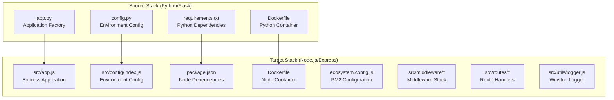
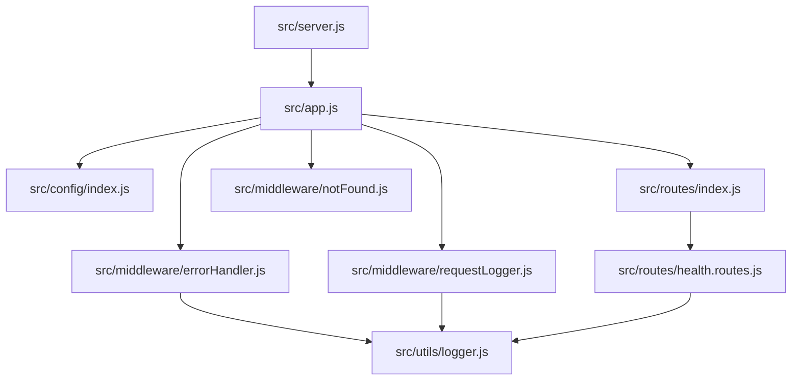
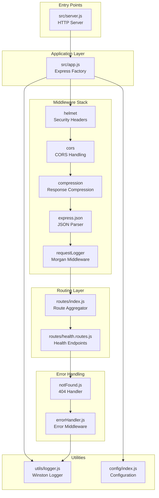
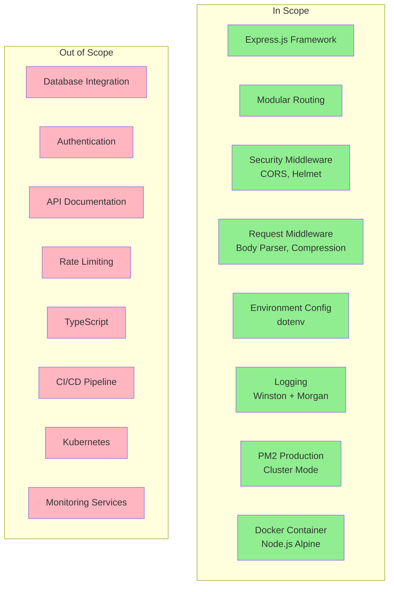

# Technical Specification

# 0. Agent Action Plan

## 0.1 Intent Clarification

### 0.1.1 Core Objective

Based on the provided requirements, the Blitzy platform understands that the objective is to **completely transform the existing Python/Flask HTTP server into a production-ready Node.js/Express.js application** with comprehensive enterprise features. This represents a full technology stack migration rather than an incremental enhancement.

The user's request translates to the following enhanced requirements:

| Original Requirement | Clarified Technical Objective |
|---------------------|------------------------------|
| "Enhance this basic HTTP server with Express.js framework" | Replace the Python/Flask application (`app.py`, `config.py`) with a Node.js/Express.js server structure |
| "Add routing" | Implement Express Router with modular route definitions, separating concerns into dedicated route files |
| "Add middleware" | Integrate comprehensive middleware stack: CORS, Helmet (security headers), body-parser, error handling, request validation |
| "Add environment config" | Implement dotenv-based configuration with environment-specific settings (development, production, testing) |
| "Add logging" | Integrate Winston for application logging and Morgan for HTTP request logging with file rotation and structured output |
| "Prepare for production deployment with PM2" | Create PM2 ecosystem configuration with cluster mode, zero-downtime deployments, and process monitoring |

**Implicit Requirements Detected:**

- Remove all Python dependencies (`requirements.txt`, Flask, Gunicorn)
- Replace Dockerfile with Node.js-based container configuration
- Maintain equivalent functionality: health endpoint, error handling, CORS support
- Preserve environment variable patterns from existing `.env.example`
- Update all documentation to reflect Node.js/Express stack

### 0.1.2 Task Categorization

| Category | Classification |
|----------|---------------|
| **Primary Task Type** | Technology Stack Migration + Feature Enhancement |
| **Secondary Aspects** | Configuration Management, Logging Infrastructure, Production Deployment |
| **Scope Classification** | Cross-cutting change affecting all source files, configuration, and deployment infrastructure |
| **Complexity Level** | Complete rewrite with architectural parity |

**Migration Scope Analysis:**



### 0.1.3 Special Instructions and Constraints

**Critical Directives:**

- Maintain backward compatibility with existing API endpoints (`/api/health`)
- Preserve the Docker containerization approach but update for Node.js runtime
- Match the existing configuration hierarchy (Development → Production → Testing)
- Implement the same error response format (JSON with status and message fields)
- Ensure CORS configuration matches the existing pattern

**Methodological Requirements:**

- Follow Express.js 5.x patterns (latest stable release with promise support)
- Use modular file organization with clear separation of concerns
- Implement centralized error handling middleware
- Use async/await patterns for asynchronous operations

**User-Specified Examples to Preserve:**

The existing health endpoint response format must be maintained:
```json
{"status": "healthy", "service": "api", "timestamp": "ISO-8601"}
```

### 0.1.4 Technical Interpretation

These requirements translate to the following technical implementation strategy:

| Goal | Technical Action | Target Component |
|------|-----------------|------------------|
| Replace Flask with Express | Create Express application with equivalent routing structure | `src/app.js`, `src/server.js` |
| Implement modular routing | Create Express Router instances for each resource domain | `src/routes/*.js` |
| Add security middleware | Integrate Helmet for HTTP security headers, CORS for cross-origin requests | `src/middleware/security.js` |
| Add request/response middleware | Integrate body-parser (JSON, URL-encoded), compression | `src/middleware/request.js` |
| Implement logging | Configure Winston with multiple transports (console, file) and Morgan for HTTP logging | `src/utils/logger.js`, `src/middleware/logger.js` |
| Environment configuration | Create dotenv-based config loader with validation | `src/config/index.js` |
| PM2 production setup | Create ecosystem.config.js with cluster mode configuration | `ecosystem.config.js` |
| Update containerization | Rewrite Dockerfile for Node.js with multi-stage build | `Dockerfile` |

**Implementation Approach Summary:**

"To achieve the Express.js migration, we will create a new Node.js application structure in `src/` directory, replacing `app.py` with `src/app.js` that uses Express 5.x with comprehensive middleware. To enable modular routing, we will create route files under `src/routes/` using Express Router. To implement production logging, we will configure Winston with file and console transports wrapped by Morgan middleware for HTTP request logging. To prepare for production deployment, we will create `ecosystem.config.js` for PM2 cluster mode with zero-downtime reload capabilities."


## 0.2 Repository Scope Discovery

### 0.2.1 Comprehensive File Analysis

**Current Repository Structure (Python/Flask):**

| File Path | Type | Purpose | Migration Action |
|-----------|------|---------|------------------|
| `app.py` | Source | Flask application factory with error handlers and CORS | DELETE - Replace with Express equivalent |
| `config.py` | Source | Python class-based configuration hierarchy | DELETE - Replace with JavaScript config |
| `requirements.txt` | Config | Python package dependencies | DELETE - Replace with package.json |
| `Dockerfile` | Config | Multi-stage Python/Gunicorn container | UPDATE - Rewrite for Node.js |
| `.env.example` | Config | Environment variable template | UPDATE - Adapt for Node.js patterns |
| `README.md` | Doc | Project documentation and structure | UPDATE - Complete rewrite for Express |

**Target Repository Structure (Node.js/Express):**

```
project-root/
├── src/
│   ├── app.js                    # Express application setup
│   ├── server.js                 # Server entry point
│   ├── config/
│   │   └── index.js              # Environment configuration
│   ├── routes/
│   │   ├── index.js              # Route aggregator
│   │   └── health.routes.js      # Health check endpoints
│   ├── middleware/
│   │   ├── errorHandler.js       # Centralized error handling
│   │   ├── notFound.js           # 404 handler
│   │   └── requestLogger.js      # Morgan HTTP logging
│   └── utils/
│       └── logger.js             # Winston logger configuration
├── logs/                         # Log file directory (gitignored)
├── package.json                  # Node.js dependencies and scripts
├── package-lock.json             # Dependency lock file
├── ecosystem.config.js           # PM2 configuration
├── Dockerfile                    # Node.js container
├── .dockerignore                 # Docker build exclusions
├── .env.example                  # Environment template
├── .env                          # Local environment (gitignored)
├── .gitignore                    # Git exclusions
└── README.md                     # Updated documentation
```

### 0.2.2 Web Search Research Conducted

**Best Practices Research Findings:**

| Topic | Key Findings | Source |
|-------|--------------|--------|
| Express.js Production Setup | <cite index="1-6,1-7">"To ensure your app restarts if it crashes, use a process manager. A process manager is a 'container' for applications that facilitates deployment, provides high availability, and enables you to manage the application at runtime."</cite> | Express.js Official Docs |
| PM2 Cluster Mode | <cite index="4-1">"For Node.js applications, PM2 includes an automatic load balancer that will share all HTTP[s]/Websocket/TCP/UDP connections between each spawned processes."</cite> | PM2 Quick Start |
| Express.js Version | <cite index="21-2">"Latest version: 5.2.1, last published: 9 days ago."</cite> | npm Registry |
| Winston + Morgan Integration | <cite index="12-6,12-7">"Morgan is a Node.js and Express middleware to log HTTP requests and errors. Winston is a logger for just about everything."</cite> | Better Stack Guide |
| PM2 Version | <cite index="35-1">"Production process manager for Node.JS applications with a built-in load balancer. Latest version: 6.0.14"</cite> | npm Registry |
| Environment Configuration | <cite index="7-11,7-12">"Utilize environment variables to manage configuration settings dynamically. According to a 2024 survey, 78% of development teams prefer this method."</cite> | MoldStud Best Practices |

### 0.2.3 Existing Infrastructure Assessment

**Current Project Structure Analysis:**

| Aspect | Current State | Target State |
|--------|--------------|--------------|
| **Runtime** | Python 3.12 | Node.js 20 LTS (v20.x) |
| **Framework** | Flask 3.0.0 | Express.js 5.2.1 |
| **WSGI/Process Manager** | Gunicorn 21.2.0 | PM2 6.0.14 |
| **Configuration** | Python class hierarchy | JavaScript module with dotenv |
| **Logging** | Python logging (not implemented) | Winston + Morgan |
| **Container Base** | python:3.12-slim | node:20-alpine |
| **Port** | 8000 (production) | 3000 (configurable) |

**Existing Patterns to Preserve:**

| Pattern | Flask Implementation | Express Equivalent |
|---------|---------------------|-------------------|
| Application Factory | `create_app(config_name)` | `createApp()` function export |
| Error Handlers | `@app.errorhandler(code)` decorators | Express error middleware |
| CORS Configuration | `CORS(app, resources={...})` | `cors()` middleware with options |
| Health Check | `GET /api/health` route | Express router endpoint |
| Environment Config | `Config` class with subclasses | JavaScript config object |

**Build and Deployment Configurations:**

| Configuration | Current (Python) | Target (Node.js) |
|--------------|------------------|------------------|
| Development Server | `flask run` | `npm run dev` (nodemon) |
| Production Server | `gunicorn -b 0.0.0.0:8000` | `pm2 start ecosystem.config.js` |
| Container Build | Multi-stage with Python | Multi-stage with Node.js |
| Health Check | `/health` endpoint | `/api/health` endpoint |

**Testing Infrastructure:**

| Component | Current | Target |
|-----------|---------|--------|
| Framework | pytest, pytest-flask | Jest (recommended) |
| Test Directory | `tests/` (planned) | `tests/` or `__tests__/` |
| Coverage Tool | pytest-cov | Jest built-in coverage |


## 0.3 File Transformation Mapping

### 0.3.1 File-by-File Execution Plan

**Complete Transformation Matrix:**

| Target File | Transformation | Source File/Reference | Purpose/Changes |
|-------------|----------------|----------------------|-----------------|
| `package.json` | CREATE | `requirements.txt` | Define Node.js dependencies (Express, PM2, Winston, Morgan, dotenv, cors, helmet), npm scripts, and project metadata |
| `src/app.js` | CREATE | `app.py` | Express application factory with middleware stack, error handlers, and route registration |
| `src/server.js` | CREATE | `app.py` | HTTP server entry point with graceful shutdown handling |
| `src/config/index.js` | CREATE | `config.py` | Environment-based configuration using dotenv with validation |
| `src/routes/index.js` | CREATE | - | Route aggregator that mounts all route modules |
| `src/routes/health.routes.js` | CREATE | `app.py` (health endpoint) | Health check route handler with system status response |
| `src/middleware/errorHandler.js` | CREATE | `app.py` (error handlers) | Centralized error handling middleware for all error types |
| `src/middleware/notFound.js` | CREATE | `app.py` (404 handler) | 404 Not Found middleware for unmatched routes |
| `src/middleware/requestLogger.js` | CREATE | - | Morgan HTTP request logging middleware configuration |
| `src/utils/logger.js` | CREATE | - | Winston logger with console and file transports |
| `ecosystem.config.js` | CREATE | - | PM2 process management configuration with cluster mode |
| `Dockerfile` | UPDATE | `Dockerfile` | Rewrite for Node.js 20 Alpine with multi-stage build |
| `.dockerignore` | CREATE | - | Exclude node_modules, logs, .env from Docker context |
| `.env.example` | UPDATE | `.env.example` | Update variable names for Node.js conventions (PORT, NODE_ENV) |
| `.env` | CREATE | `.env.example` | Local development environment variables |
| `.gitignore` | CREATE | - | Node.js gitignore patterns (node_modules, logs, .env, coverage) |
| `README.md` | UPDATE | `README.md` | Complete rewrite with Node.js/Express documentation |
| `app.py` | DELETE | - | Remove Python Flask entry point |
| `config.py` | DELETE | - | Remove Python configuration module |
| `requirements.txt` | DELETE | - | Remove Python dependencies file |

### 0.3.2 New Files Detail

**`package.json`** - Node.js Project Configuration
- Content type: Configuration
- Based on: npm init defaults + Express project conventions
- Key sections:
  - `name`, `version`, `description`
  - `main`: "src/server.js"
  - `scripts`: dev, start, start:prod, lint, test
  - `dependencies`: express, cors, helmet, winston, morgan, dotenv, compression
  - `devDependencies`: nodemon, eslint

**`src/app.js`** - Express Application Factory
- Content type: Source
- Based on: `app.py` application factory pattern
- Key functions:
  - `createApp()` - Factory function
  - Middleware registration sequence
  - Route mounting
  - Error handler registration

**`src/server.js`** - Server Entry Point
- Content type: Source
- Based on: `app.py` conditional execution block
- Key functions:
  - HTTP server creation
  - Port binding from environment
  - Graceful shutdown handlers (SIGTERM, SIGINT)

**`src/config/index.js`** - Configuration Management
- Content type: Configuration
- Based on: `config.py` class hierarchy
- Key sections:
  - Base configuration defaults
  - Environment-specific overrides
  - Configuration validation
  - Export of merged config object

**`src/routes/health.routes.js`** - Health Check Endpoint
- Content type: Source
- Based on: `app.py` health endpoint
- Key sections:
  - Express Router instance
  - `GET /` handler returning health status
  - Response format matching original

**`src/middleware/errorHandler.js`** - Error Handling
- Content type: Source
- Based on: `app.py` error handlers (400, 404, 405, 500)
- Key sections:
  - Error class definitions
  - Centralized error middleware
  - JSON error response formatting

**`src/utils/logger.js`** - Winston Logger Configuration
- Content type: Utility
- Based on: Industry best practices for Node.js logging
- Key sections:
  - Logger creation with multiple transports
  - Console transport with colorization
  - File transport with rotation
  - Log level based on environment

**`ecosystem.config.js`** - PM2 Configuration
- Content type: Configuration
- Based on: PM2 documentation for cluster mode
- Key sections:
  - App name and script path
  - Cluster mode with max instances
  - Environment variable configuration
  - Log file paths

### 0.3.3 Files to Modify Detail

**`Dockerfile`** - Container Configuration
- Current state: Python 3.12-slim with Gunicorn
- Target state: Node.js 20-alpine with PM2-runtime
- Sections to update:
  - Base image: `FROM node:20-alpine`
  - Dependencies: `npm ci` instead of `pip install`
  - Entry point: `pm2-runtime` instead of `gunicorn`
  - Health check: Update endpoint path

**`.env.example`** - Environment Template
- Current state: Flask-specific variables
- Target state: Node.js/Express variables
- Changes:
  - `FLASK_APP` → Remove
  - `FLASK_ENV` → `NODE_ENV`
  - `SECRET_KEY` → Retained
  - `PORT` → Add (default 3000)
  - `LOG_LEVEL` → Add (debug, info, warn, error)

**`README.md`** - Project Documentation
- Current state: Python/Flask documentation
- Target state: Node.js/Express documentation
- Sections to update:
  - Technology stack description
  - Installation instructions
  - Development commands
  - Production deployment with PM2
  - Project structure diagram
  - API endpoint documentation

### 0.3.4 Configuration and Documentation Updates

**Configuration Changes:**

| Config File | Setting | Old Value | New Value |
|-------------|---------|-----------|-----------|
| `.env.example` | `FLASK_APP` | `app.py` | (removed) |
| `.env.example` | `FLASK_ENV` | `development` | `NODE_ENV=development` |
| `.env.example` | `PORT` | (not present) | `3000` |
| `.env.example` | `LOG_LEVEL` | (not present) | `info` |
| `Dockerfile` | Base image | `python:3.12-slim` | `node:20-alpine` |
| `Dockerfile` | Install command | `pip install` | `npm ci` |
| `Dockerfile` | Entry point | `gunicorn` | `pm2-runtime` |
| `Dockerfile` | HEALTHCHECK | `/health` | `/api/health` |

**Documentation Updates:**

| Document | Section | Update Required |
|----------|---------|-----------------|
| `README.md` | Technology Stack | Python/Flask → Node.js/Express |
| `README.md` | Prerequisites | Python 3.12 → Node.js 20 LTS |
| `README.md` | Installation | pip → npm |
| `README.md` | Development | flask run → npm run dev |
| `README.md` | Production | gunicorn → pm2 |
| `README.md` | Project Structure | Complete restructure |
| `README.md` | API Endpoints | Maintain same endpoints |
| `README.md` | Docker Usage | Update build/run commands |

### 0.3.5 Cross-File Dependencies

**Import/Reference Updates:**

| Dependency Type | Files Affected | Change Description |
|----------------|----------------|-------------------|
| App factory import | `src/server.js` | Import `createApp` from `./app.js` |
| Config import | All `src/**/*.js` | Import config from `../config` |
| Logger import | All middleware and routes | Import logger from `../utils/logger` |
| Route registration | `src/app.js` | Import and mount all route modules |
| Middleware registration | `src/app.js` | Import and register all middleware |

**Module Dependency Graph:**




## 0.4 Dependency Inventory

### 0.4.1 Key Private and Public Packages

**Production Dependencies:**

| Registry | Package Name | Version | Purpose |
|----------|--------------|---------|---------|
| npm | express | ^5.0.1 | Web application framework for Node.js with robust routing and middleware support |
| npm | cors | ^2.8.5 | CORS (Cross-Origin Resource Sharing) middleware for Express |
| npm | helmet | ^8.0.0 | Security middleware that sets various HTTP headers for protection |
| npm | compression | ^1.7.5 | Gzip compression middleware for response optimization |
| npm | morgan | ^1.10.0 | HTTP request logger middleware for Express |
| npm | winston | ^3.17.0 | Versatile logging library with multiple transports |
| npm | winston-daily-rotate-file | ^5.0.0 | Winston transport for daily rotating log files |
| npm | dotenv | ^16.4.7 | Loads environment variables from .env file into process.env |
| npm | express-validator | ^7.2.1 | Request validation middleware for Express |
| npm | http-errors | ^2.0.0 | Create HTTP error objects for Express error handling |
| npm | uuid | ^11.0.3 | Generate RFC-compliant UUIDs for request tracking |

**Development Dependencies:**

| Registry | Package Name | Version | Purpose |
|----------|--------------|---------|---------|
| npm | nodemon | ^3.1.7 | Automatic server restart during development |
| npm | eslint | ^9.16.0 | JavaScript linting for code quality |
| npm | eslint-config-prettier | ^9.1.0 | ESLint configuration that disables conflicting Prettier rules |
| npm | jest | ^29.7.0 | JavaScript testing framework |
| npm | supertest | ^7.0.0 | HTTP assertion library for testing Express |
| npm | cross-env | ^7.0.3 | Set environment variables across platforms |

**Production Process Management (Global):**

| Registry | Package Name | Version | Purpose |
|----------|--------------|---------|---------|
| npm | pm2 | ^6.0.14 | Production process manager with cluster mode and monitoring |

### 0.4.2 Dependency Updates

**Dependencies to Remove (Python Stack):**

| Package Name | Version | Reason for Removal |
|--------------|---------|-------------------|
| Flask | 3.0.0 | Replaced by Express.js |
| gunicorn | 21.2.0 | Replaced by PM2 |
| python-dotenv | 1.0.0 | Replaced by Node.js dotenv |
| Flask-CORS | 4.0.0 | Replaced by cors middleware |
| Flask-SQLAlchemy | 3.1.1 | Not needed for initial migration |
| pytest | 8.0.0 | Replaced by Jest |
| pytest-flask | 1.3.0 | Replaced by supertest |
| Werkzeug | 3.0.1 | Flask dependency, no longer needed |

**Rationale for Version Selections:**

| Package | Version Choice | Rationale |
|---------|---------------|-----------|
| express | ^5.0.1 | <cite index="22-22,22-24">"Node.js version support: Dropped support for Node.js versions before v18. Promise support: Middleware can now return rejected promises, caught by the router as errors."</cite> Express 5.x provides modern async/await support. |
| pm2 | ^6.0.14 | Latest stable version with improved cluster mode and monitoring |
| winston | ^3.17.0 | Latest 3.x series with comprehensive transport support |
| dotenv | ^16.4.7 | Modern version with expanded variable support and multiline values |
| helmet | ^8.0.0 | Latest version with updated security defaults for 2024 |

### 0.4.3 Import/Reference Updates

**Module Import Pattern:**

All source files will use ES Module syntax (ESM) or CommonJS based on project configuration. The recommended approach for Express 5.x is ESM:

| File Pattern | Import Statement Example |
|--------------|-------------------------|
| `src/**/*.js` (Config) | `import config from '../config/index.js';` |
| `src/**/*.js` (Logger) | `import logger from '../utils/logger.js';` |
| `src/**/*.js` (Express) | `import express from 'express';` |
| `src/**/*.js` (Middleware) | `import cors from 'cors';` |

**Import Transformation Rules:**

| Context | Pattern | Apply To |
|---------|---------|----------|
| Express App | `import express from 'express'` | `src/app.js` |
| Configuration | `import config from './config/index.js'` | `src/app.js`, `src/server.js` |
| Logger | `import logger from './utils/logger.js'` | All route and middleware files |
| Routes | `import healthRoutes from './routes/health.routes.js'` | `src/app.js` |
| Middleware | `import { errorHandler, notFoundHandler } from './middleware/errorHandler.js'` | `src/app.js` |

### 0.4.4 Runtime Requirements

**Node.js Runtime:**

| Requirement | Specification | Justification |
|-------------|--------------|---------------|
| Node.js Version | 20.x LTS (≥20.10.0) | <cite index="24-22,24-23">"Express.js 5 officially adopts Node.js 18 as the minimum supported version. This means it's time to upgrade your Node.js environment if you're running older versions like Node.js 14."</cite> Node.js 20 LTS provides long-term support and performance improvements. |
| npm Version | 10.x (bundled with Node.js 20) | Compatible package management |
| PM2 Installation | Global (`npm install -g pm2`) | Required for production process management |

**Container Runtime:**

| Requirement | Specification | Justification |
|-------------|--------------|---------------|
| Base Image | `node:20-alpine` | Minimal footprint (~50MB), security-hardened |
| Process Manager | `pm2-runtime` | <cite index="10-1">"The best practice for containerized deployments is using pm2-runtime inside Docker containers to get both container portability and advanced Node.js process management features."</cite> |
| User | Non-root (`node` user) | Security best practice |

### 0.4.5 Complete package.json Specification

```json
{
  "name": "express-api-server",
  "version": "1.0.0",
  "description": "Production-ready Express.js API server",
  "main": "src/server.js",
  "type": "module",
  "engines": {
    "node": ">=20.0.0"
  },
  "scripts": {
    "start": "node src/server.js",
    "dev": "nodemon src/server.js",
    "start:prod": "pm2 start ecosystem.config.js",
    "stop:prod": "pm2 stop ecosystem.config.js",
    "lint": "eslint src/",
    "test": "cross-env NODE_ENV=test jest"
  }
}
```


## 0.5 Implementation Design

### 0.5.1 Technical Approach

**Primary Objectives with Implementation Approach:**

| Objective | Implementation Strategy |
|-----------|------------------------|
| Create Express Application | Implement application factory pattern in `src/app.js` using Express 5.x with async middleware support |
| Implement Modular Routing | Create Express Router instances in `src/routes/` with resource-based organization |
| Add Security Middleware | Integrate Helmet for HTTP security headers and CORS for cross-origin request handling |
| Implement Logging | Configure Winston with console and file transports, integrate Morgan for HTTP request logging |
| Configure Environment | Use dotenv to load `.env` files with environment-specific configuration validation |
| Prepare PM2 Deployment | Create `ecosystem.config.js` with cluster mode for multi-core utilization |
| Update Containerization | Rewrite Dockerfile with Node.js 20-alpine base and pm2-runtime entrypoint |

**Logical Implementation Flow:**

1. **Foundation Phase** - Establish the core Express application structure:
   - Create `package.json` with all dependencies
   - Implement `src/config/index.js` for environment configuration
   - Create `src/utils/logger.js` with Winston configuration

2. **Application Core Phase** - Build the Express application:
   - Implement `src/app.js` with middleware registration
   - Create middleware files in `src/middleware/`
   - Implement error handling middleware

3. **Routing Phase** - Add route handlers:
   - Create `src/routes/health.routes.js` for health endpoint
   - Create `src/routes/index.js` as route aggregator
   - Mount routes in `src/app.js`

4. **Server Phase** - Create the server entry point:
   - Implement `src/server.js` with HTTP server
   - Add graceful shutdown handling
   - Configure port from environment

5. **Production Phase** - Prepare for deployment:
   - Create `ecosystem.config.js` for PM2
   - Update `Dockerfile` for Node.js
   - Update documentation

### 0.5.2 Component Impact Analysis

**Component Architecture:**



**Direct Modifications Required:**

| Component | Modification | Purpose |
|-----------|-------------|---------|
| `src/app.js` | Create Express app with middleware chain | Central application setup |
| `src/server.js` | Create HTTP server with graceful shutdown | Server lifecycle management |
| `src/config/index.js` | Load and validate environment config | Centralized configuration |
| `src/utils/logger.js` | Configure Winston with transports | Application-wide logging |

**Indirect Impacts and Dependencies:**

| Component | Impact | Reason |
|-----------|--------|--------|
| `Dockerfile` | Requires complete rewrite | Runtime change from Python to Node.js |
| `.env.example` | Requires variable updates | Different environment variable patterns |
| `README.md` | Requires complete rewrite | Technology stack documentation change |
| `.gitignore` | Requires Node.js patterns | Different build artifacts |

### 0.5.3 Middleware Stack Design

**Middleware Registration Order:**

<cite index="11-19,11-20">"Place the express-winston logger before the router... Place the express-winston errorLogger after the router."</cite>

| Order | Middleware | Purpose | Configuration |
|-------|-----------|---------|---------------|
| 1 | `helmet()` | Security headers | Default with customizable options |
| 2 | `cors()` | CORS handling | Origins from config |
| 3 | `compression()` | Gzip compression | Threshold from config |
| 4 | `express.json()` | JSON body parsing | Limit from config |
| 5 | `express.urlencoded()` | URL-encoded parsing | Extended: true |
| 6 | `requestLogger` | Morgan HTTP logging | Combined format in production |
| 7 | Routes | API endpoints | Mounted under `/api` |
| 8 | `notFoundHandler` | 404 responses | JSON error format |
| 9 | `errorHandler` | Error responses | Structured error handling |

### 0.5.4 Logging Architecture

**Winston Configuration:**

<cite index="12-1,12-2">"We are using three different transports: Allow the use the console to print the messages... Allow to print all the error level messages inside the error.log file... Allow to print all the error message inside the all.log file."</cite>

| Transport | Target | Log Level | Format |
|-----------|--------|-----------|--------|
| Console | stdout | Based on NODE_ENV | Colorized, simple |
| File (all) | `logs/combined.log` | info | JSON with timestamp |
| File (errors) | `logs/error.log` | error | JSON with timestamp |

**Morgan Integration:**

<cite index="14-14">"When you connect Morgan with a Winston logger, all your logging is formatted the same way and goes to the same place."</cite>

| Environment | Format | Stream |
|-------------|--------|--------|
| Development | `dev` (colorized) | Winston http level |
| Production | `combined` | Winston http level |
| Test | Silent | - |

### 0.5.5 Error Handling Design

**Error Response Format (matching Flask implementation):**

```javascript
{
  "error": {
    "status": 404,
    "message": "Resource not found"
  }
}
```

**Error Handler Chain:**

| Handler | HTTP Status | Trigger |
|---------|-------------|---------|
| Validation Error | 400 | express-validator failures |
| Not Found | 404 | Unmatched routes |
| Method Not Allowed | 405 | Wrong HTTP method |
| Server Error | 500 | Unhandled exceptions |

### 0.5.6 PM2 Configuration Design

<cite index="3-17">"Create a file named ecosystem.config.js in your project root: module.exports = { apps: [{ name: 'my-app', script: './app.js', instances: 'max', exec_mode: 'cluster', env: { NODE_ENV: 'production' } }] }"</cite>

**Cluster Mode Configuration:**

| Setting | Value | Purpose |
|---------|-------|---------|
| `name` | "api-server" | Process identification |
| `script` | "./src/server.js" | Entry point |
| `instances` | "max" | Utilize all CPU cores |
| `exec_mode` | "cluster" | Enable load balancing |
| `env_production` | `NODE_ENV: 'production'` | Production variables |
| `watch` | false | Disable in production |
| `max_memory_restart` | "500M" | Memory limit per instance |

### 0.5.7 Docker Configuration Design

**Multi-Stage Build Strategy:**

| Stage | Base Image | Purpose |
|-------|-----------|---------|
| Builder | `node:20-alpine` | Install dependencies |
| Production | `node:20-alpine` | Minimal runtime image |

**Security Considerations:**

| Practice | Implementation |
|----------|---------------|
| Non-root user | `USER node` directive |
| Minimal image | Alpine-based |
| Production only | `npm ci --only=production` |
| Health check | `/api/health` endpoint |


## 0.6 Scope Boundaries

### 0.6.1 Exhaustively In Scope

**Source Code Changes:**

| Pattern | Files Included | Purpose |
|---------|----------------|---------|
| `src/**/*.js` | All JavaScript source files | Core application code |
| `src/app.js` | Express application factory | Main application setup |
| `src/server.js` | HTTP server entry point | Server lifecycle management |
| `src/config/*.js` | Configuration modules | Environment management |
| `src/routes/*.js` | Route handlers | API endpoint definitions |
| `src/middleware/*.js` | Middleware functions | Request/response processing |
| `src/utils/*.js` | Utility modules | Shared functionality |

**Configuration Updates:**

| Pattern | Files Included | Purpose |
|---------|----------------|---------|
| `package.json` | Project manifest | Dependencies and scripts |
| `package-lock.json` | Dependency lock | Reproducible builds |
| `ecosystem.config.js` | PM2 configuration | Production process management |
| `.env.example` | Environment template | Variable documentation |
| `.env` | Local environment | Development configuration |
| `.gitignore` | Git exclusions | Node.js-specific patterns |
| `.dockerignore` | Docker exclusions | Build context optimization |
| `.eslintrc.*` | ESLint configuration | Code quality rules |

**Documentation Updates:**

| File | Sections Affected | Changes Required |
|------|-------------------|------------------|
| `README.md` | All sections | Complete rewrite for Node.js/Express |

**Build/Deployment:**

| Pattern | Files Included | Purpose |
|---------|----------------|---------|
| `Dockerfile` | Container definition | Node.js container build |

**Test Updates:**

| Pattern | Files Included | Purpose |
|---------|----------------|---------|
| `tests/**/*.test.js` | Test files | Jest test specifications |
| `jest.config.js` | Jest configuration | Test framework setup |

**Files to Delete:**

| Pattern | Files | Reason |
|---------|-------|--------|
| `app.py` | Python Flask entry point | Replaced by src/app.js |
| `config.py` | Python configuration | Replaced by src/config/index.js |
| `requirements.txt` | Python dependencies | Replaced by package.json |

### 0.6.2 Explicitly Out of Scope

**Related Features Not Specified:**

| Feature | Reason for Exclusion |
|---------|---------------------|
| Database integration | Not mentioned in user requirements |
| Authentication/Authorization | Not mentioned in user requirements |
| API documentation (Swagger/OpenAPI) | Not mentioned in user requirements |
| Rate limiting | Not mentioned in user requirements |
| Session management | Not mentioned in user requirements |
| WebSocket support | Not mentioned in user requirements |

**Performance Optimizations Beyond Requirements:**

| Optimization | Reason for Exclusion |
|--------------|---------------------|
| Redis caching | Not mentioned in user requirements |
| CDN integration | Not mentioned in user requirements |
| Load balancer configuration | PM2 cluster mode is sufficient |
| Database connection pooling | Database not in scope |

**Refactoring Unrelated to Core Objectives:**

| Refactoring | Reason for Exclusion |
|-------------|---------------------|
| TypeScript migration | Not mentioned in user requirements |
| GraphQL implementation | REST API is the target |
| Microservices architecture | Single application scope |
| Event-driven architecture | Not mentioned in user requirements |

**Additional Tooling Not Mentioned:**

| Tooling | Reason for Exclusion |
|---------|---------------------|
| CI/CD pipeline configuration | Not mentioned in user requirements |
| Kubernetes manifests | Docker is sufficient |
| Monitoring dashboards | PM2 monitoring is sufficient |
| Log aggregation services | File-based logging is sufficient |

**Future Enhancements Not Part of Current Request:**

| Enhancement | Reason for Exclusion |
|-------------|---------------------|
| API versioning | Not mentioned in user requirements |
| Request validation schemas | Basic validation only |
| API rate limiting | Not mentioned in user requirements |
| Caching layer | Not mentioned in user requirements |
| Background job processing | Not mentioned in user requirements |

### 0.6.3 Scope Boundary Diagram



### 0.6.4 Boundary Decisions and Rationale

| Decision | Rationale |
|----------|-----------|
| Use Express 5.x instead of 4.x | Native async/await support aligns with modern Node.js practices |
| Use Winston instead of Bunyan/Pino | Most widely adopted, extensive documentation and ecosystem |
| Use PM2 instead of systemd | <cite index="5-1,5-2,5-3">"PM2 has been around for a few years. They utilize a custom-built script that manages and runs your server.js file. It is simpler to set up."</cite> PM2 is Node.js-native with built-in cluster mode. |
| Use Alpine base image | Minimal footprint (~50MB) while maintaining compatibility |
| File-based logging | Simple, portable, sufficient for initial deployment |
| No TypeScript | Reduces complexity for initial migration |
| No database | Focus on core Express.js migration as specified |


## 0.7 Execution Parameters

### 0.7.1 Special Execution Instructions

**Process-Specific Requirements:**

| Requirement | Implementation | Justification |
|-------------|---------------|---------------|
| Complete Python removal | Delete all `.py` files and `requirements.txt` | Clean technology transition |
| Preserve API contract | Maintain `/api/health` endpoint format | Backward compatibility |
| Maintain Docker workflow | Keep multi-stage build pattern | Consistent deployment |
| Environment parity | Match existing env variable patterns | Smooth transition |

**Tools and Platforms:**

| Tool | Version | Usage |
|------|---------|-------|
| Node.js | 20.x LTS | JavaScript runtime |
| npm | 10.x | Package management |
| Express.js | 5.0.1+ | Web framework |
| PM2 | 6.0.14 | Process management |
| Docker | Latest | Containerization |
| Alpine Linux | 3.20 | Container base |

**Quality Requirements:**

| Aspect | Requirement | Validation |
|--------|-------------|------------|
| Code Style | ESLint with recommended rules | `npm run lint` |
| Error Handling | All routes wrapped in error handler | Manual review |
| Logging | All requests logged, errors captured | Log file inspection |
| Security | Helmet defaults applied | Header inspection |
| CORS | Configurable origins | API testing |

### 0.7.2 Constraints and Boundaries

**Technical Constraints:**

| Constraint | Description | Impact |
|------------|-------------|--------|
| Node.js 20+ | Minimum runtime version | Express 5.x compatibility |
| ES Modules | Use `"type": "module"` in package.json | Import syntax consistency |
| Single Process Entry | `src/server.js` as sole entry point | PM2 cluster management |
| Port Configuration | Environment variable controlled | Deployment flexibility |

**Process Constraints:**

| Constraint | Description |
|------------|-------------|
| No Python code | All functionality must be in JavaScript |
| No external services | Self-contained application |
| No breaking API changes | Existing health endpoint must work |
| No manual intervention | Graceful shutdown handling required |

**Output Constraints:**

| Constraint | Description |
|------------|-------------|
| JSON responses | All API responses in JSON format |
| Structured logs | Winston JSON format for production |
| Error messages | Consistent error response schema |
| Health check | Standard health response format |

**Compatibility Requirements:**

| Component | Compatibility |
|-----------|---------------|
| Docker | Compatible with existing Docker workflows |
| Environment Variables | Same variable names where possible |
| API Endpoints | Identical endpoint paths and responses |
| HTTP Methods | Same HTTP methods as Flask implementation |

### 0.7.3 Development Workflow

**Local Development:**

```bash
# Install dependencies
npm install

#### Start development server (with hot reload)
npm run dev

#### Run linting
npm run lint

#### Run tests
npm test
```

**Production Deployment:**

```bash
# Install production dependencies only
npm ci --only=production

#### Start with PM2
pm2 start ecosystem.config.js --env production

#### View logs
pm2 logs

#### Monitor processes
pm2 monit

#### Graceful restart
pm2 reload all

#### Stop all processes
pm2 stop all
```

**Docker Workflow:**

```bash
# Build image
docker build -t express-api:latest .

#### Run container
docker run -d -p 3000:3000 \
  -e NODE_ENV=production \
  -e PORT=3000 \
  express-api:latest

#### Health check
curl http://localhost:3000/api/health
```

### 0.7.4 Environment Configuration

**Required Environment Variables:**

| Variable | Required | Default | Description |
|----------|----------|---------|-------------|
| `NODE_ENV` | Yes | development | Environment mode |
| `PORT` | No | 3000 | HTTP server port |
| `LOG_LEVEL` | No | info | Winston log level |
| `CORS_ORIGIN` | No | * | Allowed CORS origins |

**Optional Environment Variables:**

| Variable | Default | Description |
|----------|---------|-------------|
| `SECRET_KEY` | (generated) | Application secret for signing |
| `REQUEST_LIMIT` | 10mb | Maximum request body size |
| `COMPRESSION_THRESHOLD` | 1kb | Minimum size for compression |

**Environment File Structure:**

```
# .env.example
NODE_ENV=development
PORT=3000
LOG_LEVEL=debug
CORS_ORIGIN=*
SECRET_KEY=your-secret-key-here
```

### 0.7.5 Monitoring and Observability

**PM2 Monitoring:**

<cite index="10-26,10-27,10-28,10-29">"Process Monitoring: Automatically restarts applications if they crash or are killed. Startup Scripts: Generates scripts to launch PM2 and your applications on server boot. Cluster Mode: Allows you to run multiple instances of your application, load-balancing traffic across them. Log Management: Collects and centralizes logs from all running applications."</cite>

| Feature | Command | Purpose |
|---------|---------|---------|
| Process List | `pm2 list` | View running processes |
| Logs | `pm2 logs` | Stream application logs |
| Monitor | `pm2 monit` | Real-time monitoring dashboard |
| Status | `pm2 show api-server` | Detailed process info |
| Reload | `pm2 reload all` | Zero-downtime restart |

**Log File Locations:**

| Log Type | Path | Contents |
|----------|------|----------|
| Combined | `logs/combined.log` | All log levels |
| Errors | `logs/error.log` | Error level only |
| PM2 Output | `~/.pm2/logs/api-server-out.log` | stdout |
| PM2 Errors | `~/.pm2/logs/api-server-error.log` | stderr |

### 0.7.6 Graceful Shutdown Handling

**Signal Handlers:**

| Signal | Action | Timeout |
|--------|--------|---------|
| SIGTERM | Graceful shutdown | 30 seconds |
| SIGINT | Graceful shutdown | 30 seconds |
| SIGUSR2 | Restart (nodemon) | - |

**Shutdown Sequence:**

1. Stop accepting new connections
2. Complete in-flight requests
3. Close database connections (if any)
4. Flush log buffers
5. Exit process


## 0.8 Special Instructions

### 0.8.1 Task-Specific Requirements

**Framework and Pattern Requirements:**

| Requirement | Implementation | Reference |
|-------------|---------------|-----------|
| Use Express 5.x patterns | Async middleware, promise rejection handling | Express 5.x migration guide |
| Follow application factory pattern | `createApp()` function export from `app.js` | Existing Flask `create_app()` pattern |
| Implement modular routing | Express Router with separate route files | Express best practices |
| Use middleware composition | Sequential middleware registration | Express documentation |

**Code Style Requirements:**

| Requirement | Implementation |
|-------------|---------------|
| ES Module syntax | `import`/`export` statements |
| Async/await for async operations | Avoid callbacks, use promises |
| Consistent error handling | Try-catch with next() propagation |
| Descriptive variable names | camelCase for variables, PascalCase for classes |

**Security Requirements:**

| Requirement | Implementation |
|-------------|---------------|
| HTTP security headers | Helmet middleware with defaults |
| CORS configuration | Configurable origin whitelist |
| JSON body size limits | Express body-parser limits |
| No sensitive data in logs | Sanitize request bodies in logging |

### 0.8.2 Backward Compatibility Requirements

**API Endpoint Compatibility:**

| Endpoint | Method | Response Format | Status |
|----------|--------|-----------------|--------|
| `/api/health` | GET | `{"status": "healthy", ...}` | Must maintain |

**Response Format Compatibility:**

The health endpoint must return the same JSON structure as the Flask implementation:

```javascript
// Required response format
{
  "status": "healthy",
  "service": "api",
  "timestamp": "2024-12-11T12:00:00.000Z"
}
```

**Error Response Compatibility:**

All error responses must follow the existing format:

```javascript
// Required error format
{
  "error": {
    "status": 404,
    "message": "Resource not found"
  }
}
```

### 0.8.3 Production Deployment Requirements

**PM2 Configuration Requirements:**

<cite index="2-20,2-21,2-22">"An advantage of cluster mode is zero-downtime reloads in production using pm2 reload. This restarts processes sequentially, ensuring continuous availability. Conversely, pm2 restart halts and restarts all processes simultaneously, causing brief downtime."</cite>

| Requirement | Configuration |
|-------------|--------------|
| Cluster mode | `exec_mode: 'cluster'` |
| Auto-restart on crash | `autorestart: true` |
| Max memory limit | `max_memory_restart: '500M'` |
| Log file rotation | PM2 log-rotate module |
| Startup on boot | `pm2 startup` + `pm2 save` |

**Container Requirements:**

| Requirement | Configuration |
|-------------|--------------|
| Non-root execution | `USER node` in Dockerfile |
| Health checks | `HEALTHCHECK` directive |
| Signal handling | `pm2-runtime` with signal forwarding |
| Minimal image | Alpine-based image |

### 0.8.4 Logging Requirements

**Winston Configuration Requirements:**

<cite index="19-13,19-14,19-15">"Use a consistent logging level: Set the logging level consistently throughout the application. Use a centralized logging setup: Use a single logging instance throughout the application. Avoid logging sensitive information: Do not log sensitive data, such as passwords or API keys."</cite>

| Requirement | Implementation |
|-------------|---------------|
| Log levels | error, warn, info, http, debug |
| Environment-based levels | debug (dev), info (prod) |
| Structured logging | JSON format in production |
| Request logging | Morgan integration with Winston |
| Error stack traces | Full traces in development only |

**Morgan Integration Requirements:**

| Requirement | Implementation |
|-------------|---------------|
| Development format | `dev` (colorized, concise) |
| Production format | `combined` (Apache format) |
| Skip health checks | Avoid logging health check requests |
| Stream to Winston | Custom stream writing to logger.http() |

### 0.8.5 File Organization Requirements

**Directory Structure Requirements:**

```
src/
├── app.js              # Express app factory (exported)
├── server.js           # HTTP server (entry point)
├── config/
│   └── index.js        # Centralized configuration
├── routes/
│   ├── index.js        # Route aggregator
│   └── health.routes.js# Health check routes
├── middleware/
│   ├── errorHandler.js # Error handling middleware
│   ├── notFound.js     # 404 handler
│   └── requestLogger.js# Morgan configuration
└── utils/
    └── logger.js       # Winston configuration
```

**Naming Conventions:**

| Type | Convention | Example |
|------|------------|---------|
| Route files | `*.routes.js` | `health.routes.js` |
| Middleware files | Descriptive names | `errorHandler.js` |
| Config files | `index.js` or descriptive | `config/index.js` |
| Utility files | Descriptive names | `logger.js` |

### 0.8.6 Testing Requirements

**Test Framework:**

| Requirement | Implementation |
|-------------|---------------|
| Framework | Jest |
| HTTP testing | Supertest |
| Coverage threshold | 80% recommended |
| Test environment | `NODE_ENV=test` |

**Test Organization:**

| Type | Location | Pattern |
|------|----------|---------|
| Unit tests | `tests/unit/` | `*.test.js` |
| Integration tests | `tests/integration/` | `*.test.js` |
| E2E tests | `tests/e2e/` | `*.test.js` |

### 0.8.7 Documentation Requirements

**README Updates:**

| Section | Content Required |
|---------|-----------------|
| Overview | Node.js/Express application description |
| Prerequisites | Node.js 20+, npm 10+ |
| Installation | `npm install` instructions |
| Development | `npm run dev` workflow |
| Production | PM2 deployment instructions |
| Docker | Build and run commands |
| API Reference | Health endpoint documentation |
| Configuration | Environment variables table |

**Inline Documentation:**

| Requirement | Implementation |
|-------------|---------------|
| JSDoc comments | All exported functions |
| Middleware documentation | Purpose and parameters |
| Route documentation | HTTP method, path, response |
| Config documentation | Variable descriptions |


