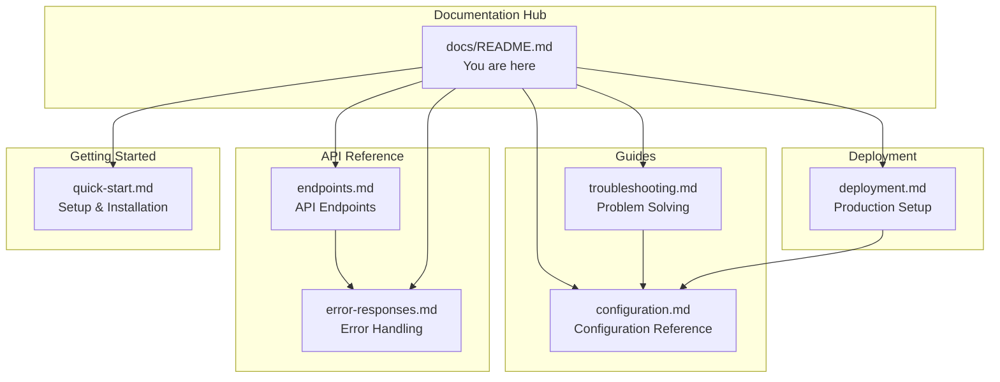
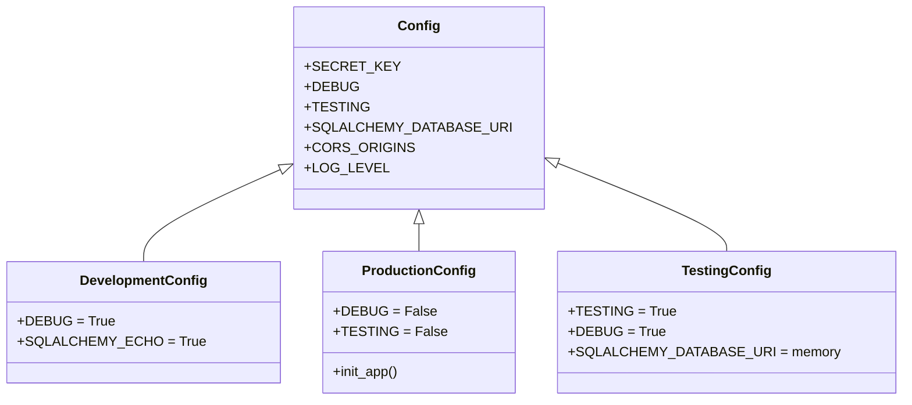

# ExistingProduct1-3Dec Documentation

Welcome to the comprehensive documentation for the ExistingProduct1-3Dec Flask application. This documentation hub provides everything you need to understand, configure, deploy, and contribute to the project.

> **Note:** This project was migrated from Node.js/Express to Python/Flask, maintaining API compatibility while leveraging Python's ecosystem.

---

## Quick Links

| Documentation | Description |
|---------------|-------------|
| [Quick Start Guide](getting-started/quick-start.md) | Get up and running in minutes |
| [API Reference](api/endpoints.md) | Complete endpoint documentation |
| [Error Responses](api/error-responses.md) | Error handling and response formats |
| [Configuration Guide](guides/configuration.md) | Environment variables and settings |
| [Troubleshooting](guides/troubleshooting.md) | Common issues and solutions |
| [Deployment Guide](deployment/deployment.md) | Production deployment instructions |

---

## Documentation Overview

This documentation is organized into several sections to help you find the information you need quickly:

### Documentation Structure



### About This Project

ExistingProduct1-3Dec is a Python/Flask web server application providing RESTful API endpoints. The application features:

- **Flask Application Factory Pattern**: Enables flexible configuration and testing
- **Multi-Environment Configuration**: Development, production, and testing configurations
- **Docker Support**: Multi-stage build for optimized container deployment
- **CORS Support**: Cross-origin request handling for API access
- **SQLAlchemy Integration**: Database ORM with multiple backend support
- **Comprehensive Error Handling**: Consistent JSON error responses

*Source: /README.md, /app.py:1-24*

---

## Getting Started

New to the project? Start here to get the application running on your local machine.

### Prerequisites

Before you begin, ensure you have:

- **Python 3.12+** - [Download Python](https://www.python.org/downloads/)
- **pip** - Python package installer (included with Python)
- **virtualenv** (recommended) - For isolated Python environments
- **Docker** (optional) - For containerized deployment

### Quick Installation

```bash
# Clone and setup
git clone <repository-url>
cd ExistingProduct1-3Dec

# Create virtual environment
python -m venv venv
source venv/bin/activate  # Linux/macOS
# venv\Scripts\activate   # Windows

# Install dependencies
pip install -r requirements.txt

# Configure environment
cp .env.example .env
# Edit .env with your settings

# Run development server
flask run
```

The server starts at `http://localhost:5000` by default.

📖 **[Complete Quick Start Guide →](getting-started/quick-start.md)**

*Source: /README.md:21-110*

---

## API Reference

The application exposes RESTful API endpoints under the `/api` prefix. All responses follow a consistent JSON format.

### Endpoints Overview

| Method | Endpoint | Description |
|--------|----------|-------------|
| GET | `/api/health` | Health check endpoint |

*Additional endpoints are documented as they are implemented.*

### Response Formats

**Success Response:**
```json
{
  "data": {},
  "message": "Success"
}
```

**Error Response:**
```json
{
  "error": "Error message description"
}
```

### HTTP Status Codes

| Code | Description |
|------|-------------|
| 200 | Success |
| 201 | Created |
| 400 | Bad Request |
| 404 | Not Found |
| 405 | Method Not Allowed |
| 500 | Internal Server Error |

📖 **[Complete API Reference →](api/endpoints.md)**

📖 **[Error Response Guide →](api/error-responses.md)**

*Source: /README.md:256-303, /app.py:100-186*

---

## Configuration

The application uses a hierarchical configuration system with environment-specific settings and environment variable overrides.

### Configuration Hierarchy



### Essential Environment Variables

| Variable | Description | Default |
|----------|-------------|---------|
| `FLASK_ENV` | Environment mode | `development` |
| `SECRET_KEY` | Cryptographic key | `dev-secret-key-...` |
| `DATABASE_URL` | Database connection | `sqlite:///app.db` |
| `DEBUG` | Enable debug mode | `false` |
| `CORS_ORIGINS` | Allowed CORS origins | `*` |
| `LOG_LEVEL` | Logging verbosity | `INFO` |

> **Security Note:** Always generate a secure `SECRET_KEY` for production:
> ```bash
> python -c "import secrets; print(secrets.token_hex(32))"
> ```

📖 **[Complete Configuration Reference →](guides/configuration.md)**

*Source: /config.py:47-168, /.env.example:1-117*

---

## Deployment

The application supports multiple deployment strategies for different environments.

### Deployment Options

| Method | Use Case | Documentation |
|--------|----------|---------------|
| Development Server | Local development | `flask run` |
| Gunicorn | Production WSGI | [Deployment Guide](deployment/deployment.md#production-with-gunicorn) |
| Docker | Containerized deployment | [Deployment Guide](deployment/deployment.md#docker-deployment) |

### Quick Docker Deployment

```bash
# Build the image
docker build -t existingproduct1-3dec .

# Run the container
docker run -p 8000:8000 \
  -e FLASK_ENV=production \
  -e SECRET_KEY=your-secure-key \
  existingproduct1-3dec
```

The containerized application:
- Runs on port 8000
- Uses Gunicorn with 4 workers and 2 threads
- Includes health checks at `/health`
- Runs as non-root user for security

📖 **[Complete Deployment Guide →](deployment/deployment.md)**

*Source: /Dockerfile:1-108, /README.md:179-218*

---

## Troubleshooting

Encountering issues? The troubleshooting guide covers common problems and their solutions.

### Common Issues

| Issue | Likely Cause | Quick Fix |
|-------|--------------|-----------|
| Port already in use | Another process on port 5000 | Use `--port=5001` or stop other process |
| Import errors | Missing dependencies | Run `pip install -r requirements.txt` |
| Database connection fails | Invalid DATABASE_URL | Check connection string format |
| CORS errors | Origin not allowed | Update `CORS_ORIGINS` in config |
| Health check fails | Application not responding | Check logs, verify configuration |

### Getting Help

1. Check the [Troubleshooting Guide](guides/troubleshooting.md)
2. Review application logs
3. Verify environment configuration
4. Open an issue in the repository

📖 **[Complete Troubleshooting Guide →](guides/troubleshooting.md)**

---

## Contributing to Documentation

We welcome contributions to improve this documentation. Please follow these guidelines:

### Documentation Standards

1. **Format**: Use Markdown with consistent heading hierarchy
2. **Code Blocks**: Always include language identifiers
3. **Source Citations**: Include `Source: /path/to/file:LineNumber` for technical claims
4. **Diagrams**: Use Mermaid syntax for diagrams
5. **Links**: Use relative paths for internal documentation links

### File Structure

```
docs/
├── README.md                      # This file - documentation index
├── getting-started/
│   └── quick-start.md             # Quick start guide
├── api/
│   ├── endpoints.md               # API endpoint reference
│   └── error-responses.md         # Error handling guide
├── guides/
│   ├── configuration.md           # Configuration reference
│   └── troubleshooting.md         # Troubleshooting guide
└── deployment/
    └── deployment.md              # Deployment guide
```

### Contributing Workflow

1. Fork the repository
2. Create a feature branch: `git checkout -b docs/your-improvement`
3. Make your documentation changes
4. Ensure all links are valid
5. Submit a pull request

### Code Documentation Standards

When documenting source code:

- **Python Docstrings**: Use Google-style format
- **Inline Comments**: Explain "why" not "what"
- **Type Hints**: Document types in docstrings
- **Examples**: Include usage examples in docstrings

*Source: /README.md:304-335*

---

## Additional Resources

### Project Files

| File | Purpose |
|------|---------|
| [README.md](../README.md) | Main project README |
| [.env.example](../.env.example) | Environment configuration template |
| [Dockerfile](../Dockerfile) | Docker container definition |
| [requirements.txt](../requirements.txt) | Python dependencies |

### External Documentation

- [Flask Documentation](https://flask.palletsprojects.com/en/3.0.x/)
- [Flask-SQLAlchemy](https://flask-sqlalchemy.palletsprojects.com/en/3.1.x/)
- [Flask-CORS](https://flask-cors.readthedocs.io/en/latest/)
- [Gunicorn Documentation](https://docs.gunicorn.org/en/stable/)
- [Python-dotenv](https://saurabh-kumar.com/python-dotenv/)

---

## Version Information

| Component | Version |
|-----------|---------|
| Python | 3.12+ |
| Flask | 3.0.0 |
| Gunicorn | 21.2.0 |
| Flask-SQLAlchemy | 3.1.1 |
| Flask-CORS | 4.0.0 |

---

*Last Updated: December 2024*

*This documentation is maintained as part of the ExistingProduct1-3Dec project. For issues or suggestions, please open an issue in the repository.*
