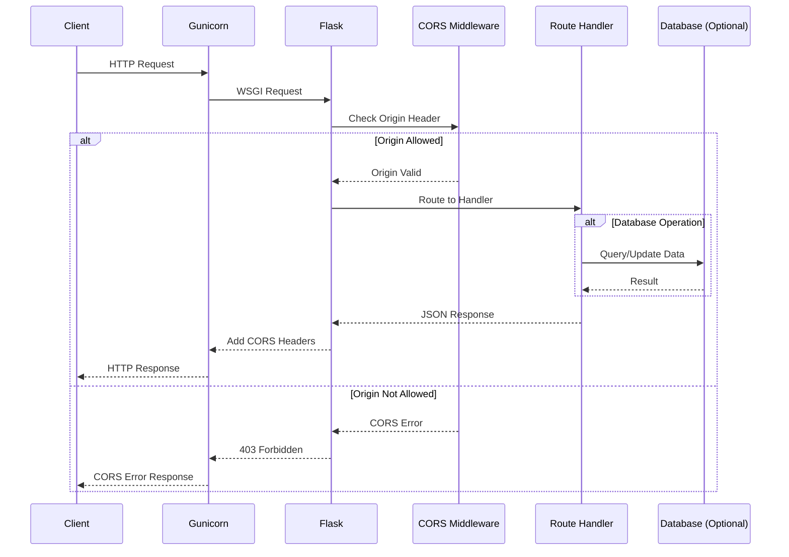
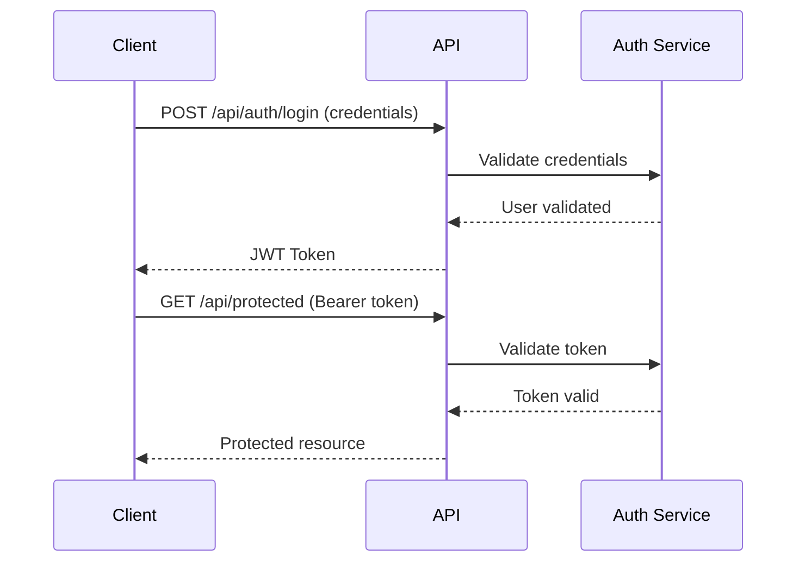

# API Endpoints Reference

> **Last Updated:** December 2024  
> **Source Files:** `app.py`, `README.md`, `config.py`  
> **Maintainer:** Blitzy

Complete API endpoint reference documentation for the Flask application. This guide documents all available API endpoints with HTTP methods, paths, parameters, request/response examples, and curl commands.

---

## Table of Contents

- [Overview](#overview)
- [Base URL](#base-url)
- [Request/Response Flow](#requestresponse-flow)
- [Request Headers](#request-headers)
- [Response Headers](#response-headers)
- [API Endpoints](#api-endpoints)
  - [Health Check](#health-check-endpoint)
- [Standard Response Format](#standard-response-format)
- [HTTP Status Codes](#http-status-codes)
- [Authentication](#authentication)
- [Examples](#examples)
  - [curl Examples](#curl-examples)
  - [Python Examples](#python-examples)
  - [JavaScript Examples](#javascript-examples)
- [Health Endpoint Path Note](#health-endpoint-path-note)
- [Related Documentation](#related-documentation)

---

## Overview

The ExistingProduct1-3Dec application exposes a RESTful API built with Flask. The API follows standard REST conventions and returns JSON responses for all endpoints.

**Key Features:**

- All API endpoints are prefixed with `/api`
- CORS (Cross-Origin Resource Sharing) is enabled for `/api/*` routes
- Consistent JSON error response format across all endpoints
- Support for multiple deployment environments (development, production, Docker)

**CORS Configuration:**

Cross-origin requests are allowed for all `/api/*` routes. The allowed origins are configured via the `CORS_ORIGINS` environment variable.

*Source: `/app.py:78-86`*

```python
# CORS configuration from app.py
cors_origins = app.config.get('CORS_ORIGINS', '*')
CORS(app, resources={r"/api/*": {"origins": cors_origins}})
```

---

## Base URL

The API base URL varies depending on your deployment environment:

| Environment | Base URL | Notes |
|-------------|----------|-------|
| Development | `http://localhost:5000` | Default Flask development server |
| Production | `http://your-domain.com` | Replace with your production domain |
| Docker Container | `http://localhost:8000` | Default Docker container port |

**Development Example:**
```
GET http://localhost:5000/api/health
```

**Docker Example:**
```
GET http://localhost:8000/api/health
```

*Source: `/README.md:258-261`*

---

## Request/Response Flow

The following diagram illustrates the request/response flow through the Flask application:



**Flow Description:**

1. **Client** sends an HTTP request to the API
2. **Gunicorn** WSGI server receives the request and passes it to Flask
3. **Flask** processes the request through the CORS middleware
4. **CORS Middleware** validates the request origin against allowed origins
5. **Route Handler** processes the request and optionally interacts with the database
6. **Response** flows back through the same path with appropriate headers

*Source: `/app.py:34-97`*

---

## Request Headers

When making requests to the API, include the following headers:

| Header | Value | Required | Description |
|--------|-------|----------|-------------|
| `Content-Type` | `application/json` | Yes* | Required for POST, PUT, PATCH requests with body |
| `Accept` | `application/json` | Recommended | Indicates JSON response preference |
| `Origin` | `<your-origin>` | Browser-sent | Automatically sent by browsers for CORS |

**Example Request Headers:**

```http
Content-Type: application/json
Accept: application/json
```

### CORS Request Headers

For cross-origin requests, browsers automatically send:

| Header | Description |
|--------|-------------|
| `Origin` | The origin (scheme + domain + port) of the requesting page |
| `Access-Control-Request-Method` | The HTTP method for preflight requests |
| `Access-Control-Request-Headers` | Custom headers for preflight requests |

---

## Response Headers

All API responses include the following headers:

| Header | Value | Description |
|--------|-------|-------------|
| `Content-Type` | `application/json` | All responses are JSON |
| `Access-Control-Allow-Origin` | `*` or specific origin | CORS allowed origin |
| `Access-Control-Allow-Methods` | Varies | Allowed HTTP methods |
| `Access-Control-Allow-Headers` | Varies | Allowed request headers |

**Example Response Headers:**

```http
HTTP/1.1 200 OK
Content-Type: application/json
Access-Control-Allow-Origin: *
```

*Source: `/app.py:78-81`, `/config.py:80`*

---

## API Endpoints

### Endpoint Summary Table

| Method | Endpoint | Description | Auth Required |
|--------|----------|-------------|---------------|
| GET | `/api/health` | Health check endpoint | No |

> **Note:** Additional endpoints will be documented as they are implemented. The application uses Flask Blueprints registered at `/api` prefix.

*Source: `/README.md:265-271`*

---

### Health Check Endpoint

Returns the health status of the application. Used for monitoring, container orchestration health checks, and load balancer health probes.

#### Request

```http
GET /api/health
```

| Parameter | Type | Required | Description |
|-----------|------|----------|-------------|
| None | - | - | No parameters required |

#### Response

**Success Response (200 OK):**

```json
{
  "status": "healthy",
  "message": "Application is running"
}
```

| Field | Type | Description |
|-------|------|-------------|
| `status` | string | Health status indicator (`"healthy"`) |
| `message` | string | Human-readable status message |

#### curl Example

```bash
# Development server
curl -X GET http://localhost:5000/api/health

# Docker container
curl -X GET http://localhost:8000/api/health

# With verbose output
curl -v -X GET http://localhost:5000/api/health

# With headers
curl -X GET \
  -H "Accept: application/json" \
  http://localhost:5000/api/health
```

#### Expected Output

```json
{
  "status": "healthy",
  "message": "Application is running"
}
```

*Source: `/README.md:267-270`*

---

## Standard Response Format

All API responses follow a consistent JSON format to ensure predictable client-side handling.

### Success Response Structure

```json
{
  "data": {},
  "message": "Success"
}
```

| Field | Type | Description |
|-------|------|-------------|
| `data` | object | The response payload (varies by endpoint) |
| `message` | string | Human-readable success message |

**Example Success Response:**

```json
{
  "data": {
    "id": 1,
    "name": "Example Resource",
    "created_at": "2024-12-01T12:00:00Z"
  },
  "message": "Resource retrieved successfully"
}
```

### Error Response Structure

```json
{
  "error": "Error type",
  "message": "Detailed error description"
}
```

| Field | Type | Description |
|-------|------|-------------|
| `error` | string | Error type identifier |
| `message` | string | Detailed error description (optional) |

**Example Error Response:**

```json
{
  "error": "Bad request",
  "message": "Invalid request data"
}
```

*Source: `/README.md:273-290`*

---

## HTTP Status Codes

The API uses standard HTTP status codes to indicate the success or failure of requests:

### Success Codes

| Code | Name | Description |
|------|------|-------------|
| 200 | OK | Request succeeded |
| 201 | Created | Resource created successfully |
| 204 | No Content | Request succeeded, no content to return |

### Client Error Codes

| Code | Name | Description |
|------|------|-------------|
| 400 | Bad Request | Invalid request syntax or parameters |
| 401 | Unauthorized | Authentication required or failed |
| 403 | Forbidden | Authenticated but access denied |
| 404 | Not Found | Requested resource does not exist |
| 405 | Method Not Allowed | HTTP method not supported for endpoint |
| 422 | Unprocessable Entity | Request valid but semantically incorrect |

### Server Error Codes

| Code | Name | Description |
|------|------|-------------|
| 500 | Internal Server Error | Unexpected server error |
| 502 | Bad Gateway | Invalid response from upstream server |
| 503 | Service Unavailable | Server temporarily unavailable |

**Error Handler Implementation:**

All HTTP errors return consistent JSON responses. Error handlers are registered in the Flask application to ensure no HTML error pages are returned.

*Source: `/app.py:100-186`, `/README.md:292-303`*

> **See Also:** [Error Responses Documentation](error-responses.md) for detailed error handling information and examples for each error type.

---

## Authentication

### Current Status

The API currently does not require authentication for the health check endpoint. Future endpoints may require JWT (JSON Web Token) authentication.

### JWT Configuration

JWT authentication settings are available in the configuration:

| Environment Variable | Default | Description |
|---------------------|---------|-------------|
| `JWT_SECRET_KEY` | Uses `SECRET_KEY` | Secret key for signing JWT tokens |
| `JWT_ACCESS_TOKEN_EXPIRES` | `3600` (1 hour) | Token expiration time in seconds |

*Source: `/config.py:81-82`, `/.env.example:77-81`*

### Future Authentication Flow

When authentication is implemented, the expected flow will be:



**Authentication Header Format:**

```http
Authorization: Bearer <your-jwt-token>
```

> **Note:** Authentication endpoints will be documented when implemented. Check the [Configuration Reference](../guides/configuration.md) for JWT configuration details.

---

## Examples

### curl Examples

#### Basic Health Check

```bash
# Simple health check
curl http://localhost:5000/api/health
```

#### Health Check with JSON Output

```bash
# Pretty-printed JSON output (requires jq)
curl -s http://localhost:5000/api/health | jq .
```

#### Health Check with All Headers

```bash
curl -v \
  -H "Accept: application/json" \
  -H "Content-Type: application/json" \
  http://localhost:5000/api/health
```

#### Docker Container Health Check

```bash
# Check health from within Docker network
curl http://localhost:8000/api/health

# From another container in the same network
curl http://flask-app:8000/api/health
```

#### Health Check with Timeout

```bash
# Set connection and request timeout
curl --connect-timeout 5 --max-time 10 \
  http://localhost:5000/api/health
```

---

### Python Examples

#### Using requests Library

```python
import requests

# Basic health check
def check_health(base_url: str = "http://localhost:5000") -> dict:
    """
    Check the health status of the API.
    
    Args:
        base_url: The base URL of the API server
        
    Returns:
        dict: Health status response
        
    Raises:
        requests.RequestException: If the request fails
    """
    response = requests.get(
        f"{base_url}/api/health",
        headers={"Accept": "application/json"},
        timeout=10
    )
    response.raise_for_status()
    return response.json()

# Usage
if __name__ == "__main__":
    try:
        health = check_health()
        print(f"Status: {health.get('status')}")
        print(f"Message: {health.get('message')}")
    except requests.RequestException as e:
        print(f"Health check failed: {e}")
```

#### With Error Handling

```python
import requests
from typing import Optional, Dict, Any

def api_request(
    endpoint: str,
    method: str = "GET",
    data: Optional[Dict[str, Any]] = None,
    base_url: str = "http://localhost:5000"
) -> Dict[str, Any]:
    """
    Make an API request with comprehensive error handling.
    
    Args:
        endpoint: API endpoint path (e.g., "/api/health")
        method: HTTP method (GET, POST, PUT, DELETE)
        data: Request body data for POST/PUT requests
        base_url: Base URL of the API server
        
    Returns:
        dict: API response data
        
    Raises:
        requests.HTTPError: For HTTP error responses
        requests.RequestException: For connection errors
    """
    url = f"{base_url}{endpoint}"
    headers = {
        "Content-Type": "application/json",
        "Accept": "application/json"
    }
    
    response = requests.request(
        method=method,
        url=url,
        json=data,
        headers=headers,
        timeout=30
    )
    
    # Raise exception for HTTP errors
    response.raise_for_status()
    
    return response.json()

# Usage example
try:
    result = api_request("/api/health")
    print(result)
except requests.HTTPError as e:
    print(f"HTTP Error: {e.response.status_code}")
    print(f"Response: {e.response.json()}")
except requests.RequestException as e:
    print(f"Request failed: {e}")
```

---

### JavaScript Examples

#### Using fetch API

```javascript
/**
 * Check API health status
 * @param {string} baseUrl - API base URL
 * @returns {Promise<Object>} Health status response
 */
async function checkHealth(baseUrl = 'http://localhost:5000') {
  const response = await fetch(`${baseUrl}/api/health`, {
    method: 'GET',
    headers: {
      'Accept': 'application/json',
      'Content-Type': 'application/json'
    }
  });

  if (!response.ok) {
    const error = await response.json();
    throw new Error(error.error || `HTTP ${response.status}`);
  }

  return response.json();
}

// Usage
checkHealth()
  .then(data => {
    console.log('Status:', data.status);
    console.log('Message:', data.message);
  })
  .catch(error => {
    console.error('Health check failed:', error.message);
  });
```

#### Using axios

```javascript
import axios from 'axios';

// Create axios instance with default config
const api = axios.create({
  baseURL: 'http://localhost:5000',
  timeout: 10000,
  headers: {
    'Content-Type': 'application/json',
    'Accept': 'application/json'
  }
});

// Health check function
async function checkHealth() {
  try {
    const response = await api.get('/api/health');
    return response.data;
  } catch (error) {
    if (error.response) {
      // Server responded with error status
      console.error('Error:', error.response.data.error);
      throw error;
    } else if (error.request) {
      // No response received
      console.error('No response from server');
      throw new Error('Server unreachable');
    } else {
      // Request setup error
      console.error('Request error:', error.message);
      throw error;
    }
  }
}

// Usage
checkHealth()
  .then(data => console.log(data))
  .catch(error => console.error(error));
```

#### TypeScript Interface Definitions

```typescript
// API Response Types
interface HealthResponse {
  status: 'healthy' | 'unhealthy';
  message: string;
}

interface SuccessResponse<T> {
  data: T;
  message: string;
}

interface ErrorResponse {
  error: string;
  message?: string;
}

// API Client
class ApiClient {
  private baseUrl: string;

  constructor(baseUrl: string = 'http://localhost:5000') {
    this.baseUrl = baseUrl;
  }

  async health(): Promise<HealthResponse> {
    const response = await fetch(`${this.baseUrl}/api/health`);
    if (!response.ok) {
      const error: ErrorResponse = await response.json();
      throw new Error(error.error);
    }
    return response.json();
  }
}

// Usage
const api = new ApiClient();
api.health().then(console.log).catch(console.error);
```

---

## Health Endpoint Path Note

> **⚠️ Important Notice: Health Endpoint Path Discrepancy**

There is a known discrepancy between the Docker health check configuration and the API endpoint path:

| Configuration | Path | Used By |
|---------------|------|---------|
| Dockerfile HEALTHCHECK | `/health` | Container orchestration |
| API Blueprint | `/api/health` | Application clients |

*Source: `/Dockerfile:85-86`*

```dockerfile
# Dockerfile HEALTHCHECK configuration
HEALTHCHECK --interval=30s --timeout=10s --start-period=5s --retries=3 \
    CMD curl --fail http://localhost:${PORT}/health || exit 1
```

### Recommendations

1. **For Container Health Checks:** Use `/health` as configured in the Dockerfile
2. **For Application Clients:** Use `/api/health` for consistency with the API blueprint prefix

### Resolution Options

If you need to align the paths, you have two options:

**Option A:** Add a root-level `/health` route (recommended for container compatibility):

```python
@app.route('/health')
def root_health():
    return jsonify({"status": "healthy", "message": "Application is running"})
```

**Option B:** Update the Dockerfile to use the `/api/health` path:

```dockerfile
HEALTHCHECK --interval=30s --timeout=10s --start-period=5s --retries=3 \
    CMD curl --fail http://localhost:${PORT}/api/health || exit 1
```

---

## Related Documentation

- **[Error Responses](error-responses.md)** - Detailed error handling documentation with examples for each HTTP error type (400, 404, 405, 500)
- **[Configuration Reference](../guides/configuration.md)** - Complete environment variable reference including CORS settings and JWT configuration
- **[Deployment Guide](../deployment/deployment.md)** - Production deployment instructions for Docker and Gunicorn
- **[Troubleshooting Guide](../guides/troubleshooting.md)** - Common issues and solutions for API-related problems
- **[Documentation Index](../README.md)** - Main documentation navigation

---

## Changelog

| Date | Version | Changes |
|------|---------|---------|
| December 2024 | 1.0.0 | Initial API documentation created |

---

*This documentation is part of the ExistingProduct1-3Dec Flask application. For questions or contributions, please open an issue in the repository.*
