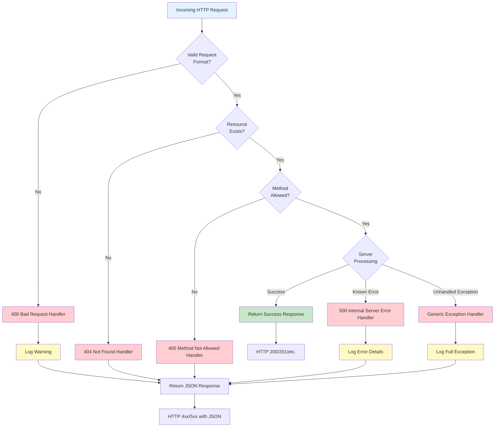

# Error Responses

> **Last Updated:** December 2024  
> **Source File:** `app.py:111-185`  
> **Maintainer:** Blitzy

Comprehensive documentation for error responses returned by the Flask API. This guide covers the standard error response format, all HTTP error codes, and provides guidance for handling errors in client applications.

---

## Table of Contents

- [Overview](#overview)
- [Error Response Schema](#error-response-schema)
- [Error Handling Flowchart](#error-handling-flowchart)
- [HTTP 400 Bad Request](#http-400-bad-request)
- [HTTP 404 Not Found](#http-404-not-found)
- [HTTP 405 Method Not Allowed](#http-405-method-not-allowed)
- [HTTP 500 Internal Server Error](#http-500-internal-server-error)
- [Unhandled Exceptions](#unhandled-exceptions)
- [Client Implementation Guide](#client-implementation-guide)
  - [Python Client Example](#python-client-example)
  - [JavaScript Client Example](#javascript-client-example)
  - [Error Handling Best Practices](#error-handling-best-practices)
- [Related Documentation](#related-documentation)

---

## Overview

The Flask API implements consistent JSON error responses for all error conditions. This design ensures that:

1. **Uniform Error Format**: All API errors return a predictable JSON structure, enabling frontend applications to handle errors uniformly without special-casing different error types.

2. **No HTML Error Pages**: Custom error handlers intercept Flask's default HTML error pages and return JSON responses instead, which is essential for API consumers expecting machine-readable responses.

3. **Security by Design**: Server-side error details are logged for debugging but not exposed to clients, preventing information leakage that could be exploited by malicious actors.

4. **Backward Compatibility**: The error response format maintains compatibility with the original Node.js API behavior for clients that were built against the previous implementation.

**Key Characteristics:**

| Feature | Description |
|---------|-------------|
| Response Format | JSON only (no HTML) |
| Content-Type | `application/json` |
| Error Fields | `error` (required), `message` (optional) |
| Logging | Server-side logging for all errors |
| Security | Internal details hidden from responses |

*Source: `/app.py:100-109`*

---

## Error Response Schema

All API errors return a consistent JSON structure. This schema applies to all HTTP error status codes (4xx and 5xx).

### Standard Error Response

```json
{
  "error": "Error type description",
  "message": "Optional additional details about the error"
}
```

### Schema Definition

**JSON Schema:**

```json
{
  "$schema": "http://json-schema.org/draft-07/schema#",
  "type": "object",
  "required": ["error"],
  "properties": {
    "error": {
      "type": "string",
      "description": "Human-readable error type description"
    },
    "message": {
      "type": "string",
      "description": "Optional additional context or details about the error"
    }
  },
  "additionalProperties": false
}
```

**TypeScript Interface:**

```typescript
interface ErrorResponse {
  /** Human-readable error type description */
  error: string;
  /** Optional additional context or details about the error */
  message?: string;
}
```

### Field Descriptions

| Field | Type | Required | Description |
|-------|------|----------|-------------|
| `error` | string | Yes | A concise, human-readable description of the error type. Examples: "Bad request", "Not found", "Method not allowed", "Internal server error" |
| `message` | string | No | Additional context about the specific error. May include details about what was invalid or what went wrong. Only included when safe to expose. |

---

## Error Handling Flowchart

The following diagram illustrates how the Flask application processes requests and routes errors to the appropriate handlers:



**Flow Description:**

1. **Request Validation**: Flask first validates the incoming request format
2. **Resource Lookup**: If format is valid, checks if the requested resource exists
3. **Method Verification**: For existing resources, verifies the HTTP method is supported
4. **Processing**: Attempts to process the request
5. **Error Handling**: Any errors are caught by the appropriate handler
6. **Logging**: All errors are logged server-side with appropriate severity
7. **Response**: JSON error response is returned to the client

---

## HTTP 400 Bad Request

The 400 Bad Request error is returned when the server cannot process the request due to client-side errors in the request format or content.

*Source: `/app.py:111-124`*

### When It Occurs

This error is triggered by:

- **Malformed Request Body**: Invalid JSON syntax or structure
- **Missing Required Parameters**: Required fields are absent from the request
- **Invalid Parameter Values**: Parameter values that don't match expected types or formats
- **Content-Type Mismatch**: Request body doesn't match declared Content-Type
- **Request Size Exceeded**: Request body exceeds server limits

### Error Response

```json
{
  "error": "Bad request",
  "message": "Invalid request"
}
```

**With Detailed Message:**

```json
{
  "error": "Bad request",
  "message": "Missing required field: username"
}
```

### Response Details

| Property | Value |
|----------|-------|
| HTTP Status Code | 400 |
| Error Type | Bad request |
| Message Included | Yes (when description available) |
| Logging Level | WARNING |

### Implementation Details

The error handler extracts the error description when available to provide helpful feedback to API consumers:

```python
@app.errorhandler(400)
def bad_request(error):
    app.logger.warning(f'Bad Request: {error}')
    return jsonify({
        'error': 'Bad request',
        'message': str(error.description) if hasattr(error, 'description') else 'Invalid request'
    }), 400
```

### Example Scenarios

**Scenario 1: Invalid JSON Body**

```bash
# Request with malformed JSON
curl -X POST http://localhost:5000/api/resource \
  -H "Content-Type: application/json" \
  -d '{"name": "test",}'  # Trailing comma - invalid JSON
```

**Response:**
```json
{
  "error": "Bad request",
  "message": "Failed to decode JSON object"
}
```

**Scenario 2: Missing Required Field**

```bash
# Request missing required field
curl -X POST http://localhost:5000/api/users \
  -H "Content-Type: application/json" \
  -d '{"email": "user@example.com"}'  # Missing 'username' field
```

**Response:**
```json
{
  "error": "Bad request",
  "message": "Missing required field: username"
}
```

### Client Resolution

When receiving a 400 error:

1. **Check request syntax**: Validate JSON is properly formatted
2. **Verify required fields**: Ensure all required parameters are included
3. **Validate field types**: Check that values match expected data types
4. **Review Content-Type**: Ensure header matches request body format
5. **Check request size**: Large payloads may exceed server limits

---

## HTTP 404 Not Found

The 404 Not Found error is returned when the requested resource does not exist at the specified endpoint.

*Source: `/app.py:126-138`*

### When It Occurs

This error is triggered by:

- **Invalid Endpoint Path**: The requested URL path doesn't match any registered route
- **Non-existent Resource**: A specific resource (by ID or identifier) doesn't exist
- **Deleted Resource**: The resource existed previously but has been removed
- **Typos in URL**: Misspelled endpoint paths

### Error Response

```json
{
  "error": "Not found"
}
```

### Response Details

| Property | Value |
|----------|-------|
| HTTP Status Code | 404 |
| Error Type | Not found |
| Message Included | No |
| Logging Level | None (silent) |

### Implementation Details

The 404 handler returns a minimal response without additional details:

```python
@app.errorhandler(404)
def not_found(error):
    return jsonify({'error': 'Not found'}), 404
```

**Note:** The 404 handler intentionally does not include a `message` field or logging, as 404 errors are common and don't typically indicate problems requiring investigation.

### Example Scenarios

**Scenario 1: Invalid Endpoint**

```bash
# Request to non-existent endpoint
curl http://localhost:5000/api/nonexistent
```

**Response:**
```json
{
  "error": "Not found"
}
```

**Scenario 2: Non-existent Resource**

```bash
# Request for resource that doesn't exist
curl http://localhost:5000/api/users/99999
```

**Response:**
```json
{
  "error": "Not found"
}
```

### Client Resolution

When receiving a 404 error:

1. **Verify the URL**: Check for typos in the endpoint path
2. **Check API prefix**: Ensure you're using `/api/` prefix for all endpoints
3. **Confirm resource exists**: Verify the resource ID or identifier is correct
4. **Review API documentation**: Confirm the endpoint is documented and available
5. **Check API version**: If versioned API, ensure correct version is specified

---

## HTTP 405 Method Not Allowed

The 405 Method Not Allowed error is returned when the HTTP method used is not supported for the requested endpoint.

*Source: `/app.py:140-152`*

### When It Occurs

This error is triggered by:

- **Wrong HTTP Method**: Using POST on a GET-only endpoint, or vice versa
- **Unsupported Methods**: Using methods like PUT, PATCH, or DELETE on endpoints that don't support them
- **Method Case Sensitivity**: HTTP methods must be uppercase (GET, not get)

### Error Response

```json
{
  "error": "Method not allowed"
}
```

### Response Details

| Property | Value |
|----------|-------|
| HTTP Status Code | 405 |
| Error Type | Method not allowed |
| Message Included | No |
| Logging Level | None (silent) |
| Allow Header | Included by Flask (lists allowed methods) |

### Implementation Details

```python
@app.errorhandler(405)
def method_not_allowed(error):
    return jsonify({'error': 'Method not allowed'}), 405
```

**Note:** Flask automatically includes an `Allow` header in 405 responses listing the permitted methods for the endpoint.

### Example Scenarios

**Scenario 1: POST to GET-only Endpoint**

```bash
# POST request to health check (GET only)
curl -X POST http://localhost:5000/api/health
```

**Response Headers:**
```
HTTP/1.1 405 Method Not Allowed
Allow: GET, HEAD, OPTIONS
Content-Type: application/json
```

**Response Body:**
```json
{
  "error": "Method not allowed"
}
```

**Scenario 2: DELETE on Read-only Endpoint**

```bash
# DELETE request on endpoint that doesn't support it
curl -X DELETE http://localhost:5000/api/config
```

**Response:**
```json
{
  "error": "Method not allowed"
}
```

### Client Resolution

When receiving a 405 error:

1. **Check the HTTP method**: Verify you're using the correct method (GET, POST, PUT, DELETE, etc.)
2. **Review Allow header**: Check the response's `Allow` header for permitted methods
3. **Consult API documentation**: Confirm which methods are supported for the endpoint
4. **Use OPTIONS request**: Send an OPTIONS request to discover allowed methods

```bash
# Discover allowed methods
curl -X OPTIONS http://localhost:5000/api/health -i
```

---

## HTTP 500 Internal Server Error

The 500 Internal Server Error is returned when an unexpected error occurs during request processing on the server side.

*Source: `/app.py:154-168`*

### When It Occurs

This error is triggered by:

- **Database Errors**: Connection failures, query errors, or constraint violations
- **External Service Failures**: Third-party API errors or timeouts
- **Application Bugs**: Unhandled edge cases or programming errors
- **Resource Exhaustion**: Memory limits, disk space, or connection pool depletion
- **Configuration Issues**: Missing environment variables or invalid settings

### Error Response

```json
{
  "error": "Internal server error"
}
```

### Response Details

| Property | Value |
|----------|-------|
| HTTP Status Code | 500 |
| Error Type | Internal server error |
| Message Included | No (security consideration) |
| Logging Level | ERROR |

### Implementation Details

The 500 handler logs error details server-side while returning a generic message to clients:

```python
@app.errorhandler(500)
def internal_error(error):
    app.logger.error(f'Server Error: {error}')
    return jsonify({'error': 'Internal server error'}), 500
```

**Security Note:** Detailed error information is intentionally excluded from the response to prevent information disclosure. Full error details are available in server logs for debugging.

### Example Scenarios

**Scenario 1: Database Connection Failure**

```bash
# Request that requires database access when DB is unavailable
curl http://localhost:5000/api/users
```

**Response:**
```json
{
  "error": "Internal server error"
}
```

**Server Log:**
```
ERROR: Server Error: (psycopg2.OperationalError) could not connect to server
```

**Scenario 2: Missing Configuration**

```bash
# Request that requires missing configuration
curl -X POST http://localhost:5000/api/send-email
```

**Response:**
```json
{
  "error": "Internal server error"
}
```

**Server Log:**
```
ERROR: Server Error: KeyError: 'SMTP_HOST'
```

### Client Resolution

When receiving a 500 error:

1. **Retry the request**: Transient issues may resolve on retry (with exponential backoff)
2. **Check service status**: Verify the API service is operational
3. **Contact support**: If the issue persists, contact the API provider
4. **Do not retry immediately**: Implement exponential backoff to avoid overwhelming the server

**Note for Operators:** Check server logs for detailed error information when investigating 500 errors.

---

## Unhandled Exceptions

The generic exception handler catches any exceptions not handled by specific error handlers, ensuring the API always returns a valid JSON response.

*Source: `/app.py:170-185`*

### When It Occurs

This handler catches:

- **Unexpected Exceptions**: Any Python exception not caught elsewhere
- **Third-Party Library Errors**: Exceptions from external packages
- **Runtime Errors**: Division by zero, null reference, type errors
- **Assertion Failures**: Failed assert statements

### Error Response

```json
{
  "error": "Internal server error"
}
```

### Response Details

| Property | Value |
|----------|-------|
| HTTP Status Code | 500 |
| Error Type | Internal server error |
| Message Included | No (security consideration) |
| Logging Level | ERROR |
| Exception Details | Logged server-side only |

### Implementation Details

The catch-all exception handler logs the exception type and message for debugging:

```python
@app.errorhandler(Exception)
def handle_exception(error):
    app.logger.error(f'Unhandled exception: {type(error).__name__}: {error}')
    return jsonify({'error': 'Internal server error'}), 500
```

### Security Considerations

The generic exception handler is designed with security in mind:

1. **No Stack Traces**: Stack traces are never included in API responses
2. **No Exception Details**: The specific exception type and message are hidden from clients
3. **Consistent Response**: All unhandled exceptions return the same generic message
4. **Full Logging**: Complete exception details are logged server-side for debugging

This prevents potential information leakage such as:
- Internal file paths
- Database schema details
- Third-party service configurations
- Application architecture information

### Example Scenarios

**Scenario 1: Unexpected Runtime Error**

```bash
# Request that triggers an unexpected error
curl http://localhost:5000/api/calculate?value=abc
```

**Response:**
```json
{
  "error": "Internal server error"
}
```

**Server Log:**
```
ERROR: Unhandled exception: ValueError: invalid literal for int() with base 10: 'abc'
```

**Scenario 2: Third-Party Service Error**

```bash
# Request that calls failing external service
curl http://localhost:5000/api/external-data
```

**Response:**
```json
{
  "error": "Internal server error"
}
```

**Server Log:**
```
ERROR: Unhandled exception: ConnectionError: Failed to establish connection to external service
```

### Debugging Unhandled Exceptions

For operators and developers debugging unhandled exceptions:

1. **Check Application Logs**: Review logs for the full exception details
2. **Enable Debug Mode**: In development, set `FLASK_DEBUG=1` for detailed error pages
3. **Monitor Error Frequency**: Track exception patterns to identify systematic issues
4. **Add Specific Handlers**: For recurring exceptions, add dedicated error handlers

---

## Client Implementation Guide

This section provides guidance and code examples for handling API errors in client applications.

### Python Client Example

```python
"""
Python client example for handling Flask API errors.

This module demonstrates proper error handling patterns when
consuming the Flask API from a Python application.
"""

import requests
from typing import Optional, Dict, Any


class APIError(Exception):
    """Custom exception for API errors."""
    
    def __init__(self, status_code: int, error: str, message: Optional[str] = None):
        self.status_code = status_code
        self.error = error
        self.message = message
        super().__init__(f"{status_code} {error}: {message or ''}")


class APIClient:
    """Client for interacting with the Flask API."""
    
    def __init__(self, base_url: str = "http://localhost:5000"):
        self.base_url = base_url.rstrip('/')
        self.session = requests.Session()
        self.session.headers.update({'Content-Type': 'application/json'})
    
    def _handle_response(self, response: requests.Response) -> Dict[str, Any]:
        """
        Process API response and handle errors.
        
        Args:
            response: The requests Response object
            
        Returns:
            Parsed JSON response data
            
        Raises:
            APIError: When the API returns an error response
        """
        # Check for successful response
        if response.ok:
            return response.json()
        
        # Parse error response
        try:
            error_data = response.json()
            raise APIError(
                status_code=response.status_code,
                error=error_data.get('error', 'Unknown error'),
                message=error_data.get('message')
            )
        except ValueError:
            # Response wasn't valid JSON
            raise APIError(
                status_code=response.status_code,
                error='Invalid response',
                message='Server returned non-JSON response'
            )
    
    def get(self, endpoint: str) -> Dict[str, Any]:
        """
        Make a GET request to the API.
        
        Args:
            endpoint: API endpoint path (e.g., '/api/health')
            
        Returns:
            Parsed JSON response
        """
        url = f"{self.base_url}{endpoint}"
        response = self.session.get(url)
        return self._handle_response(response)
    
    def post(self, endpoint: str, data: Dict[str, Any]) -> Dict[str, Any]:
        """
        Make a POST request to the API.
        
        Args:
            endpoint: API endpoint path
            data: Request body data
            
        Returns:
            Parsed JSON response
        """
        url = f"{self.base_url}{endpoint}"
        response = self.session.post(url, json=data)
        return self._handle_response(response)


# Usage example
def main():
    """Demonstrate API error handling."""
    client = APIClient()
    
    # Example: Handling different error types
    try:
        # This will succeed
        health = client.get('/api/health')
        print(f"Health check: {health}")
        
    except APIError as e:
        if e.status_code == 400:
            print(f"Bad request: {e.message}")
        elif e.status_code == 404:
            print(f"Resource not found: {e.error}")
        elif e.status_code == 405:
            print(f"Method not allowed for this endpoint")
        elif e.status_code >= 500:
            print(f"Server error - please retry later")
        else:
            print(f"API error: {e}")


if __name__ == '__main__':
    main()
```

### JavaScript Client Example

```javascript
/**
 * JavaScript client example for handling Flask API errors.
 * 
 * This module demonstrates proper error handling patterns when
 * consuming the Flask API from a JavaScript/TypeScript application.
 */

/**
 * Custom error class for API errors
 */
class APIError extends Error {
  constructor(statusCode, error, message = null) {
    super(`${statusCode} ${error}${message ? ': ' + message : ''}`);
    this.name = 'APIError';
    this.statusCode = statusCode;
    this.error = error;
    this.apiMessage = message;
  }
}

/**
 * API client class for making requests
 */
class APIClient {
  constructor(baseUrl = 'http://localhost:5000') {
    this.baseUrl = baseUrl.replace(/\/$/, '');
  }

  /**
   * Process API response and handle errors
   * @param {Response} response - Fetch API Response object
   * @returns {Promise<Object>} Parsed JSON response
   * @throws {APIError} When the API returns an error response
   */
  async handleResponse(response) {
    // Attempt to parse JSON response
    let data;
    try {
      data = await response.json();
    } catch (e) {
      throw new APIError(
        response.status,
        'Invalid response',
        'Server returned non-JSON response'
      );
    }

    // Check for successful response
    if (response.ok) {
      return data;
    }

    // Throw API error with details
    throw new APIError(
      response.status,
      data.error || 'Unknown error',
      data.message || null
    );
  }

  /**
   * Make a GET request to the API
   * @param {string} endpoint - API endpoint path
   * @returns {Promise<Object>} Parsed JSON response
   */
  async get(endpoint) {
    const response = await fetch(`${this.baseUrl}${endpoint}`, {
      method: 'GET',
      headers: {
        'Content-Type': 'application/json',
      },
    });
    return this.handleResponse(response);
  }

  /**
   * Make a POST request to the API
   * @param {string} endpoint - API endpoint path
   * @param {Object} data - Request body data
   * @returns {Promise<Object>} Parsed JSON response
   */
  async post(endpoint, data) {
    const response = await fetch(`${this.baseUrl}${endpoint}`, {
      method: 'POST',
      headers: {
        'Content-Type': 'application/json',
      },
      body: JSON.stringify(data),
    });
    return this.handleResponse(response);
  }
}

// Usage example
async function main() {
  const client = new APIClient();

  try {
    // This will succeed
    const health = await client.get('/api/health');
    console.log('Health check:', health);

  } catch (error) {
    if (error instanceof APIError) {
      switch (error.statusCode) {
        case 400:
          console.error(`Bad request: ${error.apiMessage}`);
          break;
        case 404:
          console.error(`Resource not found: ${error.error}`);
          break;
        case 405:
          console.error('Method not allowed for this endpoint');
          break;
        default:
          if (error.statusCode >= 500) {
            console.error('Server error - please retry later');
          } else {
            console.error(`API error: ${error.message}`);
          }
      }
    } else {
      // Network error or other non-API error
      console.error('Network error:', error.message);
    }
  }
}

// Run example
main();
```

### Error Handling Best Practices

When implementing API error handling in client applications, follow these best practices:

#### 1. Always Expect Errors

```python
# Good: Wrap API calls in try/except
try:
    result = client.get('/api/resource')
except APIError as e:
    handle_error(e)

# Bad: Assuming success
result = client.get('/api/resource')  # May throw unhandled exception
```

#### 2. Handle Errors by Type

Different error types require different handling strategies:

| Error Code | Strategy |
|------------|----------|
| 400 | Display validation errors to user, highlight invalid fields |
| 404 | Show "not found" message, offer navigation alternatives |
| 405 | Log as bug (shouldn't happen in production), show generic error |
| 500 | Retry with backoff, show "try again later" message |

#### 3. Implement Retry Logic for Server Errors

```python
import time
from typing import Callable, TypeVar

T = TypeVar('T')

def retry_with_backoff(
    func: Callable[[], T],
    max_retries: int = 3,
    initial_delay: float = 1.0
) -> T:
    """
    Retry a function with exponential backoff.
    
    Args:
        func: Function to retry
        max_retries: Maximum number of retry attempts
        initial_delay: Initial delay between retries in seconds
        
    Returns:
        Result of the function call
        
    Raises:
        APIError: If all retries fail
    """
    delay = initial_delay
    last_exception = None
    
    for attempt in range(max_retries + 1):
        try:
            return func()
        except APIError as e:
            last_exception = e
            # Only retry on server errors (5xx)
            if e.status_code < 500:
                raise
            if attempt < max_retries:
                time.sleep(delay)
                delay *= 2  # Exponential backoff
    
    raise last_exception
```

#### 4. Log Errors Appropriately

```python
import logging

logger = logging.getLogger(__name__)

try:
    result = client.post('/api/users', user_data)
except APIError as e:
    if e.status_code >= 500:
        # Server errors should be logged for monitoring
        logger.error(f"Server error during user creation: {e}")
    elif e.status_code == 400:
        # Client errors may be useful for debugging
        logger.warning(f"Invalid user data: {e.message}")
    raise
```

#### 5. Provide User-Friendly Messages

Map API errors to user-friendly messages appropriate for your application:

```python
ERROR_MESSAGES = {
    400: "Please check your input and try again.",
    404: "The requested item could not be found.",
    405: "This action is not available.",
    500: "Something went wrong on our end. Please try again later.",
}

def get_user_message(error: APIError) -> str:
    """Get a user-friendly error message."""
    return ERROR_MESSAGES.get(
        error.status_code,
        "An unexpected error occurred."
    )
```

---

## Related Documentation

For additional information, refer to the following documentation:

- **[API Endpoints Reference](endpoints.md)**: Complete documentation of all available API endpoints, including request/response formats and examples.

- **[Troubleshooting Guide](../guides/troubleshooting.md)**: Solutions for common issues including server errors, configuration problems, and debugging techniques.

- **[Configuration Reference](../guides/configuration.md)**: Documentation for environment variables and configuration options that affect error handling behavior.

- **[Deployment Guide](../deployment/deployment.md)**: Information about production deployment, logging configuration, and monitoring error rates.

---

*This documentation is generated from source code analysis. For the most up-to-date information, refer to the source files referenced in each section.*
